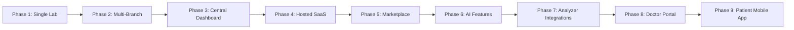

# 01 — Product Specification

**Purpose:** defines what is being built, for whom, and why — the business and product layer, independent of technical implementation.
**Why it exists:** every technical and design decision downstream should trace back to a requirement or principle stated here.
**Read this:** first, before any other document. Read again whenever scope is questioned or a new feature request arrives — check it against Scope/Non-Goals before assuming it belongs in v1.

---

## Executive Summary

A client currently running lab operations on H2 Cloud has commissioned a replacement: a Laboratory Management System (LMS) plus a public website, built to work **fully offline**, run on infrastructure the client owns, and give the client full data ownership. Commercially, this is licensed on a **recurring basis** (yearly, monthly, or in some cases usage-based — e.g. tied to receipt/report volume) — see Business Context below for the pricing rationale. The vendor is building this as v1 of a genuine SaaS product intended for multiple lab customers — this first client's deployment stays single-tenant and self-hosted, with SaaS-readiness as an architectural property from day one rather than something bolted on later.

## Background

The client's core complaint with H2 Cloud is that it does not work without internet — an operational risk for a business that must register patients, collect payment, and issue results daily regardless of connectivity or power reliability. This single complaint is the reason offline-first is the top design constraint of the entire project, not one requirement among many.

## Business Context

**Market position:** H2 Cloud and comparable lab-management competitors charge roughly PKR 65,000/year for a purely online service. This client's requirement — full offline operation *plus* automated data synchronization to a public tracking website (not the manual/separate data entry a purely online competitor's service doesn't need to solve at all) — is a materially harder engineering problem, and would reasonably be priced well above that market rate; a comparable from-scratch custom build with this scope would run in the PKR 1–1.5 million range. The client is being charged an above-market yearly recurring rate that reflects this — offline-first operation *with* automated online report tracking is a combination no competitor in this market currently offers, making this the top tier of what any lab-software vendor is putting in front of a Pakistani clinic today.

**Pricing model:** a one-time purchase was considered but isn't commercially sustainable for the vendor at a rate the client can absorb; the model is a **recurring license** — yearly or monthly, with usage-based pricing (e.g. per receipt/report volume) also viable for some future customers — rather than a single upfront payment. This recurring-license model is what `09_LabFlow_Licensing_and_Subscription_Architecture.md` is designed around.

**Software ownership (decided):** the client owns their data and their deployment for the duration of an active license. The vendor retains source code ownership, intellectual property, and the right to reuse, modify, and commercialize the codebase for other customers — this is the same core product every future customer licenses, not a one-off build. This must be an explicit clause in the service contract. Data ownership is unaffected by license status — per `09_LabFlow_Licensing_and_Subscription_Architecture.md § 6-7`, an expired license blocks application access but never deletes the client's data.

## Business Requirements

- Complete offline functionality for all daily lab operations
- Client's own server — no third-party cloud dependency
- Recurring license (yearly/monthly/usage-based) rather than a one-time purchase — see Business Context
- Full data ownership by the client, unaffected by license status
- Website integration for public info, online booking, and report lookup
- SMS notifications at key patient touchpoints
- Architecture expandable to multiple branches without a rewrite

## Product Vision

A lab system that feels as modern and convenient as a cloud LMS (dashboards, SMS, online report lookup, online booking) while carrying none of the operational risk of requiring internet to function. Built once, deployable either as a single client's private offline installation or as the vendor's own multi-tenant hosted product — same codebase, different configuration.

## Product Philosophy

Every architectural decision must satisfy these principles; when a decision is contested, this list settles it:

1. **Local-first.** Internet is optional for the lab; every core operation completes with zero connectivity.
2. **Single codebase, multiple deployments.** One product; this client gets single-tenant offline, future clients get hosted multi-tenant — no forked codebases.
3. **Everything replaceable.** SMS provider, printer, storage, payment method, authentication all sit behind interfaces. No vendor lock-in.
4. **Business logic lives in the backend, never the UI.**
5. **Audit everything that matters.** Corrections version; nothing important is silently overwritten or deleted.
6. **Every integration is optional.** The system works with zero third-party integrations active.
7. **No vendor lock-in** — for the client, or for the vendor's own dependencies on any third party.
8. **Data belongs to the customer**, always exportable without asking the vendor.
9. **Offline is the default. Online is an enhancement.**
10. **Future SaaS requires configuration, not rewrites** — multi-tenancy and feature flags exist from day one, even with one tenant and all flags on.

## Stakeholders

| Stakeholder | Role |
|---|---|
| Client (lab owner) | End operator, primary user of admin/staff modules; first paying customer of the SaaS product |
| Lab staff (Reception, Sample Collection, Lab Tech) | Daily operational users |
| Referring doctors | Indirect stakeholders via commission and referral tracking |
| Patients | Website visitors, SMS recipients, report-lookup users |
| Vendor | Builder, and future owner of the reusable product core |

## Scope (v1)

**Confirmed PKR 100k build (this is the actual v1 — everything else below "Non-Goals" is roadmap, not this build):**
- Patient registration
- Test/rate catalog with per-test price and a manual discount field usable at registration (no full pricing-engine pipeline — flat price + discount box)
- SMS sent on registration (confirmation) and again when the report is ready to collect
- Manual result entry into the software (no analyzer integration)
- Report printing
- A simple dashboard: patient/record list, doctor commission tracking (fixed amount or percentage, per doctor)
- A separate website: home page, about, test rates, a promotions section, and a report-lookup/print page for fully-paid patients only

**Topology:** two machines. The owner's office PC runs the local server (and is where he works from); the lab PC is a single workstation where one person handles registration, result entry, and printing — a combined role, not separate Reception/Lab Tech logins, since it's one person doing all of it. Lab equipment does not write directly into the system — everything is manually entered, as before.

**Broader scope (designed for, not part of this build):**

## Non-Goals (v1)

- Live multi-branch deployment (architecture supports it; not operationally built out)
- Lab analyzer/machine integration (results are entered manually — confirmed, no interfacing hardware today)
- Patient login/account system beyond tracking-ID + verification lookup
- Insurance/claims processing (not requested — flagged for confirmation)
- Inventory/reagent tracking, report template designer UI, full plugin marketplace tooling — designed for, not built, in v1
- **H2 Cloud data migration** — need is unknown until the client confirms whether historical data must move over. Decided approach regardless: the system supports a one-time historical import tool (CSV/Excel/SQL dump/API, whichever H2 Cloud can export) — treated as a migration utility, not a core runtime feature.

## Operating Parameters (confirmed)

| Parameter | Value |
|---|---|
| Branches at launch | 1 (schema/architecture supports more later) |
| Volume | Under 50 patients/tests per day |
| Result entry | Fully manual, no analyzer integration |
| Jurisdiction | Pakistan |
| Result release workflow | Single-step (entry = release, no separate authorization gate) |
| Report access | Tracking ID + secondary verification; full payment → view/download; partial payment → "ready for collection" only |
| Booking model | Online booking → Booking ID → walk-in redemption; no physical/live queue system |
| Licensing | No activation/DRM for this client — fully theirs to run |
| Branding | Website matches client's existing branding; internal staff software uses a neutral, modern UI |
| Language | English-only for v1; architecture supports localization later, bilingual Urdu/English not built now |
| Enabled roles | Admin, Reception, Sample Collector, Lab Technician (full RBAC role set designed, remaining roles built but disabled — see `02_Technical_Architecture.md § Authorization Matrix`) |
| Payment methods | Cash, Bank Transfer, EasyPaisa, JazzCash; card payments disabled but interface-ready |

## Functional Requirements

**LMS modules:** patient registration, invoicing, sample collection, test booking/processing, result entry with reference-range comparison and auto-interpretation, doctor referral and commission management, payment tracking, report printing/reprinting, patient history/search, barcode support, audit logs, user permissions/roles, lab and financial dashboards, backup/restore, offline mode with sync, package tests, corporate account billing, home collection.

**Website modules:** general info, about, services, rate list, test list, online test booking, report lookup/tracking, contact, branches, doctors, news/announcements, admin CMS.

**SMS features:** booking confirmation, payment reminders, report-ready notices, critical-value doctor alerts, sample rejection/recollection notices.

## Non-Functional Requirements

- **Availability:** lab operations must have zero dependency on internet uptime; only website/SMS delivery depend on connectivity, and both degrade gracefully (queued, not lost) when offline.
- **Performance:** comfortably handles current volume (<50/day) on modest local hardware (8GB+ RAM, SSD) with headroom for 5-10x growth before any infrastructure change is needed.
- **Data integrity:** no silent overwrites on clinically or financially significant records — corrections are versioned.
- **Security:** password hashing (bcrypt/argon2), RBAC, encrypted data at rest, HTTPS for all internet-facing traffic.
- **Recoverability:** nightly backups, tested restore procedure, offsite/rotated copy in addition to on-box backup.
- **Extensibility:** new integrations (WhatsApp, analytics, doctor portal) attach via existing domain events without modifying core modules.

## Product Roadmap

Nine-phase evolution from this client's deployment to a full platform:

1. **Single Lab** — this project: one client, one branch, fully offline, self-hosted.
2. **Multi-Branch** — federated model: each branch runs its own offline-capable local server, reconciling up to a shared reporting view (see `02_Technical_Architecture.md`).
3. **Central Dashboard** — group-wide view across branches for owners/admins, built from the same sync mechanism already used for the website.
4. **Hosted SaaS** — the same core, deployed multi-tenant, sold to other labs with a subscription/billing layer added on top.
5. **Marketplace** — third-party or vendor-built plugins (extra SMS providers, payment methods, report templates) installable per tenant.
6. **AI Features** — result interpretation assistance, anomaly detection, operational analytics.
7. **Analyzer Integrations** — direct machine interfacing for automated result entry, once a client actually needs it.
8. **Doctor Portal** — referring doctors log in to see their own referred patients, commission history, and outstanding balances.
9. **Patient Mobile App** — a dedicated app building on the existing tracking-ID web portal, adding push notifications and full visit history.

## Success Criteria

- Lab staff can complete a full patient visit (registration → payment → sample → result → report) with the server's internet connection fully disconnected, with no functional degradation.
- Staff adoption requires no workaround processes or shadow spreadsheets within the first month of go-live.
- A tested backup restore completes successfully before go-live, not assumed to work.
- The codebase requires no schema migration to onboard a second branch or a second (SaaS) tenant, only configuration.

---

**Dependencies:** none — this is the root document.
**Related chapters:** `02_Technical_Architecture.md` (how these requirements are met technically), `03_Core_Domain_Design.md` (business rules derived from these requirements).
**Future extensions:** success criteria and non-functional targets should be revisited once real usage data exists post-go-live.
**Remaining open questions:** none from the original list — see `README.md § Decisions Log`. New questions will surface during implementation and are tracked as they arise.
