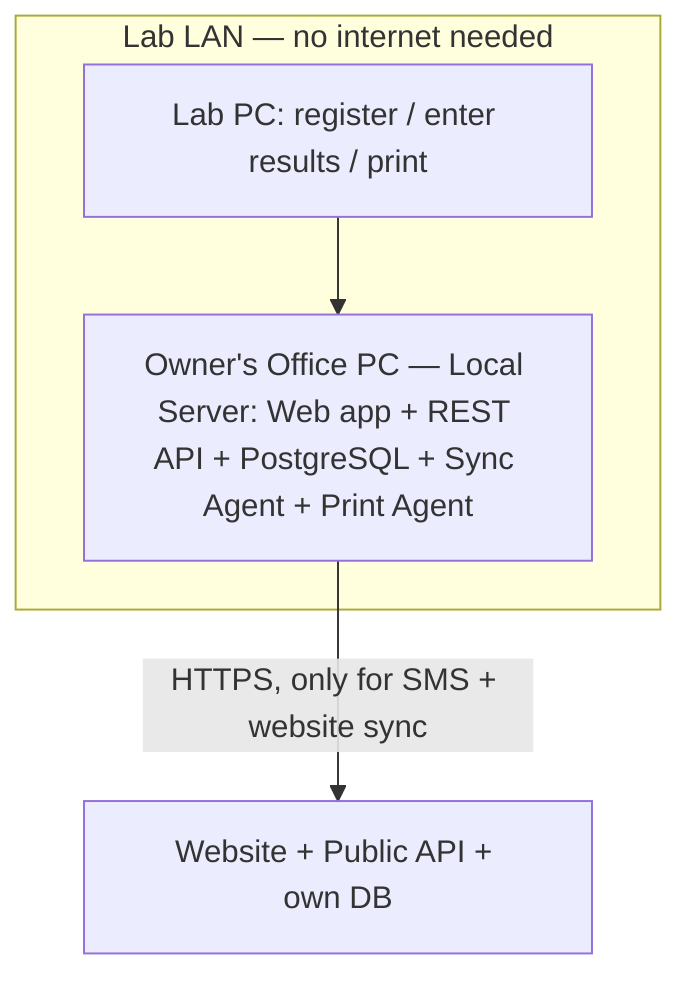
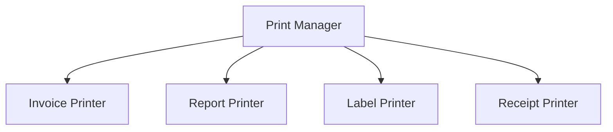

# 02 — Technical Architecture

**Purpose:** defines how the system is built, deployed, secured, and kept running without internet dependency.
**Why it exists:** translates the product requirements in `01_Product_Specification.md` into concrete infrastructure and architectural decisions.
**Read this:** before setting up any environment, writing deployment scripts, or making a decision about a third-party integration.

---

## Executive Summary

**Local server (LAN) + browser-based web app + local REST API + PostgreSQL**, with a background sync agent bridging to a separate, internet-facing website. Every integration (SMS, payment, storage, printing) sits behind a swappable interface. The schema and API are multi-tenant-capable from day one but deployed single-tenant for this client.

## System Architecture

### Deployment Topology (lab side) — Confirmed v1 Setup

Two machines: the **owner's office PC** runs the local server and is also where the owner works; the **lab PC** is a single workstation where one combined role (registration, result entry, printing) handles everything on the floor — no separate Reception/Sample Collector/Lab Tech logins for this build (see `04_Application_Modules.md § Admin Portal`). Lab equipment does not write directly into the system; all entry is manual.

### Why this over the alternatives

| Option | Verdict |
|---|---|
| Windows desktop app (WinForms/WPF) | Rejected: per-machine install/update burden, harder multi-user support, no code reuse with the website |
| Electron | Rejected: heavy footprint per workstation, no benefit over a browser once a local server exists |
| Pure PWA | Rejected for the lab core (fine for the public website): IndexedDB isn't built for shared, concurrent, transactional multi-user workloads like invoicing |
| Desktop + Web hybrid (two frontends) | Rejected: doubles maintenance/QA for marginal benefit; a browser today can reach hardware (WebUSB/WebSerial, or a small print-agent service) |
| **Local server + browser frontend (chosen)** | One install to maintain, every workstation just needs a browser, same codebase later serves the website's admin CMS |

### Components

- **Web app (frontend):** single browser-based application used by every workstation on the LAN; same codebase later serves the website's admin CMS.
- **Local REST API:** all business logic lives here — the frontend never talks to the database directly.
- **PostgreSQL:** single local instance; every relevant table carries `tenant_id`/`branch_id` from day one (see `03_Core_Domain_Design.md § Database Design`).
- **Sync agent:** background service reading an outbox/queue table, pushing sync-relevant events to the website API when internet is reachable (see Synchronization Strategy below).
- **Print agent:** small local helper (or WebUSB/WebSerial) bridging the browser to receipt/barcode/label printers.

### Multi-Tenant-Ready, Single-Tenant-Deployed

Schema and API are multi-tenant-capable (`tenant_id` everywhere), but this client's deployment is configured as a single fixed tenant — invisible in their UI, zero shared infrastructure, zero dependency on any vendor-hosted service. This is what lets the vendor reuse the same core for a future hosted SaaS offering without a data-layer retrofit.

### Multi-Branch Model (future)

**Federated model**, not hub-and-spoke: each future branch runs its own local server/DB, fully offline-capable independently. A background reconciliation process rolls branch data up to a central reporting view, using the same outbox/sync mechanism already built for the website. This preserves the offline guarantee per branch — the exact property the client is paying to get, so branch #2 shouldn't lose it just to report up to head office.

## Deployment Model

### Server Hardware (lab side) — Decided

Purchased by the **client**; vendor installs the software. Recommended spec: mini-PC, **16GB RAM, 500GB SSD**, wired Ethernet where possible, and a **UPS** — the UPS matters as much as the spec given power reliability realities, since a mid-transaction power cut is a realistic, recurring failure mode, not an edge case. This exceeds the bare minimum current volume (<50/day) would need, leaving headroom as the client's usage grows.

### Installation

- Server: one-time setup installs PostgreSQL, the API/backend, sync agent, and print agent as local services (auto-start, auto-restart on crash).
- Workstations: no install beyond a modern browser, pointed at the local server's LAN address.
- Print/barcode hardware: configured once per workstation during setup.

### Update Delivery (recurring-license model)

Since the client's server has no obligation to be online, updates ship as versioned, installable local update packages applied via a simple installer/script — not a silent auto-updater pulling from a vendor server, which would reintroduce the exact cloud dependency the client rejected. This is a deliberately separate mechanism from license validation (`09_LabFlow_Licensing_and_Subscription_Architecture.md`): a lapsed license blocks application access, it does not block the client from continuing to run whatever version they last installed, and license checks never gate whether an update package can be applied.

## Offline-First Strategy

The lab system has **zero runtime dependency on internet connectivity**. Registration, invoicing, sample tracking, result entry, and report printing all happen against the local PostgreSQL instance over the LAN. Internet is used only to *push* already-completed data outward — never required to complete a lab operation.

## Synchronization Strategy

**Outbox pattern + scheduled push**, chosen over WebSockets (unnecessary complexity; a report appearing on the website a minute or two after release is acceptable, and a persistent connection is more fragile with variable connectivity) and over VPN/tunnel-based direct DB access (bigger attack surface, and makes the lab dependent on a live tunnel to function normally — undermining the offline premise).

- Every sync-relevant event (report finalized, booking status update) writes a row to a local `sync_outbox` table in the same transaction as the change.
- The sync agent periodically checks internet reachability and pushes queued rows over HTTPS when available; failures retry with backoff.
- One-directional for report/status data (lab → website). Booking requests from the website land in a staff **review queue** — they don't write directly into operational tables; the lab always has final say.
- Same mechanism, reused, for future multi-branch reconciliation (see System Architecture above).

## Security

### Authentication & Authorization

- Password hashing via **bcrypt/argon2** — never plaintext or reversible encryption.
- Role-based access control (RBAC): Reception, Sample Collector, Lab Tech, Admin — each scoped to only the actions it needs (full detail in `03_Core_Domain_Design.md § State Machines` and the Authorization Matrix below).
- Server-side sessions with idle timeout; forced re-login on sensitive actions (e.g., voiding an invoice).

### Website / Patient-Facing Security

- Report lookup requires tracking ID **plus** a secondary verification field (phone/CNIC-last-4/DOB) — a tracking ID alone is a guessable identifier and not sufficient authentication for health data.
- Rate-limiting on lookup and booking endpoints to prevent enumeration/brute-force.
- All website traffic over HTTPS.

### Data-at-Rest & In-Transit

- Database encryption at rest recommended given the sensitivity of health data, even without a strict statutory mandate in Pakistan today.
- **Decided:** assume the lab's LAN is shared, not isolated (unconfirmed either way, so the safer assumption is used) — internal HTTPS with a locally-issued cert is implemented for LAN traffic wherever practical, at minimum supported even if not strictly enforced everywhere on day one.
- Sync traffic to the website always over HTTPS.

### Audit & Accountability

- Append-only audit log: every create/edit/delete on patients, results, invoices, and payments records who, what, when, and (for edits) before/after values.
- Result amendments preserve the original version rather than overwriting — both a clinical-safety and legal-defensibility requirement (see `03_Core_Domain_Design.md § State Machines: Result`).

### Backup, Disaster Recovery, Ransomware Protection

- Automated nightly local backup plus a periodic offsite/rotated external copy — a backup that lives only on the same machine doesn't protect against theft, fire, or ransomware encrypting the whole disk.
- Restore procedure tested at delivery, not assumed to work.
- The server should not be a general-purpose internet-browsing machine; restrict its outbound internet use to the sync agent's HTTPS calls only.
- **Decided:** the client owns and is responsible for backup custody (running the drive rotation); the software automates the backup process itself so this is a physical/logistical responsibility, not a technical one. Vendor trains the client's staff on the procedure at delivery. The optional annual maintenance agreement can include periodic backup verification as a line item.

## Authorization Matrix

The full RBAC role list (Admin, Reception, Cashier, Sample Collector, Lab Technician, Pathologist/Supervisor, Accountant, Doctor portal, Corporate Manager, Website Content Manager) is designed into the system for future use. **Confirmed for this v1 build:** only two roles are actually used — **Admin** (the owner, on the office PC that also runs the server) and a single combined **Lab Operator** role on the lab PC that covers registration, result entry, and printing (Reception + Sample Collector + Lab Tech collapsed into one, since it's one person doing all of it). The matrix below shows the full designed permission set; for this build, the "Reception", "Sample Collector", and "Lab Tech" columns are all held by the same Lab Operator login.

| Action | Reception | Sample Collector | Lab Tech | Admin | System |
|---|:---:|:---:|:---:|:---:|:---:|
| Register patient | ✅ | | | ✅ | |
| Create/confirm booking | ✅ | | | ✅ | |
| Cancel booking | ✅ | | | ✅ | |
| Issue invoice | ✅ | | | ✅ | |
| Void invoice | | | | ✅ | |
| Record payment | ✅ | | | ✅ | |
| Refund payment | | | | ✅ | |
| Collect sample | | ✅ | ✅ | | |
| Accept/reject sample | | | ✅ | | |
| Enter result | | | ✅ | | |
| Release result | | | ✅ | | |
| Amend result | | | ✅ | ✅ | |
| Print report | ✅ | | ✅ | ✅ | |
| Report state transitions | | | | | ✅ |
| Pay doctor commission | | | | ✅ | |
| Approve commission clawback | | | | ✅ | |
| Manage users/roles | | | | ✅ | |
| Configure system/feature flags | | | | ✅ | |
| Manage website content (CMS) | | | | ✅ | |
| Notification/Sync Job lifecycle | | | | | ✅ |

## Integration Strategy & Plugin Architecture

Every external dependency sits behind an internal interface so it can be replaced without touching business logic:

- **`SmsGatewayInterface`** — send message, check delivery status. See SMS Architecture below.
- **`PaymentMethodInterface`** — **decided:** Cash, Bank Transfer, EasyPaisa, and JazzCash are enabled at launch; Credit Card, Stripe, and PayPal are supported by the interface but disabled, addable later with no rewrite.
- **`PrintManagerInterface`** — routes to Invoice Printer, Report Printer, Label Printer, Receipt Printer sub-handlers; a module (e.g., Billing) requests "print an invoice" and never talks to a physical printer driver directly.
- **`StorageInterface`** — local filesystem today, swappable for other storage later without changing callers.
- **`AuthProviderInterface`** — local username/password today; extensible if SSO is ever needed for a larger SaaS client.

This is the "plugin architecture" principle from the Product Philosophy applied concretely: build the interface, ship one implementation, add more later without a rewrite.

## SMS Architecture

**Approach:** abstracted gateway behind `SmsGatewayInterface`, backed by a local, PTA-approved SMS aggregator with direct operator connectivity (Jazz, Zong, Telenor, Ufone) rather than a global provider — lower per-SMS cost, PTA-compliant sender-ID registration, and pre-paid billing (no long-term contract), consistent with the "no recurring commitment" spirit of the project.

**Decided:** no existing provider relationship — the system supports any provider that implements `SmsGatewayInterface`. Bake-off candidates: eOcean, Jazz Business, Zong Business (and others as they surface). Final provider selected at deployment time based on the bake-off results, not decided on paper now.

**Trigger points:** booking confirmation (with Booking ID), payment reminders, report-ready (message differs by payment status), critical-value alerts (to the referring doctor, marked urgent), sample rejection/recollection notices.

**Design notes:** every outgoing SMS is logged (recipient, content, status, timestamp); SMS sending flows through the same outbox/sync mechanism as website sync, so a brief internet gap queues rather than silently drops a message; patient consent for SMS captured at registration.

## Website Architecture

The website is a separate, internet-facing deployment with its own smaller database holding only what's meant to be public (report metadata + PDFs, booking requests, CMS content) — it never has direct access to the lab's operational database, receiving data one-way via the sync outbox and sending booking requests the other way into a staff review queue.

## Printing

**Print Manager** as the single entry point — no module prints directly to hardware.

A future "Report Template Engine" (design-only for now — see `01_Product_Specification.md § Non-Goals`) will let report layout (logo position, signatures, QR codes, bilingual text) be edited without a code change; deferred past v1 but the Print Manager abstraction is built now specifically so that engine can slot in later without touching Billing or Laboratory modules.

## Background Jobs

System-driven, no human role directly manipulates their internal state (see `03_Core_Domain_Design.md § State Machines: Notification, Sync Job`):

- **Sync agent** — drains the sync outbox to the website.
- **Notification dispatcher** — drains queued notifications to the SMS gateway, with retry/backoff and an abandonment threshold that should surface on an admin dashboard.
- **Retention/archival job** — moves Reports and Samples to `Archived`/`Discarded` after their configured retention period.
- **Booking expiry job** — expires unconfirmed online bookings past their time window.

## Feature Flags

Toggleable, off by default until the relevant phase of the roadmap is reached: Inventory tracking, Machine/analyzer integration, WhatsApp notifications, Doctor Portal, Multi-branch mode, Analytics/AI features. Flags exist in the schema/config from day one even while unused, per Product Philosophy principle 10.

## Deployment Strategy

Single production environment at the client site for v1 — no separate staging needed at this scale, but the vendor should maintain its own dev/test copy to validate update packages before shipping them.

## Disaster Recovery

Covered under Security above (backup cadence, tested restore, offsite copy). In the event of full server loss: restore the latest backup onto replacement hardware; the client's LAN-only workstation configuration means no other reconfiguration is needed beyond pointing at the restored server's address.

## Risk Register

| # | Risk | Impact | Mitigation |
|---|---|---|---|
| 1 | Single local server is a single point of failure | Operations halt if hardware fails | Nightly + offsite backups, tested restore, spare machine/image ready |
| 2 | Power outages corrupting the DB mid-transaction | Data loss/corruption | UPS, Postgres transactional integrity, backup cadence |
| 3 | Tracking-ID-only report lookup guessable | Patient privacy breach | Secondary verification field + rate-limiting |
| 4 | IP/ownership ambiguity with the client's contract | Vendor blocked from reusing codebase for SaaS | **Decided:** client owns data/deployment for the duration of an active license (recurring — yearly/monthly/usage-based, not perpetual, per `01_Product_Specification.md § Business Context` and `09_LabFlow_Licensing_and_Subscription_Architecture.md`), vendor retains source/IP and reuse rights — remaining action is making sure this is an explicit clause in the actual signed contract, not just a design decision |
| 5 | Scope creep from dual-purpose build (client deliverable + SaaS foundation) | Delays the first paying customer's delivery | Keep multi-tenant scaffolding minimal/invisible for v1; no SaaS-only features until there's a real second client |
| 6 | Sync delay perceived as unreliable | Trust in "still works with website" erodes | Set expectations clearly; surface last-synced-at to staff |
| 7 | Manual result entry error (no analyzer integration) | Wrong results reaching patients | Reference-range highlighting, critical-value flagging |
| 8 | Existing H2 Cloud data not migrated | Client loses historical records on cutover | Confirm migration need and export format early |
| 9 | Staff unfamiliar with a new system | Slow adoption, shadow workarounds | Keep core workflows close to existing muscle memory; short training at go-live |
| 10 | SMS provider reliability/cost drift | Missed notifications, unexpected cost | `SmsGatewayInterface` abstraction allows swapping providers without a rewrite |

---

**Dependencies:** `01_Product_Specification.md` (requirements driving these decisions).
**Related chapters:** `03_Core_Domain_Design.md` (the business rules this infrastructure serves), `04_Application_Modules.md` (the user-facing surface built on top).
**Future extensions:** Report Template Engine, Inventory module, Analyzer integration, Doctor Portal, Plugin marketplace — all designed for via the interfaces above, none built in v1.
**Remaining open questions:** none from the original list — see `README.md § Decisions Log`. New infrastructure questions will surface during deployment and are tracked as they arise.
