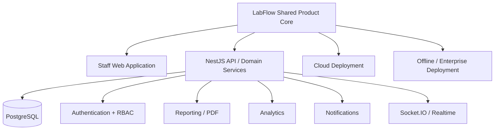
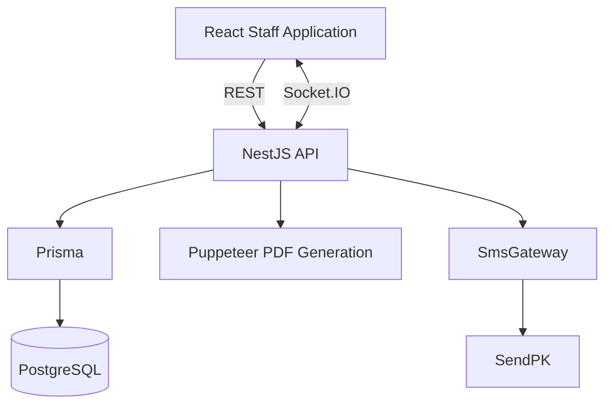
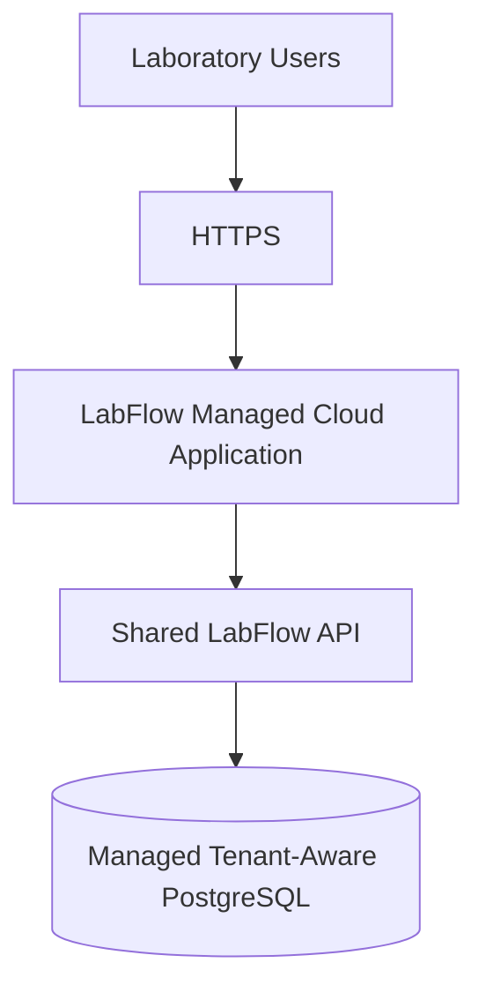
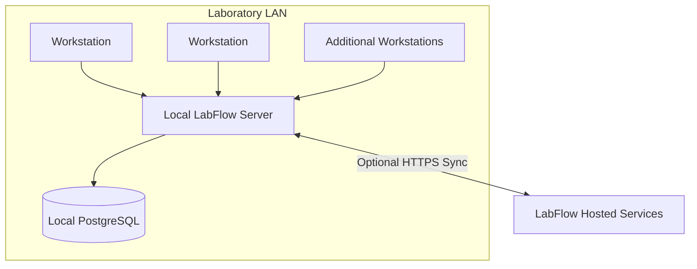
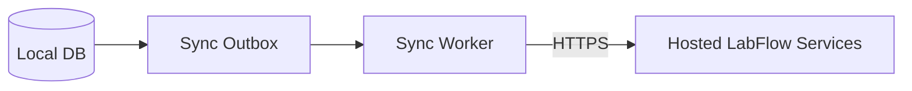
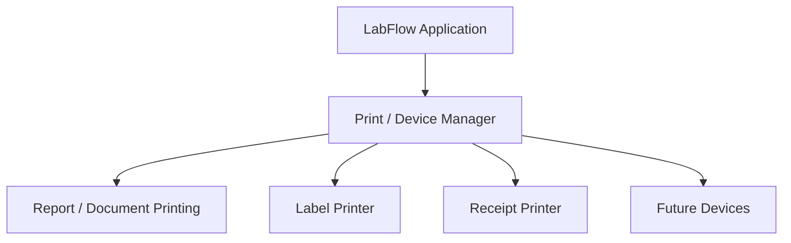

# 02 - Technical Architecture

**Purpose:** defines how LabFlow is built, deployed, secured, integrated, and operated across Basic Cloud, Pro Cloud, and Offline / Enterprise.

**Why it exists:** translates the product requirements in `01_Product_Specification.md` and the tier model in `10_Product_Tiers_and_SaaS_Scope.md` into concrete infrastructure and architectural decisions.

**Read this:** before setting up an environment, designing deployment infrastructure, adding an external integration, introducing background processing, changing tenant boundaries, or making decisions that differ between cloud and Offline / Enterprise.

---

## Executive Summary

LabFlow is built as **one shared product platform with multiple deployment models**.

The shared application core consists of:

* browser-based staff application;
* NestJS backend/API;
* PostgreSQL through Prisma;
* shared laboratory domain logic;
* permission-based authorization;
* reporting/printing services;
* analytics;
* notifications;
* tenant and branch scoping.

The same product core is intended to support:

1. **Basic Cloud** through vendor-managed hosted infrastructure;
2. **Pro Cloud** through vendor-managed hosted infrastructure with expanded product entitlements;
3. **Offline / Enterprise** through locally deployed infrastructure with optional online/hybrid synchronization.

The current codebase already implements the core application architecture, local PostgreSQL operation, REST APIs, WebSockets, authentication, centralized RBAC, PDF generation, analytics, and an abstracted SMS gateway with SendPK as the current implementation. The public website was extracted to `zaighaumrana/labwebsitedemo` on 2026-10-01 and is independent of this local software repository.

Several broader platform components are intentionally part of the target architecture but are not yet complete, including the SaaS control plane, production synchronization agent, separate hosted public-data store for Offline / Enterprise, automated backups, internal HTTPS automation, printer-driver abstraction, tier entitlement enforcement, and several background workers.

Architecture documentation must therefore distinguish **implemented infrastructure** from **scaffolded infrastructure** and **target platform architecture**.

## System Architecture

### Shared Product Core



The product should reuse these shared components wherever infrastructure differences do not require different behavior.

### Current Implemented Application Architecture

The current codebase operates as a modular web application:



This represents the **current development architecture**, not the final production topology for every tier.

Current implementation includes:

* React/Vite staff application;
* NestJS API;
* Prisma/PostgreSQL;
* REST communication;
* Socket.IO;
* session authentication;
* centralized permission-based RBAC;
* Puppeteer-based PDF generation;
* SendPK through an SMS gateway abstraction;
* tenant and branch schema foundations.

### Product Deployment Models

#### Basic Cloud

Target model:



The vendor operates infrastructure, deployments, upgrades, backups, monitoring, and tenant provisioning.

#### Pro Cloud

Uses the same fundamental managed-cloud architecture as Basic Cloud.

Differences should primarily come from:

* product entitlements;
* enabled modules;
* operational scale;
* branch capabilities;
* analytics/business functionality;
* support/service levels.

Basic and Pro must not become separate codebases.

#### Offline / Enterprise

Target model:



The local environment remains authoritative for core laboratory operations and must continue functioning when internet access is unavailable.

### Why Browser-Based Staff Software Remains the Core UI

| Option                                                       | Architectural decision                                                                                                                                               |
| ------------------------------------------------------------ | -------------------------------------------------------------------------------------------------------------------------------------------------------------------- |
| Traditional WinForms/WPF client                              | Not the shared product UI. Creates per-workstation deployment/update burden and separates local and cloud frontend architecture unnecessarily.                       |
| Electron                                                     | Not currently justified for the primary product UI. Adds desktop runtime overhead without replacing the need for backend infrastructure.                             |
| Pure client-side PWA with IndexedDB as operational authority | Rejected for shared laboratory transactional data.                                                                                                                   |
| Separate desktop and browser product frontends               | Avoid unless a specific product capability truly requires it. Permanent duplicate frontends increase maintenance and QA cost.                                        |
| **Shared browser-based application**                         | **Current direction.** Supports cloud deployments directly and allows Offline / Enterprise workstations to connect to a local server using the same product surface. |
| Thin native workstation shell                                | May be introduced for Offline / Enterprise packaging where useful, without replacing the shared web application. See Doc 08.                                         |

## Components

### Implemented

* **Staff web application**
  React/Vite application for laboratory staff.

* **NestJS API**
  Contains application/domain logic. Frontends do not connect directly to PostgreSQL.

* **PostgreSQL + Prisma**
  Current transactional data store and ORM/data-access layer.

* **Socket.IO**
  Used for real-time application updates where needed.

* **Authentication**
  Session-based authentication with bcrypt password hashing and account/login protections.

* **Permission-based RBAC**
  Backend controllers authorize against granular permissions rather than scattered role checks.

* **Reporting/PDF service**
  Puppeteer generates reports, invoices, and doctor statements.

* **Analytics subsystem**
  Dedicated analytics module and query layers.

* **SMS abstraction**
  `SmsGateway` architecture exists with SendPK as the current provider implementation.

* **Public website separation**
  Accepted and implemented on 2026-10-01. The independent website must never directly access local PostgreSQL, the local NestJS API, the laboratory LAN, the local filesystem, or locally stored report files. See Doc 07.

### Partial / Scaffolded

* **Tenant/branch architecture**
  Tenant and branch concepts are deeply represented in the schema and many service queries, but full hosted SaaS tenant provisioning and cross-tenant operational infrastructure remain unfinished.

* **`SyncOutbox`**
  Database model exists, but production event capture/draining and synchronization processing are not yet complete.

* **`FeatureFlag`**
  Schema/seeding foundations exist, but feature entitlement is not yet a complete runtime platform system.

* **`AuditLog`**
  Schema exists, but application-wide append-only audit recording is not yet consistently implemented.

### Designed / Planned

* production Sync Agent;
* SaaS tenant control plane;
* subscription/tier entitlement system;
* separate Offline / Enterprise hosted public-data store;
* cloud-to-local booking queue;
* production Print Manager abstraction;
* receipt/label physical-printer adapters;
* `PaymentMethodInterface`;
* `StorageInterface`;
* `AuthProviderInterface`;
* automated backup service;
* background notification dispatcher;
* booking-expiry worker;
* retention/archive worker;
* production health/monitoring plane;
* automated internal HTTPS setup for Offline / Enterprise.

## Multi-Tenant Architecture

Multi-tenancy is now a **product requirement**, not speculative SaaS future-proofing.

Cloud tiers are expected to host multiple independent laboratory organizations while maintaining strict isolation.

Conceptually:

```text
LabFlow Cloud
+-- Tenant A
|   +-- Branch 1
|   +-- Branch 2
+-- Tenant B
|   +-- Branch 1
+-- Tenant C
    +-- Branch 1
    +-- Branch 2
    +-- Branch 3
```

### Tenant Rules

* operational data must be tenant-scoped;
* API access must derive tenant context from authenticated/trusted context rather than arbitrary client input wherever possible;
* analytics must remain tenant-scoped;
* reporting must remain tenant-scoped;
* background workers must preserve tenant boundaries;
* synchronization jobs must preserve tenant identity;
* public APIs must never allow tenant-boundary escape;
* files/documents must eventually inherit the same isolation rules as relational data.

Tenant architecture is not complete merely because `tenantId` exists in the schema.

Full SaaS productization additionally requires:

* tenant provisioning;
* tenant lifecycle;
* subscription state;
* entitlement assignment;
* tenant branding/configuration;
* operational monitoring;
* tenant-aware background processing;
* cloud deployment automation.

## Multi-Branch Model

Branches are first-class domain concepts.

A tenant may have one or multiple branches.

The exact deployment topology may differ by tier.

### Cloud

Multiple branches can operate against the centrally managed LabFlow platform while remaining branch-scoped where appropriate.

### Offline / Enterprise

Two patterns may eventually be supported depending on customer scale:

1. one local server serving multiple connected branches where network architecture allows it;
2. federated branch servers with synchronization/central reconciliation where branches must remain independently offline-capable.

The federated model must use durable synchronization rather than direct cross-branch database coupling.

## Deployment Model

### Cloud Tiers

Vendor responsibility includes:

* application hosting;
* database hosting;
* HTTPS;
* deployment;
* upgrades;
* backup;
* monitoring;
* service health;
* tenant provisioning;
* security patching;
* infrastructure scaling.

Exact cloud infrastructure remains a deployment implementation decision and should not leak into business/domain logic.

### Offline / Enterprise

The laboratory operates a local LabFlow environment.

Target production packaging is defined in `08_Windows_Packaging_and_Installer_Roadmap.md`.

A production deployment should eventually install and manage:

* PostgreSQL;
* LabFlow API;
* compiled staff application;
* background services;
* health checks;
* backup tooling;
* licensing component;
* optional synchronization;
* optional local hardware adapters.

Workstations should require minimal configuration.

### Offline / Enterprise Hardware

Hardware sizing should be based on:

* user count;
* branch count;
* document/report retention;
* expected patient volume;
* backup requirements;
* local synchronization workload.

A suitable small deployment may still use a mini-PC with SSD storage and UPS protection, but the product specification must not hardcode one historical laboratory's hardware as the universal LabFlow architecture.

### Update Delivery

#### Cloud

Vendor-controlled deployment pipeline.

#### Offline / Enterprise

Updates should be distributed through controlled versioned packages or installer upgrades.

Update architecture must:

* preserve customer data;
* run controlled database migrations;
* support rollback/recovery strategy;
* avoid requiring permanent internet connectivity;
* remain separate from license enforcement.

Licensing determines entitlement to use the application.

Software-update mechanics determine which application version is installed.

These concerns must remain separate.

## Offline-First Strategy

Offline-first operation applies specifically to **Offline / Enterprise**.

Core workflows must not require internet access:

* patient registration;
* test selection;
* invoicing;
* payments;
* sample handling;
* result entry;
* result finalization;
* report generation;
* local report printing;
* local administration required for daily operations.

Online integrations may fail or become unavailable without making these core workflows unusable.

Examples of optional internet-dependent functionality include:

* SMS delivery;
* cloud synchronization;
* hosted public report access;
* cloud booking retrieval;
* license validation outside an allowed offline grace model;
* future external integrations.

Cloud editions are not expected to function without network access to the managed LabFlow platform.

## Synchronization Strategy

**Status: Designed / partially scaffolded, not yet production implemented.**

The planned Offline / Enterprise synchronization model uses a durable outbox/queue approach.

`SyncOutbox` exists as schema groundwork.

The complete production system still requires:

* transactionally writing sync events;
* worker/agent;
* retry/backoff;
* idempotency;
* authentication;
* connectivity recovery;
* conflict handling;
* monitoring;
* reconciliation;
* payload versioning.

### Planned Direction



For local-to-cloud report synchronization:

1. local transaction completes;
2. corresponding sync record is created;
3. laboratory workflow succeeds independently of internet;
4. background worker attempts delivery;
5. failures remain queued;
6. retries occur with backoff;
7. confirmed delivery marks the job complete.

Website-originated bookings must reach local review through a future online service and synchronization bridge, never through direct access to the local API or database.

The preferred architecture is:

```text
Hosted Booking Request
        v
Cloud Queue
        v
Sync
        v
Local Review / Import
        v
Operational Booking
```

Detailed design lives in `07_Website_Separation_and_Offline_Online_Hybrid.md`.

## Security

Security is a product-wide requirement across every tier.

### Authentication & Authorization

### Implemented

* bcrypt password hashing;
* session-based authentication;
* login/session controls;
* `SessionGuard`;
* centralized Permission enum;
* role-to-permission mapping;
* `PermissionGuard`;
* fail-closed behavior for roles without an active permission bundle;
* ADMIN superuser model;
* current LAB_OPERATOR bundle.

The active authorization model is:

```text
Authenticated User
       v
Role
       v
Permission Bundle
       v
Required Route Permission
       v
Allow / Deny
```

Detailed RBAC architecture lives in `12_RBAC_and_Operator_Dashboard.md`.

### Product Entitlements

A second layer is required for the SaaS product:

```text
Tenant
  v
Subscription / License
  v
Tier
  v
Feature Entitlement
  v
User Permission
```

This entitlement layer is **not yet fully implemented**.

A user should ultimately need both:

1. tenant entitlement to the feature;
2. permission to perform the action.

### Currently Active Roles

The currently implemented permission bundles are:

* **ADMIN**
  Superuser.

* **LAB_OPERATOR**
  Operational permissions including patients, bookings, invoice creation, payment recording, sample workflow, result entry/finalization, report viewing/printing, referring-doctor lookup, catalog viewing, operator dashboard, and cash-shift management.

The Prisma Role enum contains additional reserved roles such as:

* RECEPTION;
* SAMPLE_COLLECTOR;
* LAB_TECH;
* CASHIER;
* PATHOLOGIST;
* ACCOUNTANT;
* DOCTOR_PORTAL;
* CORPORATE_MANAGER;
* WEBSITE_CONTENT_MANAGER.

They should not be described as active until permission bundles and corresponding workflows are intentionally implemented.

### Sensitive Actions

High-risk administrative actions should progressively receive stronger protections such as:

* explicit permissions;
* audit records;
* possible re-authentication;
* approval workflows where appropriate.

Examples:

* refunds;
* invoice voiding;
* result amendments;
* role changes;
* system configuration;
* license/tenant administration.

## Website / Patient-Facing Security

Future public functionality in the separate website repository requires a stricter trust boundary than internal staff APIs. The local API no longer hosts website booking or report-lookup routes.

Future online report lookup should use a tracking identifier and secondary verification.

Production architecture must require:

* non-guessable or sufficiently strong identifiers;
* strict secondary verification;
* normalized comparison;
* rate limiting;
* tenant/branch isolation;
* HTTPS;
* minimal returned data;
* no direct access to the local API, operational database, laboratory LAN, filesystem, or locally stored reports.

### Future Online Service Requirements

Public lookup rate limiting must be implemented in the future online service.

Secondary verification rules must be validated before production use.

These requirements belong to future online integration work; no bridge is being implemented during local application stabilization.

## Data at Rest & In Transit

### Cloud

Production cloud deployments must use:

* HTTPS;
* secure database connections;
* provider-appropriate encryption at rest;
* secret management;
* controlled network access;
* backup encryption where appropriate.

### Offline / Enterprise

Current development architecture uses LAN HTTP.

Production architecture should support secure LAN communication, with internal HTTPS or equivalent transport protection where appropriate.

**Status:** internal HTTPS automation is planned, not currently implemented.

Local database-at-rest protection may rely partly on operating-system/disk controls and deployment policy until application/platform-level encryption requirements are finalized.

## Audit & Accountability

**Architecture requirement:** clinically and financially significant changes must be attributable and historically recoverable.

The Prisma schema contains `AuditLog`.

However, application-wide audit recording is currently **partial/scaffolded**, not complete.

Target audit coverage includes:

* patient creation/update;
* invoice creation/change;
* payments;
* refunds;
* invoice voids;
* result entry;
* result finalization;
* result reopen/amendment;
* report generation/reprint;
* user changes;
* role/permission changes;
* system settings;
* doctor commission changes;
* licensing/entitlement changes;
* corporate billing actions.

Result amendment history must remain part of the clinical record independently of generic audit logs.

## Backup, Disaster Recovery & Ransomware Protection

Backup is a product requirement for every production tier.

### Cloud

Vendor-managed backup strategy should eventually include:

* automated database backups;
* retention policy;
* restore testing;
* infrastructure recovery procedures;
* monitoring of backup success;
* appropriate offsite/redundant storage.

### Offline / Enterprise

Target architecture includes:

* automated local backup;
* secondary/off-machine backup;
* configurable retention;
* restore tooling;
* restore verification;
* operator/admin visibility into backup status.

**Current status:** automated product backup/restore management is not yet implemented.

A schema capable of being backed up is not the same as a working backup product.

Full packaging/backup implementation belongs to Doc 08.

## Authorization Matrix

The old fixed-role matrix has been superseded by granular permissions.

Current product authorization should be understood as capabilities rather than hardcoded job titles.

| Capability                                                      | LAB_OPERATOR | ADMIN |
| --------------------------------------------------------------- | :----------: | :---: |
| View patients                                                   |       Yes      |   Yes   |
| Register patients                                               |       Yes      |   Yes   |
| Update patients                                                 |       Yes      |   Yes   |
| View/create/manage bookings                                     |       Yes      |   Yes   |
| View billing                                                    |       Yes      |   Yes   |
| Create invoices                                                 |       Yes      |   Yes   |
| Record payments                                                 |       Yes      |   Yes   |
| View/manage samples                                             |       Yes      |   Yes   |
| Enter results                                                   |       Yes      |   Yes   |
| Finalize/reopen/amend results through current result permission |       Yes      |   Yes   |
| View reports                                                    |       Yes      |   Yes   |
| Print reports                                                   |       Yes      |   Yes   |
| View referring-doctor information required operationally        |       Yes      |   Yes   |
| Manage doctors/commission configuration                         |              |   Yes   |
| View test/package catalog                                       |       Yes      |   Yes   |
| Modify catalog/reference ranges/packages                        |              |   Yes   |
| Operator dashboard                                              |       Yes      |   Yes   |
| Management analytics                                            |              |   Yes   |
| Manage settings                                                 |              |   Yes   |
| Manage users                                                    |              |   Yes   |
| Manage cash shift                                               |       Yes      |   Yes   |

Future roles should be introduced by mapping subsets of these and future permissions rather than changing every controller.

## Integration Strategy & Plugin Architecture

The product principle remains:

> External infrastructure should be replaceable through stable internal boundaries where doing so materially reduces coupling.

This is **architectural direction**, not a claim that every interface already exists.

### Implemented

**SMS gateway abstraction**

The current SMS integration is routed through the application's gateway/service boundary.

SendPK is the current provider implementation.

### Planned / Future Abstractions

* **Payment provider/payment-method abstraction**
* **Print Manager / physical-printer abstraction**
* **Storage abstraction**
* **Authentication-provider abstraction**
* **additional notification channel abstractions**
* **analyzer/device integrations**

Avoid creating abstractions merely because an interface could theoretically exist.

Introduce them where LabFlow genuinely needs multiple implementations, deployment-specific behavior, or vendor replacement.

## SMS Architecture

### Current Implementation

* internal SMS gateway/service boundary;
* SendPK provider;
* notification records;
* delivery/failure status persistence;
* selected booking/report SMS behavior.

### Product Direction

The notification architecture should support provider replacement without changing laboratory business logic.

Future providers or channels may include:

* other Pakistani SMS aggregators/operators;
* email;
* WhatsApp;
* push notifications.

### Planned Trigger Points

Potential product triggers include:

* booking created/confirmed;
* booking reminders;
* payment reminders;
* report-ready;
* amended report;
* critical-value notification;
* sample rejection/recollection;
* system/operational alerts.

Not every trigger is currently implemented.

### Current Gap

SMS/network delivery currently occurs too directly in some request flows for the final Offline / Enterprise reliability model.

The target pattern is:

```text
Business transaction completes
        v
Notification queued locally
        v
Background dispatcher
        v
Provider
        v
Retry / delivery status
```

The laboratory transaction must not depend on successful internet delivery.

## Website Architecture

The public website has been separated from the local LabFlow repository and deployment.

The website is maintained in `zaighaumrana/labwebsitedemo` and must never connect directly to the local laboratory API, PostgreSQL database, LAN, filesystem, or locally stored report files.

For Offline / Enterprise deployments, internet-facing functionality will use a hosted integration layer containing only data intentionally synchronized from the laboratory installation.

A future synchronization bridge will exchange approved data between the local LabFlow installation and the online integration layer.

The local laboratory application remains operational when internet connectivity is unavailable.

Detailed separation and synchronization architecture is defined in Doc 07.

### Cloud Tiers

For Basic/Pro Cloud, the public portal can operate against the managed LabFlow cloud platform while still using strict public API boundaries.

The principle is therefore:

> separate public trust boundary, not necessarily a universally separate physical database for every tier.

## Printing

### Current Implementation

LabFlow currently produces PDFs through `PrintingService`/reporting services using Puppeteer.

Implemented output includes:

* invoice PDFs;
* patient report PDFs;
* doctor statement PDFs;
* plain-paper mode;
* letterhead mode;
* configurable margins;
* continuous/one-test-per-page layouts;
* print/reprint tracking.

### Planned Hardware Abstraction

There is currently **no complete `PrintManagerInterface` or physical printer-driver architecture**.

A future Offline / Enterprise printing layer may abstract:



Do not describe this abstraction as implemented until actual device adapters exist.

## Background Jobs

### Current Status

Most product background workers described below are not yet implemented.

### Planned Workers

* **Sync worker**
  drains synchronization queues;

* **Notification dispatcher**
  sends queued messages and handles retry/backoff;

* **Booking expiry worker**
  processes stale/expired reservations;

* **Retention/archive worker**
  applies configured retention policies;

* **backup scheduler**
  creates and verifies deployment-appropriate backups;

* **license validation worker**
  applicable to Offline / Enterprise licensing architecture;

* **future SaaS operational jobs**
  tenant lifecycle, billing/entitlements, scheduled analytics or maintenance where required.

Background jobs must be:

* tenant-aware;
* idempotent where possible;
* observable;
* retry-safe;
* auditable for important state changes.

## Feature Flags & Product Entitlements

`FeatureFlag` exists as schema groundwork.

The product now requires a broader entitlement architecture.

### Feature Flag

Answers:

> Is a technical/product capability enabled in this environment or tenant?

### Product Entitlement

Answers:

> Does this subscription/license include this capability?

### RBAC Permission

Answers:

> Can this user perform this action?

These must not collapse into one mechanism.

Conceptually:

```text
Feature exists in product
        v
Environment supports it
        v
Tenant is entitled to it
        v
User has permission
        v
Action allowed
```

Full runtime enforcement is not yet implemented.

## Deployment Strategy

There is no longer one universal production topology.

### Basic Cloud

Managed SaaS deployment.

### Pro Cloud

Managed SaaS deployment with expanded entitlements/capabilities.

### Offline / Enterprise

Locally packaged deployment with optional hosted services/synchronization.

Development and test environments remain separate engineering concerns.

Production deployments must never rely on Vite development servers, source-level Node tooling, or manual developer commands as the customer operating model.

## Disaster Recovery

Disaster-recovery strategy depends on tier.

### Cloud

Vendor owns recovery process.

Target requirements include:

* automated backups;
* restore tests;
* documented RPO/RTO targets;
* infrastructure recreation;
* incident procedures.

### Offline / Enterprise

Recovery should allow:

1. replacement/repaired server;
2. LabFlow installation;
3. database restore;
4. configuration restore;
5. workstation reconnection;
6. synchronization reconciliation where applicable.

The implementation is not complete until backup creation **and restoration** are operationally tested.

## Risk Register

| #  | Risk                                                                | Impact                                              | Mitigation                                                                      |
| -- | ------------------------------------------------------------------- | --------------------------------------------------- | ------------------------------------------------------------------------------- |
| 1  | Cross-tenant data leakage in SaaS                                   | Severe privacy/security failure                     | Tenant-scoped backend design, automated isolation tests, trusted tenant context |
| 2  | Offline / Enterprise local server failure                           | Local operations unavailable                        | UPS, automated backup, tested restore, deployment recovery tooling              |
| 3  | Power failure during local operations                               | Interruption/data risk                              | PostgreSQL transactions, UPS, recovery/backup procedures                        |
| 4  | Public report enumeration                                           | Patient privacy breach                              | Strong secondary verification, rate limiting, HTTPS, minimal public payloads    |
| 5  | Product tiers diverge into separate codebases                       | Long-term engineering fragmentation                 | Shared core + entitlement architecture                                          |
| 6  | Schema scaffolding mistaken for implemented product functionality   | Incorrect development assumptions                   | Explicit implementation-status documentation                                    |
| 7  | Synchronization creates duplicates/conflicts                        | Data inconsistency                                  | Durable outbox, idempotency, versioned payloads, reconciliation rules           |
| 8  | Internet-dependent integration blocks Offline / Enterprise workflow | Laboratory downtime                                 | Queue external work after local transaction succeeds                            |
| 9  | Weak audit coverage                                                 | Clinical/financial traceability loss                | Central audit service and mandatory coverage for significant actions            |
| 10 | Backup exists but restore is untested                               | False sense of recoverability                       | Automated verification + scheduled restore tests                                |
| 11 | Feature entitlement mixed with RBAC                                 | Security/commercial leakage                         | Separate tenant entitlement and user permission layers                          |
| 12 | Reserved roles exposed before bundles exist                         | Users can authenticate but cannot operate correctly | Expose only active roles until intentionally implemented                        |
| 13 | Future website integration recreates local API/database coupling    | Larger attack surface                               | Preserve independent website boundary; use online service and future bridge     |
| 14 | External-provider outage                                            | Notifications/integrations fail                     | Gateway abstraction + durable queue/retry                                       |

---

**Dependencies:** `01_Product_Specification.md` and `10_Product_Tiers_and_SaaS_Scope.md`.

**Related chapters:** `03_Core_Domain_Design.md` defines the business/domain rules this infrastructure serves; `04_Application_Modules.md` defines the user-facing modules; `07_Website_Separation_and_Offline_Online_Hybrid.md` defines Offline / Enterprise public-service synchronization; `08_Windows_Packaging_and_Installer_Roadmap.md` defines local product packaging; `09_LabFlow_Licensing_and_Subscription_Architecture.md` defines Offline / Enterprise license validation; `12_RBAC_and_Operator_Dashboard.md` defines the current permission implementation.

**Current implementation summary:** shared web/API/PostgreSQL core, WebSockets, authentication/RBAC, analytics, PDF generation, tenant/branch schema groundwork, and SendPK SMS integration are implemented or substantially implemented. Website repository separation is accepted and implemented. Sync/bridge, hosted online services, SaaS control plane, entitlement enforcement, automated backups, Print Manager/device abstraction, and several background services remain partial or planned. Stabilizing the local LabFlow application is the current priority.

**Future extensions:** cloud infrastructure automation, tenant control plane, additional integrations, analyzers, device adapters, advanced observability, storage providers, identity providers, plugin/extension architecture.

**Remaining open questions:** hosting/provider choices, entitlement implementation details, production network/security standards, SaaS operational targets, and deployment-specific infrastructure choices should be resolved as their implementation phases begin rather than being inferred from historical single-laboratory assumptions.
