# 03 — Core Domain Design

**Purpose:** the technical "Bible" of the product — every business rule, entity, event, and workflow lives here.
**Why it exists:** backend code should be a direct implementation of what's written in this document; if code and this document disagree, this document wins until deliberately revised.
**Read this:** before writing any backend module. Re-read the relevant section before implementing any state transition or business rule.

---

## Executive Summary

The domain is modeled around a single linear backbone — Patient → Booking → Invoice → Sample → LabTest → Result → Report → Notification — with Doctor, Package, and Company as entities that attach to this backbone rather than replace it. Every operationally-scoped entity carries a `tenant_id`/`branch_id`. State transitions are explicit and enforced (see State Machines); cross-cutting behavior (notifications, sync, commission) is driven by domain events rather than direct module-to-module calls.

## Domain Model

*Read this first — every other section in this document assumes this model.*

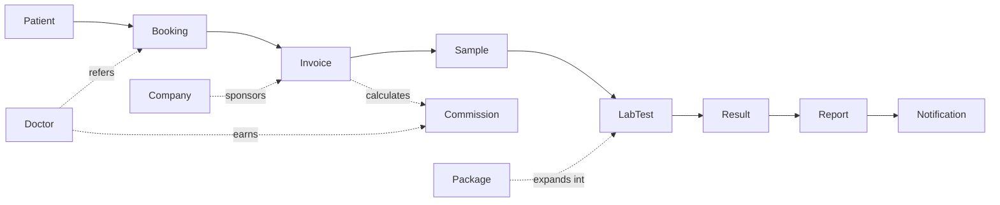

- **Patient** — a person the lab has or will provide services to; exists independently of any single visit.
- **Booking** — an intent to be tested: walk-in, online, or home-collection.
- **Invoice** — the financial record for a booking: line items, pricing-engine-adjusted price, payment status.
- **Sample** — a physical specimen collected against an invoice/booking; one sample may serve multiple tests.
- **LabTest** — a single test definition, standalone or resolved from a Package.
- **Package** — a named bundle of tests (possibly nested) sold as one priced unit.
- **Result** — a value recorded against a LabTest for a Sample; versioned, never overwritten.
- **Report** — the patient-facing document assembled from one or more Results.
- **Doctor** — a referral source, earns Commission from linked Invoices.
- **Company** — a corporate account sponsoring Invoices for linked Patients (employees).
- **Notification** — an outbound message (SMS today) triggered by domain events.

This model is what stays true even if the database changes — it's the contract a developer (or an AI coding agent) should understand in five minutes, independent of how PostgreSQL happens to store it.

## Ubiquitous Language / Glossary

One official definition per term — used consistently across all documents, code, and conversations with the client.

| Term | Definition |
|---|---|
| **Patient** | A person registered in the system, independent of any single visit. Repeat visits reuse this record. |
| **Visit** | The real-world encounter that produces one Booking, one Invoice, one or more Samples, and (usually) one Report. Not a stored entity itself — it's the informal name for "everything that happened during one trip to the lab." |
| **Booking** | The scheduling record capturing intent to be tested — walk-in, online, or home-collection — before any money or specimen is involved. |
| **Sample** | A physical specimen collected from a Patient, tracked through collection, quality-check, and testing. |
| **Report** | The patient-facing document assembled from one or more Results tied to an Invoice. May be Partial or Complete. |
| **Result** | A single recorded value for one LabTest against one Sample. Amendments create new versions; originals are never deleted. |
| **Invoice** | The financial record for a Booking: line items, applied pricing rules, and payment status. |
| **Package** | A named, priced bundle of LabTests (possibly containing nested Packages) sold as one unit. |
| **Commission** | The amount owed to a referring Doctor, calculated from an Invoice at the rate/type in effect at invoice time. |
| **Corporate Account (Company)** | An organization that sponsors Invoices on behalf of linked Patients (its employees), billed on its own cycle rather than per-visit. |
| **Tenant / Branch** | The scoping unit for multi-lab or multi-branch data isolation. Fixed to one value for this client's deployment. |

## Bounded Contexts

Each context owns its own models; no other context reaches into its data directly — cross-context communication happens via domain events.

| Bounded Context | Owns |
|---|---|
| **Patient Management** | Patient, patient history/search |
| **Billing** | Invoice, Payment, Pricing Engine, Company (corporate billing) |
| **Laboratory** | Sample, LabTest, Result, Package |
| **Reporting** | Report, report generation/versioning |
| **Notification** | Notification, SMS gateway integration |
| **Doctor Management** | Doctor, Commission |
| **Website / Public Portal** | Public-facing Booking requests, report lookup, CMS content |
| **Sync** | Sync Job, outbox processing |

## Domain Events

**Approach:** in-process event dispatcher (modular monolith), not a distributed message bus — at current scale (single branch, <50/day), a broker like Kafka/RabbitMQ is operational overkill. Each bounded context raises events through a shared in-process dispatcher; other contexts subscribe without the raising context knowing who's listening. When the product later runs as real multi-tenant SaaS at higher volume, the same dispatcher interface can be re-pointed at a real queue without changing any context's business logic.

**Design rule:** events are facts about what already happened (past tense), not commands. `ResultReleased` is an event; "ReleaseResult" is the command that, once successful, raises it.

**Core event list (v1):** `PatientRegistered` · `BookingRequested` / `BookingCreated` / `BookingConfirmed` / `BookingCancelled` / `BookingExpired` / `BookingConverted` · `InvoiceIssued` / `InvoiceVoided` / `InvoiceClosed` / `InvoiceRefunded` · `PaymentReceived` / `PaymentFailed` / `PaymentRefunded` · `SampleCollected` / `SampleInTransit` / `SampleReceived` / `SampleAccepted` / `SampleRejected` / `SampleRecollected` / `TestingStarted` / `SampleTestingCompleted` / `SampleDiscarded` · `ResultEntered` / `ResultReleased` / `ResultAmended` / `ResultVoided` / `CriticalValueDetected` · `ReportGenerated` / `ReportPartialReleased` / `ReportAmended` / `ReportArchived` / `ReportPrinted` / `ReportDownloaded` · `NotificationQueued` / `NotificationSent` / `NotificationFailed` / `NotificationAbandoned` · `DoctorCommissionCalculated` / `DoctorCommissionReversed` / `DoctorCommissionPaid` / `DoctorCommissionClawbackRequested` / `DoctorCommissionClawbackSettled` · `SyncJobQueued` / `SyncJobCompleted` / `SyncJobFailed` / `SyncJobAbandoned`

## State Machines

*Notation used throughout: **Actor** = who/what is authorized to trigger the transition. **Event** = the domain event emitted. States not listed as reachable from a given state are forbidden — see each entity's "Forbidden Transitions" list.*

### Booking

States: `PendingReview` · `Confirmed` · `CheckedIn` · `Converted` · `Expired` · `Cancelled`

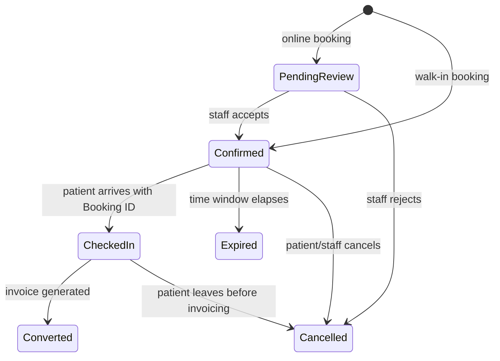

| From | To | Actor | Event |
|---|---|---|---|
| *(new)* | PendingReview | Patient (website) | `BookingRequested` |
| *(new)* | Confirmed | Reception | `BookingCreated` |
| PendingReview | Confirmed | Reception | `BookingConfirmed` |
| PendingReview | Cancelled | Reception | `BookingCancelled` |
| Confirmed | CheckedIn | Reception | `PatientCheckedIn` |
| Confirmed | Expired | System | `BookingExpired` |
| Confirmed/CheckedIn | Cancelled | Reception/Admin | `BookingCancelled` |
| CheckedIn | Converted | Reception | `BookingConverted` |

**Forbidden:** `Expired → Converted` (re-book instead); `Converted → Cancelled` direct (must go through Invoice/Payment); `Cancelled → *` (terminal); `PendingReview → CheckedIn` (must pass through Confirmed).

### Invoice

States: `Draft` · `Issued` · `Voided` · `Closed` · `Refunded`

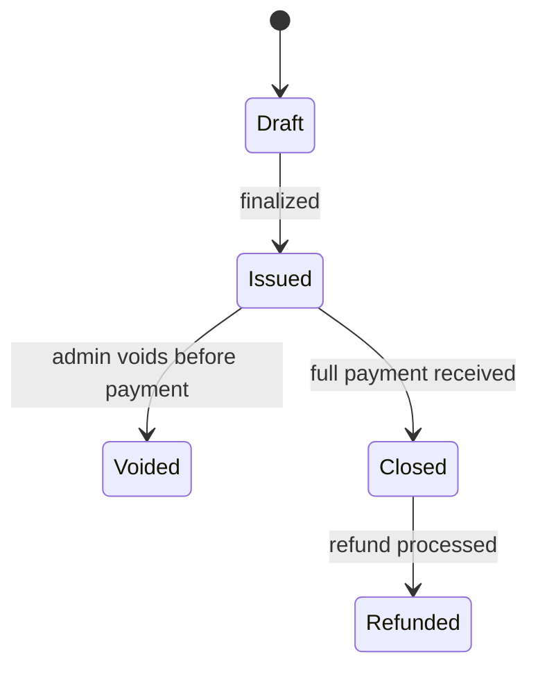

| From | To | Actor | Event |
|---|---|---|---|
| Draft | Issued | Reception | `InvoiceIssued` |
| Issued | Voided | **Admin only** | `InvoiceVoided` |
| Issued | Closed | System (on full `PaymentReceived`) | `InvoiceClosed` |
| Closed | Refunded | **Admin only** | `InvoiceRefunded` |

**Forbidden:** `Draft → Closed` (must pass through Issued); `Voided → Issued` and `Refunded → Closed` (both terminal). Only Admin can void or refund.

### Payment

States: `Pending` · `PartiallyReceived` · `FullyReceived` · `Voided` · `Refunded` · `Failed`

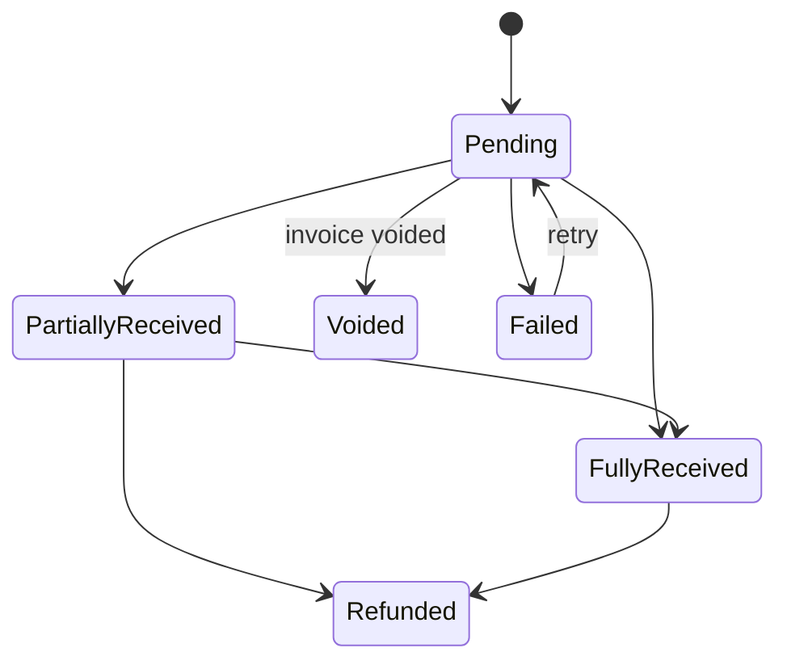

| From | To | Actor | Event |
|---|---|---|---|
| Pending | PartiallyReceived / FullyReceived | Reception | `PaymentReceived` |
| PartiallyReceived | FullyReceived | Reception | `PaymentReceived` (full) |
| PartiallyReceived / FullyReceived | Refunded | **Admin only** | `PaymentRefunded` |

**Forbidden:** `Pending → Refunded` direct (use `Voided` — no money was ever collected); `Refunded → *received states*` (terminal, no "un-refunding"). Reception records payment; only Admin refunds.

### Sample

States: `PendingCollection` · `Collected` · `InTransit` · `ReceivedAtLab` · `Accepted` · `Rejected` · `Recollected` · `InTesting` · `Completed` · `Discarded`

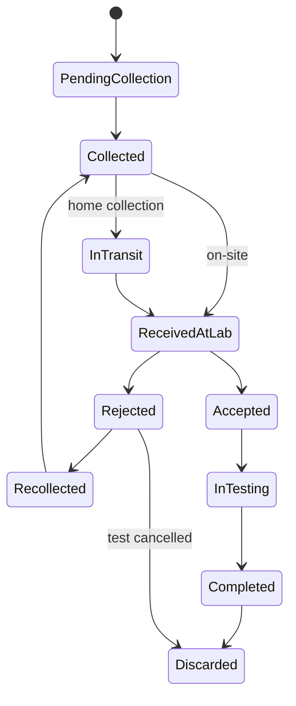

| From | To | Actor | Event |
|---|---|---|---|
| PendingCollection | Collected | Sample Collector/Lab Tech | `SampleCollected` |
| Collected | InTransit | Sample Collector (home collection) | `SampleInTransit` |
| Collected/InTransit | ReceivedAtLab | Lab Tech | `SampleReceived` |
| ReceivedAtLab | Accepted/Rejected | Lab Tech | `SampleAccepted`/`SampleRejected` |
| Rejected | Recollected | Sample Collector | `SampleRecollected` |
| Accepted | InTesting | Lab Tech | `TestingStarted` |
| InTesting | Completed | Lab Tech | `SampleTestingCompleted` |
| Completed/Rejected | Discarded | Lab Tech/Admin | `SampleDiscarded` |

**Forbidden:** `PendingCollection → Accepted` (must physically arrive first); `Discarded → *` (terminal); `Rejected → Completed` direct (must recollect). Reception has no authority here — separation between money-handling and specimen-handling.

### Result

States: `Entered` · `Released` · `Superseded` · `Voided`

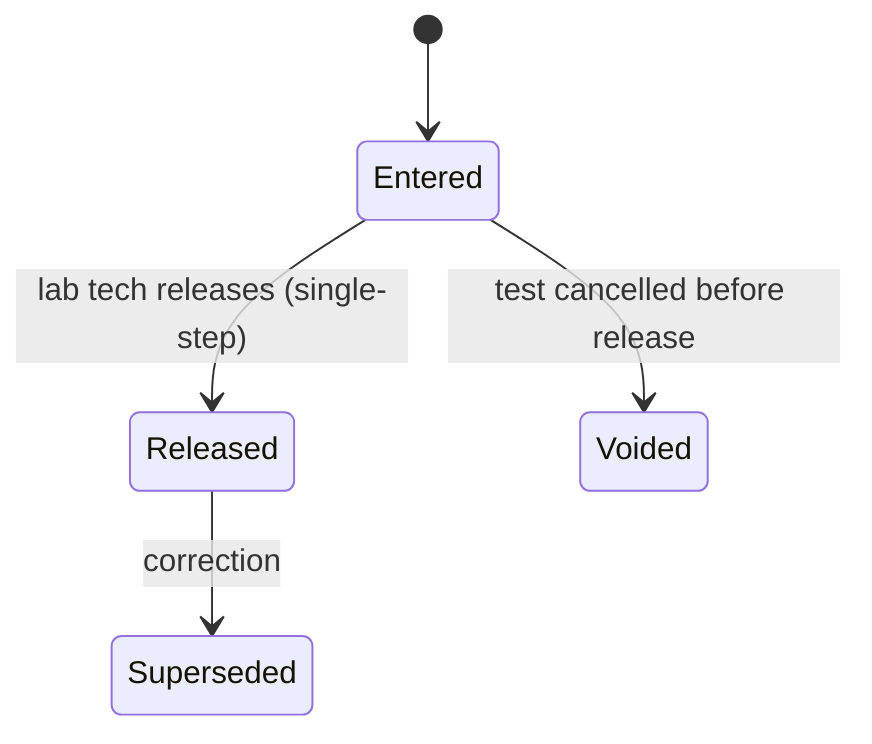

| From | To | Actor | Event |
|---|---|---|---|
| *(new)* | Entered | Lab Tech | `ResultEntered` |
| Entered | Released | Lab Tech | `ResultReleased` (+ `CriticalValueDetected` if applicable) |
| Entered | Voided | Admin | `ResultVoided` |
| Released | Superseded | Lab Tech/Admin | `ResultAmended` (creates a **new** Result record) |

**Forbidden:** `Released → Entered` (corrections go forward via Superseded + new record, never backward); `Superseded → Released` and `Voided → Released` (terminal). Only Lab Tech releases — no separate authorization role, per confirmed client workflow, but the authority still sits with clinical staff, not Reception/Admin.

### Report

States: `Pending` · `PartialReady` · `Complete` · `Amended` · `Archived`. **`Printed`/`Downloaded` are logged actions, not states** — a report can be printed/downloaded repeatedly without changing its lifecycle stage.

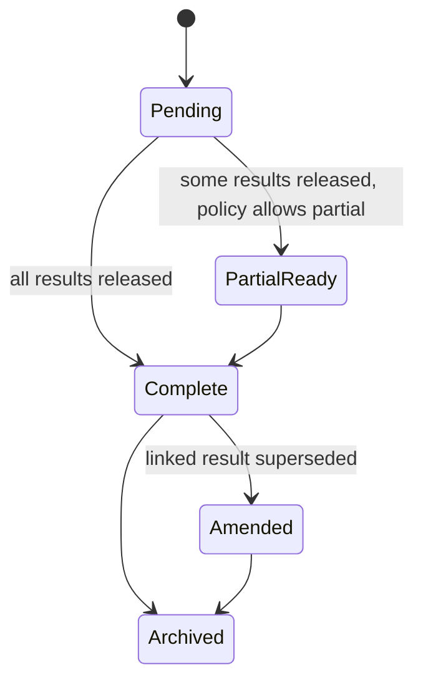

| From | To | Actor | Event |
|---|---|---|---|
| Pending | PartialReady | System | `ReportPartialReleased` |
| Pending/PartialReady | Complete | System | `ReportGenerated` |
| Complete | Amended | System (on `ResultAmended`) | `ReportAmended` |
| Complete/Amended | Archived | System (retention job) | `ReportArchived` |

Logged actions: Print (Reception/Lab Tech) → `ReportPrinted`; Download (Patient) → `ReportDownloaded`.

**Forbidden:** `Complete → Pending` and `PartialReady → Pending` (no rollback — corrections go via Amended). Entirely system-driven — no staff role directly sets Report state; it's always derived from linked Results, so it can never drift out of sync.

### Notification

States: `Queued` · `Sending` · `Sent` · `Failed` · `Retrying` · `Abandoned`

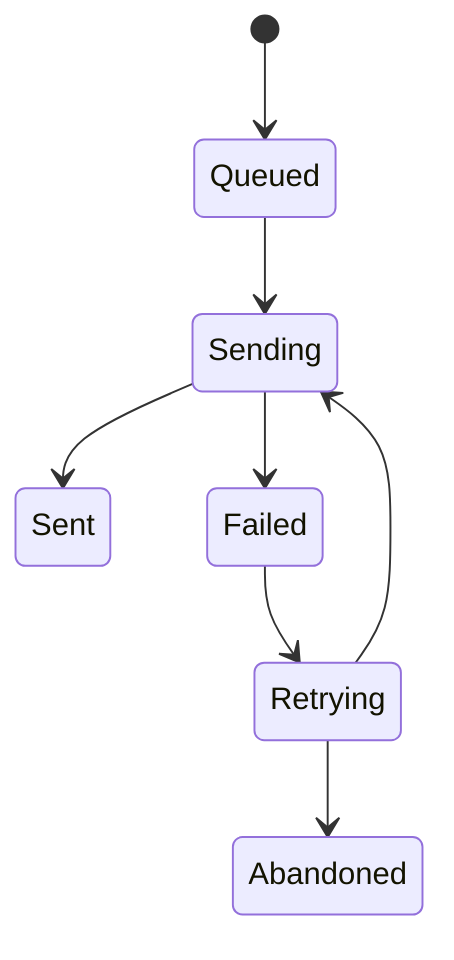

**Forbidden:** `Sent → *` (terminal — a follow-up message is a new Notification); `Abandoned → Sending` automatic (requires a fresh Notification, prevents infinite retry loops). Entirely system/background-agent driven.

### Commission

States: `Calculated` · `Payable` · `Paid` · `Reversed` · `ClawbackPending` · `Settled`

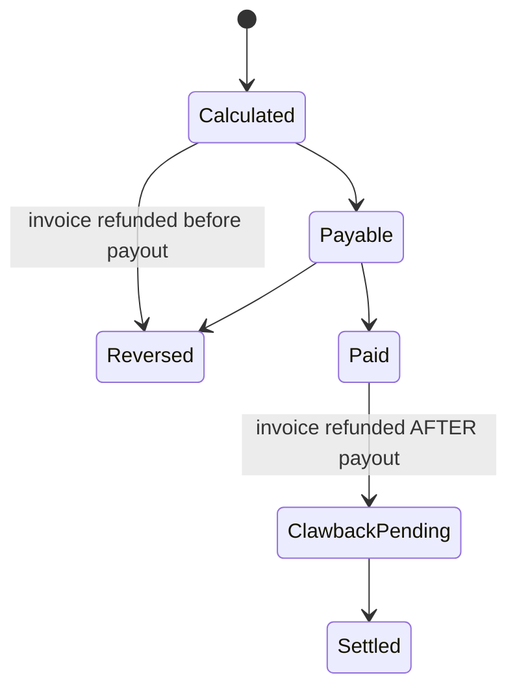

**Forbidden:** `Paid → Reversed` direct (money already moved — must go via `ClawbackPending → Settled`); `Reversed → Paid` (terminal). Only Admin triggers actual payout or clawback settlement.

### Sync Job

States: `Queued` · `Syncing` · `Synced` · `Failed` · `Retrying` · `Abandoned`

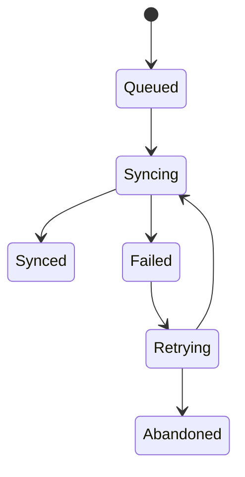

**Forbidden:** `Synced → Syncing` (terminal — a data change creates a new Sync Job, e.g. for an amended report); `Abandoned → Synced` automatic. Entirely system-driven; abandoned jobs should surface on an admin dashboard.

## Business Workflows

### Core Patient Journey (normal, walk-in, online booking, home collection, repeat patient)

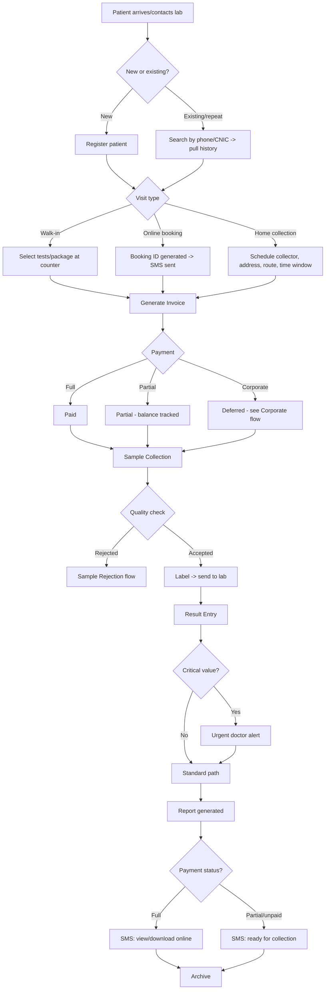

**Key decision points:** patient matching should key on phone/CNIC (typo-tolerant), not name alone. Walk-in and online booking converge into the same Invoice/Booking pipeline — walk-in isn't a lesser path. Home collection needs its own sub-fields (collector, address, route, time window). Payment status ("Partial") gates only what the website shows, not whether service proceeds. Critical-value alerts are additive to the standard release, not a replacement for it.

**Decided — Home collection:** built as part of v1 even though not originally in the client's own requirement list (a vendor-recommended addition) — radius, fee, maximum bookings per day, and scheduling windows are all configurable rather than hardcoded (see Configuration vs. Hardcoded below).

**Decided — Online booking payment:** no upfront payment required. An online booking only reserves a slot; payment is collected at reception or at the point of home collection. A future SaaS deployment can enable deposits as an optional, configurable feature — not built now.

### Exception Flows

**Sample Rejection/Recollection:** rejected sample → immediate recollection if patient on-site, else SMS/call to return; recharge only if patient-caused (fasting not observed), never for lab-side error. Recollection must trace back to the same invoice/booking, never a phantom duplicate.

**Cancelled Test:** cancellation before collection is a simple line-item removal; after collection but before processing, discards the sample and adjusts the invoice; after a result exists, it cannot be "cancelled" — use Refund/Void instead. Commission reverses if it was already calculated. Cancelling one test within a Package needs a repricing rule (see Pricing Engine).

**Refund — decided policy:** if the test was **not yet performed**, refund in full. If the test **was already performed**, no refund. For a **package**, only the cancelled/not-performed portion is refunded, recalculated through the Pricing Engine's repricing rule — never a flat pro-rata split. Results are **never deleted** regardless of refund outcome — a released report is never hidden by a later refund; the medical record stands. Patient-dispute refunds still require Admin approval per the state machine. If commission was already paid before the refund, it routes through the Commission clawback state, not a silent reversal.

**Partial Payments:** result release proceeds regardless of payment status (per client's confirmed no-authorization-gate policy); the website portal is the only thing gated by balance — full balance unlocks the downloadable report, partial shows "ready for collection" only.

**Result Amendment:** a correction always creates a new, versioned Result (`Superseded` + new `Entered→Released` record), never an edit-in-place. **Decided:** an amendment notifies everyone who touched the original — patient (SMS: "your report has been updated"), the referring doctor, the audit log, and the website (new sync push replacing the prior version) — on the principle that everyone who previously received the report should know it changed.

**Partial Report Release — decided:** configurable per lab policy, **defaulting to waiting for the complete report** rather than releasing partial results. Some labs want partial release for long-running tests (e.g., culture, 48h); others never want a partial report in a patient's hands. This is a setting, not a hardcoded behavior — when enabled, the `PartialReady` report carries an "X of Y complete" label and its own SMS, and the final complete report supersedes it via the same amendment mechanism, never as an unrelated new report.

### Corporate Accounts

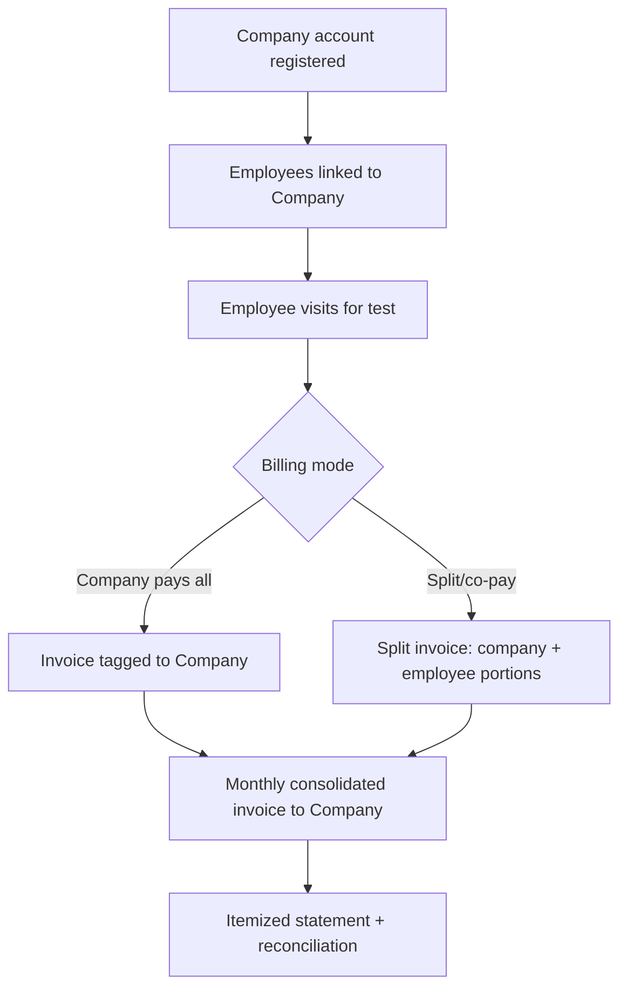

**Decided:** result-sharing policy is configurable **per company contract** — some corporate accounts receive billing-only visibility, others receive full medical reports for their linked employees, set at Company-account level rather than a single global rule.

### Doctor Referrals

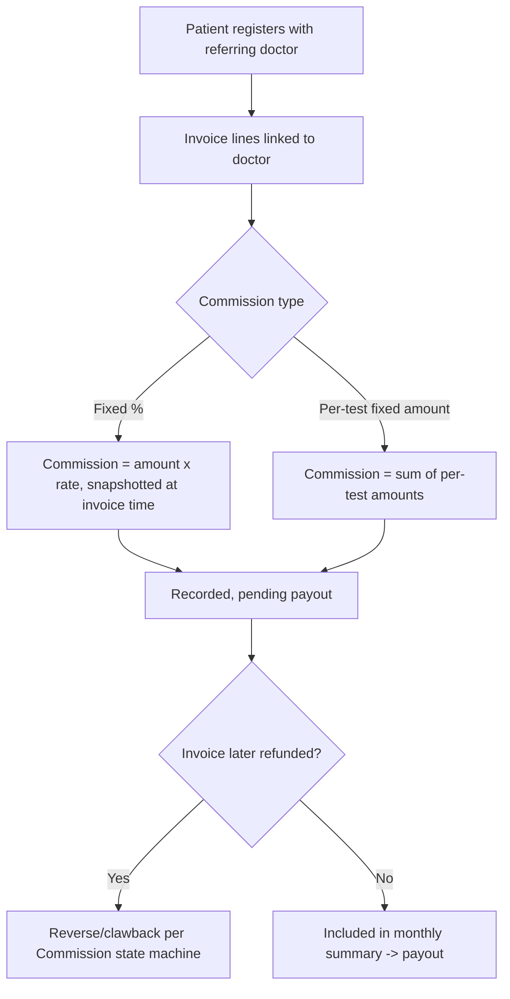

Commission rate is snapshotted at invoice time so a later rate change never retroactively alters historical figures. **Decided:** doctors paying on behalf of patients is not required for v1, but the architecture supports doctor credit accounts as a future extension, with dynamic commission configuration (percentage-based or fixed-amount, per doctor) rather than a single hardcoded model — so a doctor's arrangement (refer-for-commission vs. refer-and-pay) is a configuration choice, not a schema change.

### Package Tests

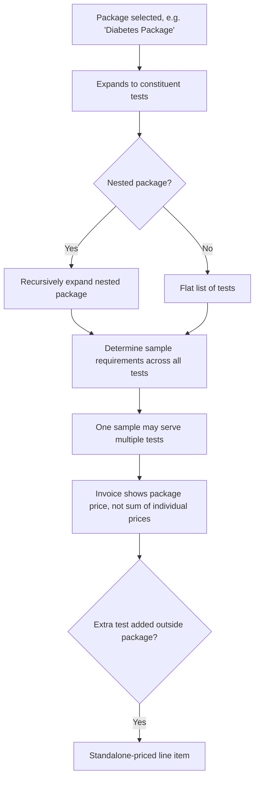

**Decided:** repricing when a package loses one constituent test is a configurable pricing-engine rule (see Pricing Engine below), defaulting to automatic recalculation through the pipeline — never hardcoded as a fixed pro-rata split.

## Pricing Engine

**Principle:** price is never a flat column on a Test row — it's the output of a rule pipeline evaluated at invoice time and then snapshotted (so later rule changes never retroactively alter a historical invoice).

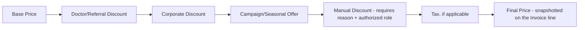

- **Base Price** — the standalone Test or Package price from the catalog.
- **Doctor/Referral Discount** — if the referring doctor has a negotiated patient discount (distinct from their own commission — these are two separate numbers, not opposite sides of the same one).
- **Corporate Discount** — rate agreed with a linked Company account.
- **Campaign/Seasonal Offer** — time-boxed promotional pricing (e.g., a "Ramadan Offer"), configured with a start/end date so it naturally expires rather than needing manual removal.
- **Manual Discount** — a staff-applied override, which should require a reason code and be limited to a role (Admin, or Reception up to a configured ceiling) — this is an audit-log entry, not a silent price edit.
- **Tax** — applied last if/when applicable (not currently required to be modeled with a specific rate — flagged as configuration, see `02_Technical_Architecture.md § Feature Flags`/Configuration below).
- **Package repricing on partial cancellation — decided:** removing one test from a package triggers automatic recalculation through this same pipeline (not a flat pro-rata split, and not hardcoded) — configurable per package if a specific package needs a different rule (e.g., a minimum-tests-remaining threshold to keep the package rate).

## Database Design

**Engine:** PostgreSQL, self-hosted. Chosen over SQL Server (licensing cost conflicts with one-time-purchase model), MySQL/MariaDB (weaker constraint/integrity guarantees), and SQLite (fine for an embedded cache, not for multi-user concurrent operational data).

**Multi-tenancy pattern:** every operationally-scoped table carries `tenant_id` and (once multi-branch is active) `branch_id`. Fixed to one value for this client, never exposed in the UI — exists so the same schema serves the future SaaS product without a migration.

**Core entities:** `patients`, `doctors`, `tests`, `test_reference_ranges` (with gender/age-band variants and critical thresholds), `packages`, `bookings`, `samples`, `results` (with `amended_from_result_id` for versioning), `invoices`/`payments`, `doctor_commissions` (rate snapshotted at invoice time), `companies`, `users`/`roles`/`permissions`, `audit_log` (append-only), `sync_outbox`, `branches`/`tenants`.

**Key design rules:** no silent overwrites on released results (versioned instead); sample rejection/recollection is a first-class status, not a workaround; commission calculation is snapshotted at invoice time, never retroactively recalculated from a doctor's current rate.

**Backup & recovery:** nightly automated `pg_dump` or continuous WAL archiving for point-in-time recovery, to a separate local disk plus a periodically rotated offsite/external copy. Restore procedure tested at delivery.

## Design Principles (recap, domain-specific)

- Events are past-tense facts, raised through an in-process dispatcher, not commands.
- Every entity's state machine explicitly forbids the transitions that look tempting but are wrong (see each "Forbidden" list above) — these are as important as the allowed transitions.
- Pricing is a pipeline, evaluated once and snapshotted, never a mutable single column.
- Bounded contexts own their models; cross-context needs are met via events, not direct data access.

## Configuration vs. Hardcoded

Business rules that must be configurable, not hardcoded, because they will change without a code deployment:

- SMS retry count and backoff interval
- Commission clearance delay (time between `Calculated` and `Payable`)
- Report/Sample retention period before archival/discard
- Critical value thresholds (per test, per gender/age band)
- Home collection fee, service radius, maximum bookings per day, and scheduling windows
- Feature toggles (Inventory, Machine Integration, WhatsApp, Doctor Portal, Multi-Branch, Analytics)
- Online booking expiry window (time before a `Confirmed` booking becomes `Expired`)
- Partial report release policy (allow/disallow, per test type if needed)
- Corporate result-sharing policy (per company contract)
- Package repricing rule on partial cancellation
- Tax rate, if/when applicable
- Sync interval and max retry counts for Notification/Sync Job

---

**Dependencies:** `01_Product_Specification.md` (business requirements this model implements).
**Related chapters:** `02_Technical_Architecture.md` (infrastructure hosting this domain), `04_Application_Modules.md` (screens/roles interacting with these entities).
**Future extensions:** Inventory as a new bounded context; Analyzer Integration as a new Sample-entry actor ("System" instead of "Lab Tech" for `ResultEntered`); Report Template Engine replacing the current hardcoded report layout.
**Remaining open questions:** none from the original list — see `README.md § Decisions Log` for how each was resolved. Any new business-rule questions that surface during implementation should be added here as they arise.
