# 03 – Core Domain Design

**Purpose:** the domain "Bible" of LabFlow. Core business concepts, invariants, state transitions, workflows, and cross-module business rules belong here.

**Why it exists:** the shared LabFlow product must preserve consistent laboratory behavior across Basic Cloud, Pro Cloud, and Offline / Enterprise. Backend implementation should follow this model unless the domain design is deliberately revised.

**Read this:** before writing or modifying backend business logic, state transitions, billing rules, result workflows, reporting rules, tenant-scoped behavior, or a module that touches another bounded context.

---

## Executive Summary

LabFlow's domain is centered around the laboratory journey:

**Patient → Booking/Visit → Invoice → Sample → Lab Test → Result → Report**

with Doctor, Package, Company, Notification, Tenant, Branch, and other business entities attaching to that journey.

The domain model is shared across product tiers.

A Basic Cloud patient and an Offline / Enterprise patient should not obey different clinical rules merely because their infrastructure is deployed differently.

The codebase already implements a substantial portion of this domain, but this document also contains **accepted target-domain behavior that remains partial or planned**.

Therefore:

> A concept appearing in this document means it belongs to the LabFlow product domain. It does not automatically mean every state, event, workflow, or UI described here is already implemented.

When current code and a domain rule disagree, determine whether:

1. the code contains an implementation defect;
2. the documented rule has been superseded;
3. the rule represents planned behavior not yet implemented.

Update the documentation explicitly rather than silently treating either side as authoritative.

## Domain Model

*Read this first. Every other section assumes these concepts.*

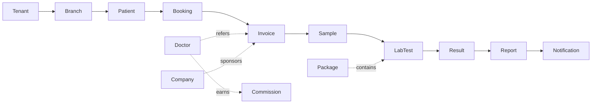

* **Tenant**: a laboratory organization/customer using LabFlow.
* **Branch**: an operational location belonging to a Tenant.
* **Patient**: a person receiving laboratory services, independent of a single encounter.
* **Booking**: intent/scheduling for laboratory service, created through staff or public channels.
* **Visit**: business-language description of a patient's encounter. It is not currently a dedicated persisted entity.
* **Invoice**: financial record containing selected tests/packages, price snapshots, discounts, payment state, and referral information.
* **Payment**: money recorded against an Invoice.
* **Sample**: physical specimen collected for one or more laboratory tests.
* **LabTest / Test**: catalog definition for a laboratory test and its parameters/reference ranges.
* **Package**: commercially sold bundle of Tests.
* **Result**: recorded laboratory result for a Test/Sample, with finalization and amendment history.
* **Report**: patient-facing clinical document assembled from finalized Results.
* **Doctor**: referral source associated with patients/invoices and optionally commission arrangements.
* **Commission / Doctor Share**: amount attributed to a referring doctor according to the commercial arrangement snapshotted at transaction time.
* **Company**: corporate/customer organization sponsoring laboratory services for linked patients/employees.
* **Notification**: persisted outbound communication attempt or delivery record.
* **Sync Job / Outbox Record**: durable unit representing data that must eventually cross a deployment boundary.

These concepts belong to the shared LabFlow domain even when a particular tier does not expose every module.

## Ubiquitous Language / Glossary

One definition per term should be used consistently across documentation, code, APIs, interfaces, and product conversations.

| Term                            | Definition                                                                                                                                                                |
| ------------------------------- | ------------------------------------------------------------------------------------------------------------------------------------------------------------------------- |
| **Tenant**                      | A laboratory organization/customer whose data, configuration, subscription/license, and product entitlements are isolated from other organizations.                       |
| **Branch**                      | A physical or operational location belonging to a Tenant.                                                                                                                 |
| **Patient**                     | A person registered in LabFlow independent of any single visit. Repeat encounters reuse the patient record where matching rules permit.                                   |
| **Visit**                       | Informal business term for one encounter involving some combination of booking, invoice, samples, tests, payments, and report. Not currently a dedicated database entity. |
| **Booking**                     | Request/scheduling record representing intent to receive laboratory services.                                                                                             |
| **Sample**                      | A physical specimen associated with laboratory processing.                                                                                                                |
| **Test / LabTest**              | Catalog definition of a laboratory investigation, including parameters and reference ranges where applicable.                                                             |
| **Test Parameter**              | Individual measurable/reported component of a Test.                                                                                                                       |
| **Reference Range**             | Contextual normal/critical thresholds used to interpret a Test Parameter.                                                                                                 |
| **Result**                      | Recorded clinical values for a Test, progressing from entry to finalization/release and supporting amendment/version history.                                             |
| **Report**                      | Patient-facing document assembled from eligible finalized Results.                                                                                                        |
| **Invoice**                     | Financial transaction containing selected tests/packages, price snapshots, discounts, balances, payment state, referral information, and other billing context.           |
| **Payment**                     | Money received and recorded against an Invoice.                                                                                                                           |
| **Package**                     | Named bundle of Tests sold as a commercial unit.                                                                                                                          |
| **Doctor**                      | Referring clinician/source associated with a patient encounter or invoice.                                                                                                |
| **Commission / Doctor Share**   | Financial amount attributed to a referring Doctor under the arrangement in effect when the transaction occurred.                                                          |
| **Corporate Account / Company** | Organization sponsoring or subsidizing laboratory services for linked patients/employees.                                                                                 |
| **Notification**                | SMS or future outbound communication stored with delivery state and audit information.                                                                                    |
| **Product Entitlement**         | Tenant-level right to use a LabFlow capability based on subscription/license/tier.                                                                                        |
| **Permission**                  | User-level authorization allowing an employee to perform an action.                                                                                                       |
| **Sync Outbox**                 | Durable local/cloud queue representation for data that must be synchronized asynchronously.                                                                               |

Historical wording such as "fixed to one value for this client's deployment" is no longer part of the domain definition.

Tenants and branches are now first-class product concepts.

## Bounded Contexts

Bounded contexts provide logical ownership of domain behavior.

Current code is a modular monolith, so these boundaries are primarily architectural/domain boundaries rather than separate deployed microservices.

| Bounded Context               | Owns / Governs                                                                            |
| ----------------------------- | ----------------------------------------------------------------------------------------- |
| **Tenant / Product Platform** | Tenant, Branch, subscription/license relationship, future feature entitlements            |
| **Patient Management**        | Patient identity, demographics, search/history                                            |
| **Booking**                   | Booking requests, confirmation, check-in, cancellation                                    |
| **Billing**                   | Invoice, InvoiceLine, Payment, pricing/discount logic, Company billing                    |
| **Catalog**                   | Tests, Test Parameters, Reference Ranges, Packages                                        |
| **Laboratory**                | Samples, testing lifecycle, result entry/finalization/amendment                           |
| **Reporting**                 | Report readiness, report generation, print/download history                               |
| **Notification**              | Notification persistence, provider dispatch, retries                                      |
| **Doctor Management**         | Doctors, referral configuration, Doctor Shares/Commissions                                |
| **Analytics**                 | Tenant-scoped management/operational aggregations                                         |
| **Public Portal**             | Public booking, public catalog/rates, report lookup                                       |
| **Sync**                      | Outbox, synchronization jobs, deployment-boundary reconciliation                          |
| **Audit**                     | Cross-cutting record of clinically, financially, and administratively significant actions |

### Current Implementation Note

These boundaries are **not yet fully event-decoupled**.

Current services often call other modules/services directly.

That is acceptable for the existing modular monolith as long as domain ownership remains clear.

## Domain Events

### Product Direction

Domain events remain the preferred long-term mechanism for cross-cutting reactions to completed business actions.

Examples:

```text
Result finalized
    ↓
ResultReleased
    ├── Reporting reacts
    ├── Notification reacts
    ├── Audit reacts
    └── Sync reacts
```

This prevents the Laboratory module from needing hardcoded knowledge of every downstream consumer.

### Current Status

**Designed / not yet implemented as a general event-dispatch system.**

The current codebase contains direct service calls and TODOs around event concepts.

Do not document the event system as operational until a shared dispatcher/outbox pattern actually performs these interactions.

### Event Naming Rule

Events describe facts that already happened and use past tense.

Examples:

* `PatientRegistered`
* `BookingCreated`
* `BookingConfirmed`
* `InvoiceIssued`
* `PaymentReceived`
* `SampleCollected`
* `SampleRejected`
* `ResultEntered`
* `ResultReleased`
* `ResultAmended`
* `ReportGenerated`
* `ReportPrinted`
* `NotificationQueued`
* `DoctorCommissionCalculated`
* `SyncJobQueued`

### Candidate Product Event Catalog

The following represents the desired domain vocabulary rather than guaranteed current implementation:

**Patient**

* `PatientRegistered`
* `PatientUpdated`

**Booking**

* `BookingRequested`
* `BookingCreated`
* `BookingConfirmed`
* `BookingCheckedIn`
* `BookingCancelled`
* `BookingExpired`
* `BookingConverted`

**Billing**

* `InvoiceIssued`
* `InvoiceVoided`
* `InvoiceClosed`
* `InvoiceRefunded`
* `PaymentReceived`
* `PaymentRefunded`
* `PaymentFailed`

**Laboratory**

* `SampleCollected`
* `SampleReceived`
* `SampleAccepted`
* `SampleRejected`
* `SampleRecollected`
* `TestingStarted`
* `SampleTestingCompleted`
* `ResultEntered`
* `ResultReleased`
* `ResultAmended`
* `ResultVoided`
* `CriticalValueDetected`

**Reporting**

* `ReportGenerated`
* `ReportReady`
* `ReportAmended`
* `ReportPrinted`
* `ReportDownloaded`
* `ReportArchived`

**Notification**

* `NotificationQueued`
* `NotificationSent`
* `NotificationFailed`
* `NotificationAbandoned`

**Doctor**

* `DoctorCommissionCalculated`
* `DoctorCommissionReversed`
* `DoctorCommissionPaid`
* `DoctorCommissionClawbackRequested`
* `DoctorCommissionClawbackSettled`

**Synchronization**

* `SyncJobQueued`
* `SyncJobCompleted`
* `SyncJobFailed`
* `SyncJobAbandoned`

## State Machines

State-machine definitions below describe both current behavior and intended mature product behavior.

Every state machine explicitly states implementation status.

### Booking

States represented in the current domain include:

`PENDING_REVIEW` · `CONFIRMED` · `CHECKED_IN` · `CONVERTED` · `EXPIRED` · `CANCELLED`

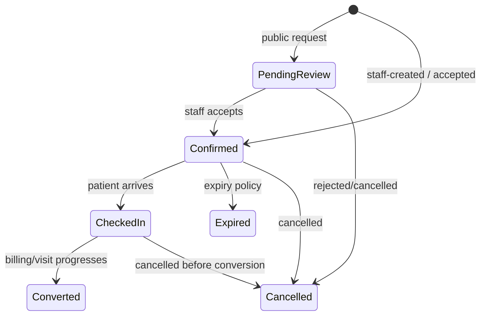

### Current Implementation

Implemented operations include:

* create booking;
* public `PENDING_REVIEW` booking;
* confirm;
* check in;
* cancel.

`EXPIRED` exists in the model but automatic expiry processing is not currently implemented.

### Target Rules

| From                | To            | Actor/Permission             | Status                 |
| ------------------- | ------------- | ---------------------------- | ---------------------- |
| *(new)*             | PendingReview | Public booking endpoint      | Implemented foundation |
| *(new)*             | Confirmed     | Authorized staff             | Implemented            |
| PendingReview       | Confirmed     | Authorized staff             | Implemented            |
| PendingReview       | Cancelled     | Authorized staff             | Implemented            |
| Confirmed           | CheckedIn     | Authorized staff             | Implemented            |
| Confirmed           | Expired       | System/background job        | Planned                |
| Confirmed/CheckedIn | Cancelled     | Authorized staff             | Implemented            |
| CheckedIn           | Converted     | Billing/application workflow | Partial                |

**Forbidden target behavior:** cancelled or expired bookings must not silently become active again. Re-entry should occur through an explicit new/rebook workflow.

### Invoice

Current invoice states include concepts equivalent to:

`DRAFT` · `ISSUED` · `VOIDED` · `CLOSED` · `REFUNDED`

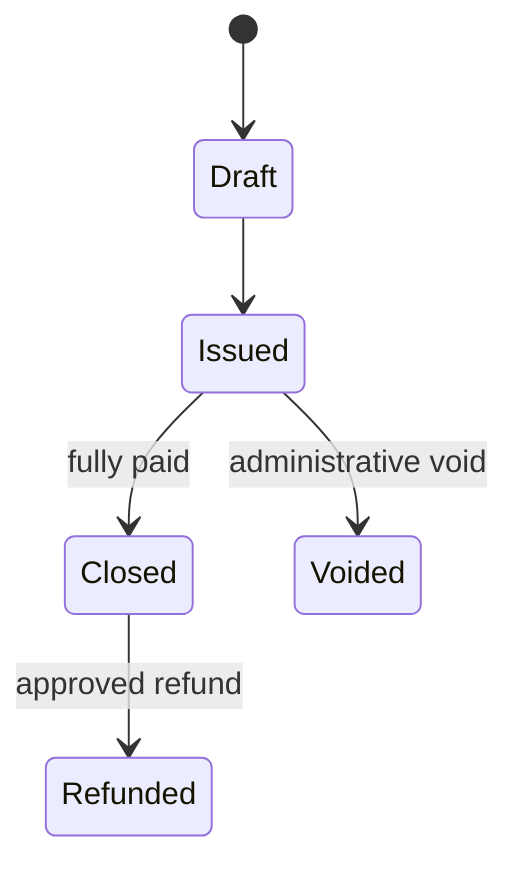

### Current Implementation

Implemented:

* invoice creation;
* line-item price snapshots;
* manual discounts;
* partial/full payment tracking;
* automatic paid/closed-style financial state behavior.

Partial/scaffolded or planned:

* complete invoice void workflow;
* complete refund workflow;
* approval/audit behavior around high-risk corrections.

Enum/state representation is not proof that a working UI/API workflow exists.

### Target Rules

* an invoice with collected money should not simply be deleted;
* financial corrections must retain history;
* refunds and voids require explicit authorization;
* refund state must reconcile Payment and Doctor Share behavior;
* significant actions must create audit records.

### Payment

Payments currently exist as individual records associated with invoices.

The financial business state of an invoice is derived from recorded amounts and balances.

### Implemented

* record payment;
* partial payment;
* full payment;
* multiple represented payment methods;
* outstanding balance calculation.

### Planned / Hardening

* refund processing;
* void/reversal workflow;
* concurrency-safe payment-total updates;
* stronger financial audit trail;
* future gateway/provider processing.

### Financial Invariant

The source of truth must remain reconcilable from payment records.

Two concurrent payment operations must not be allowed to corrupt invoice totals.

### Sample

The schema/domain contains a richer sample lifecycle including states such as:

`PENDING_COLLECTION` · `COLLECTED` · `IN_TRANSIT` · `RECEIVED_AT_LAB` · `ACCEPTED` · `REJECTED` · `RECOLLECTED` · `IN_TESTING` · `COMPLETED` · `DISCARDED`

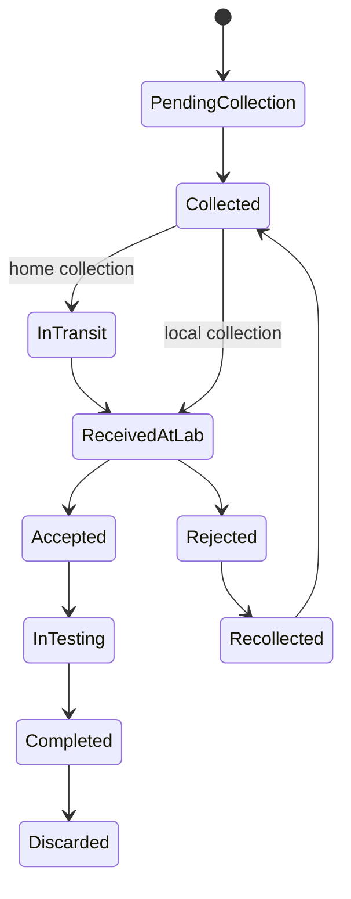

### Current Implementation

Substantial workflow exists for:

* collecting;
* receiving;
* accepting;
* rejecting;
* starting testing;
* outsourcing/un-outsourcing;
* sample viewing/search.

Some richer states and transitions such as systematic recollection, transit, completion/disposal policy are not yet complete end-to-end workflows.

### Target Rules

* rejected samples cannot silently become accepted without an explicit corrective action;
* collection/recollection history should remain traceable;
* physical sample status must not be inferred solely from result state;
* branch/tenant ownership must remain consistent.

### Result

Core states:

`ENTERED` · `RELEASED` · `SUPERSEDED` · `VOIDED`

The old assumption that entry automatically equals release is **superseded**.

Current LabFlow explicitly separates result entry from finalization.

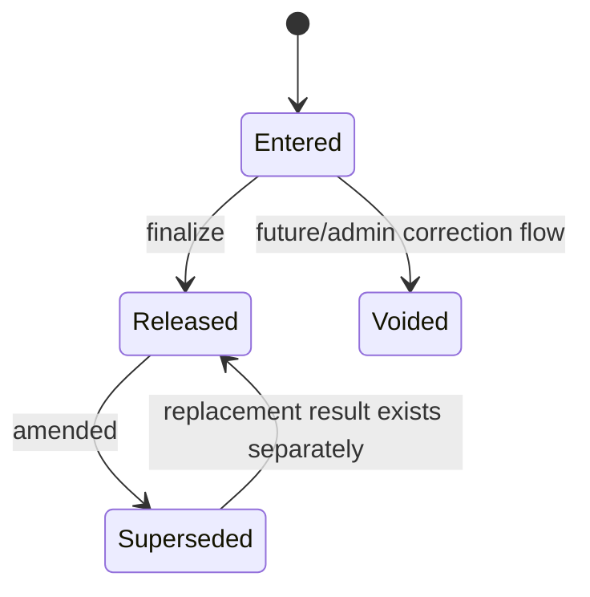

### Implemented

* result entry;
* multiple result values/parameters;
* range comparison;
* abnormal flags;
* critical flags;
* save before finalization;
* explicit finalize;
* reopen;
* amend;
* old-result supersession.

### Required Domain Invariants

Before a result can be considered clinically released:

* the Test must belong to the relevant patient/invoice/sample context;
* required Test Parameters must be satisfied;
* result values must belong to the correct Test definition;
* finalization must operate on internally trusted relationships rather than accepting arbitrary ID combinations from the client;
* amendment must preserve the previous released record;
* patient-facing reporting must use the current released version rather than superseded values.

Some of these invariants require additional code hardening.

### Result Amendment

A correction must create or preserve version history.

Conceptually:

```text
Released Result v1
      ↓ amendment
Superseded Result v1
      +
Released Result v2
```

Never silently overwrite a previously released clinical result.

Future event/audit/notification behavior should ensure relevant recipients and systems can identify that a report was amended.

### Report

Current report statuses include concepts around:

* pending;
* partial readiness;
* complete;
* amended.

Report readiness derives from laboratory result state.

### Implemented

* report readiness calculation;
* PDF generation;
* finalized-result requirement;
* payment-gated public availability;
* staff printing;
* print/reprint tracking;
* amendment foundations.

### Current Hardening Requirement

Patient-facing generated reports must contain **only the current applicable released results**.

Superseded results belong to internal history and must not appear as duplicate active results in the current patient report.

### Partial Reports

The domain supports the idea of partial readiness.

Full configurable partial-release behavior remains **planned/partial**.

Until configurable release policy exists, documentation/UI must not imply that every `PARTIAL_READY` state is automatically patient-releasable.

### Notification

Notification states represented by the product include queued/delivery/failure concepts.

### Current Implementation

* Notification persistence;
* provider send attempts;
* success/failure state;
* attempt/error information;
* SMS integration.

### Planned State Lifecycle

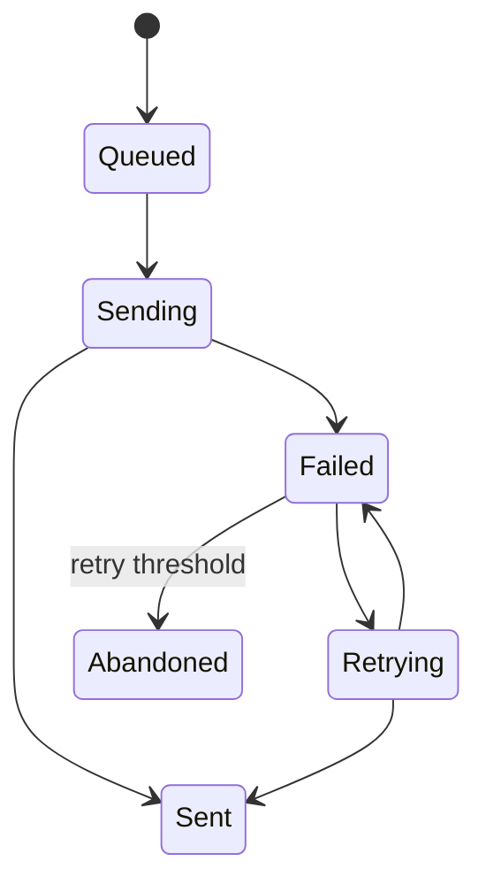

The automatic dispatcher/retry worker is not yet implemented.

Network communication should ultimately happen after the local business transaction succeeds.

### Commission / Doctor Share

Current implementation supports doctor/referral financial calculation.

Implemented commercial forms include:

* percentage-based share;
* fixed share;
* per-test fixed arrangements.

The applicable amount/rate is snapshotted so later configuration changes should not retroactively alter historical transactions.

### Implemented

* doctor records;
* referral association;
* commission/share configuration;
* calculation;
* stored historical amounts;
* doctor dashboards/statements.

### Planned / Partial

* payable lifecycle;
* payout processing;
* reversal;
* refund-related clawback;
* settlement audit.

### Sync Job

`SyncOutbox` exists as schema groundwork.

A complete Sync Job state machine is **designed, not implemented**.

Target states may include:

`QUEUED` · `PROCESSING` · `COMPLETED` · `FAILED` · `ABANDONED`

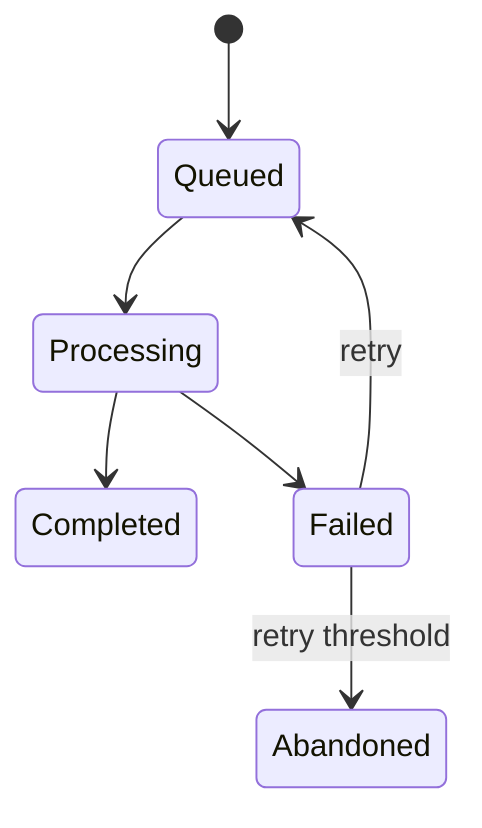

Production implementation must additionally support:

* idempotency;
* tenant identity;
* payload versioning;
* timestamps;
* retry counters;
* last error;
* authentication;
* reconciliation.

## Business Workflows

### Core Patient Journey

The shared conceptual journey remains:

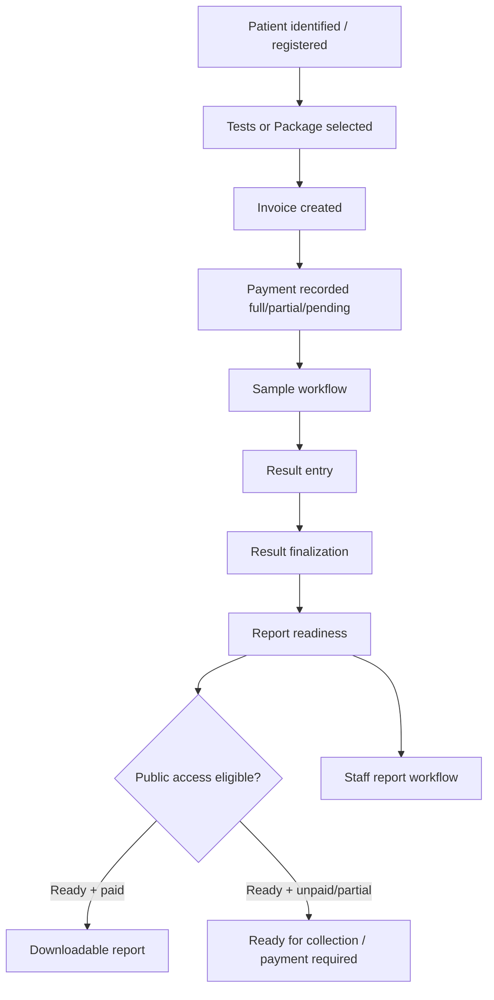

A Booking may precede invoicing, especially for:

* public online booking;
* scheduled work;
* future home collection.

A walk-in operational flow may proceed directly through registration and invoice creation without requiring the user experience to expose every theoretical domain step.

### Walk-In

1. search for existing Patient;
2. register if necessary;
3. choose Tests/Package;
4. optionally choose referring Doctor;
5. apply allowed discount;
6. create Invoice;
7. record payment if collected;
8. create/collect Sample;
9. enter Results;
10. finalize Results;
11. mark/report readiness;
12. print or expose report according to business rules.

### Repeat Patient

Patient identity is reused.

A repeat visit must create new transactional records rather than mutating historical invoice/sample/result/report records.

A future "book again" UX may preload previous selections but must produce a new transaction.

### Online Booking

Current public website can create a booking request.

Target journey:

```text
Patient submits request
       ↓
Pending Review
       ↓
Staff confirms
       ↓
Patient arrives/checks in
       ↓
Normal billing/laboratory journey
```

For Offline / Enterprise, future hosted booking synchronization must enter through a controlled queue/review boundary rather than unrestricted public writes to the local operational database.

### Home Collection

Home-collection fields and concepts exist in the domain/schema.

The complete product workflow is **partial/scaffolded**.

Target workflow eventually includes:

* address;
* scheduling window;
* collection fee;
* service-area rules;
* assigned collector;
* collection status;
* transit/receipt;
* possible route planning;
* failed/recollection scenarios.

Do not describe Home Collection as operationally complete until these pieces exist across backend and user interfaces.

### Payment & Report Access

Clinical result finalization is distinct from patient online report access.

The patient-facing public rule currently aims for:

```text
Result finalized?
    no  → Not ready
    yes ↓

Invoice fully paid?
    no  → Ready for collection / payment required
    yes → Report available
```

The medical record must not be deleted or historically rewritten merely because payment status changes later.

### Exception Flows

#### Sample Rejected

Target behavior:

* retain rejection reason/history;
* prevent normal testing progression from pretending the rejected specimen remained valid;
* support future recollection;
* optionally notify patient/staff.

Recollection workflow is not yet fully implemented.

#### Test Cancelled

A complete product cancellation/refund workflow remains planned.

The final design must coordinate:

* test state;
* sample work already performed;
* refund eligibility;
* package repricing;
* doctor share/commission;
* report history;
* audit records.

#### Refund

The domain direction is:

* refund/void must be explicit;
* money movement must remain auditable;
* completed clinical results must not disappear merely because a refund occurs;
* doctor financial effects must be reconciled rather than silently edited.

Exact refund-policy configuration and UI remain to be completed.

#### Result Amendment

Implemented foundation:

* reopen/amend;
* supersede old result;
* release replacement.

Target completion:

* complete audit attribution;
* public report replacement;
* appropriate patient/doctor notification;
* clean version history.

#### Partial Report Release

The concept belongs to the product.

Policy should eventually be configurable by tenant/laboratory.

The current implementation should not be described as a finished configurable partial-release system.

## Corporate Accounts

Corporate Accounts belong to the LabFlow product domain but are currently **partial/scaffolded**.

Schema foundations include Company and patient/company relationships.

Target workflow:

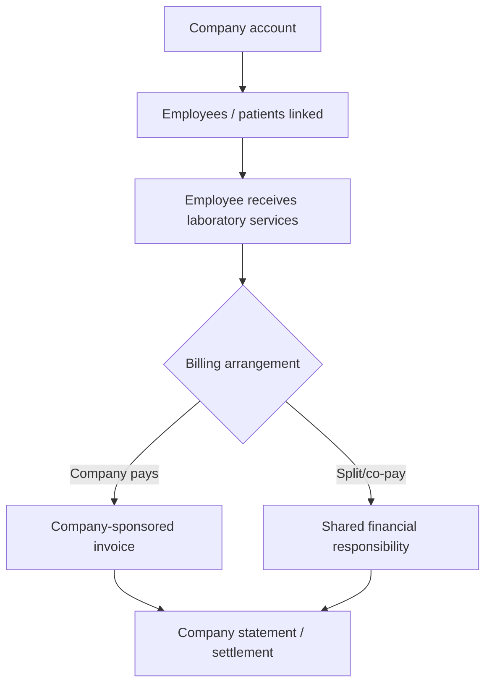

Future corporate product behavior may include:

* contracted rates;
* employee eligibility;
* company-paid services;
* patient co-pay;
* monthly statements;
* credit limits;
* company-specific result-sharing policy;
* account reconciliation.

These workflows are **not currently implemented end-to-end**.

Corporate data models must remain tenant-scoped.

## Doctor Referrals

Doctor referral functionality is substantially more mature.

Current flow:

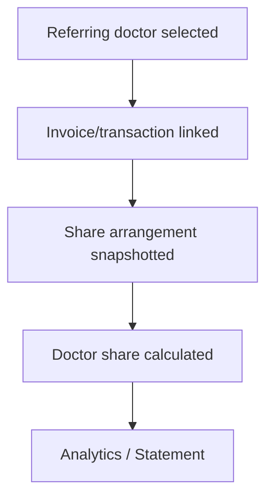

Current implementation includes:

* doctor management;
* doctor selection during operational workflow;
* multiple share/commission models;
* historical snapshot;
* analytics;
* statement PDF.

Future completion includes payout/reversal/clawback lifecycle and related audit controls.

A doctor's commission and any patient discount must remain separate business concepts.

## Package Tests

Packages are currently **catalog/billing foundations**, not a complete laboratory workflow.

Current behavior supports:

* creating/managing packages;
* associating tests with a package;
* selecting a package in billing;
* storing a package invoice line.

The current implementation does **not yet reliably perform the complete operational expansion required for laboratory processing/reporting**.

Target package workflow:

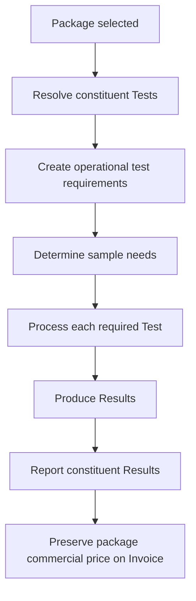

### Required Invariants

* package selection must create operational test obligations;
* every constituent test must be processable in Laboratory workflow;
* report readiness must account for package tests;
* invoice can retain package commercial presentation;
* package composition/rates at transaction time must not retroactively mutate historical invoices;
* nested package support, if retained as a product requirement, must prevent cycles;
* cancellations require explicit repricing rules.

Package expansion is a high-priority gap because catalog/billing visibility without laboratory expansion creates a misleading "implemented" state.

## Pricing Engine

The long-term product supports a pricing pipeline, but today's code implements only part of it.

### Current Implemented Pricing Foundation

Current invoice creation supports concepts including:

* catalog base price;
* invoice-line price snapshot;
* manual discount;
* discount reason;
* doctor share/commission calculated separately.

Conceptually today:

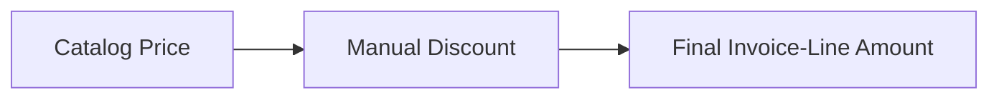

### Target Product Pricing Engine

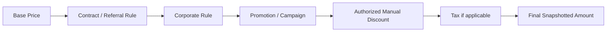

Potential layers include:

* base Test/Package price;
* doctor/referral patient pricing arrangement;
* corporate contract price;
* promotion/campaign;
* manual override;
* tax where applicable.

### Pricing Rules

* final transactional values are snapshotted;
* changing a catalog price must not alter historical invoices;
* a doctor's commission is not simply the inverse of a patient discount;
* manual discount authority should be permission/configuration controlled;
* significant overrides should be auditable;
* package repricing must use explicit product rules rather than accidental arithmetic;
* tenant configuration may influence pricing behavior.

Do not describe the complete pipeline as implemented until each rule layer exists.

## Database Design

**Current engine:** PostgreSQL through Prisma.

PostgreSQL remains appropriate across LabFlow's product models.

### SaaS

Hosted deployments use tenant-aware PostgreSQL infrastructure managed by the platform.

The exact hosting/service provider is an infrastructure decision, not a domain-model change.

### Offline / Enterprise

Local PostgreSQL remains the authoritative operational store.

### Core Entity Families

The schema currently contains or anticipates entities for:

* tenants;
* branches;
* users;
* patients;
* bookings;
* doctors;
* tests;
* test parameters;
* reference ranges;
* packages;
* package items;
* invoices;
* invoice lines;
* payments;
* samples;
* results;
* result values;
* reports;
* doctor shares/commissions;
* companies;
* patient-company relationships;
* notifications;
* audit logs;
* sync outbox;
* feature flags;
* configuration;
* cash shifts.

### Important Rule

> Schema presence means the domain has been anticipated. It does not prove the corresponding business workflow is complete.

Examples:

* `Company` does not mean Corporate Billing is complete.
* `SyncOutbox` does not mean synchronization is running.
* `FeatureFlag` does not mean product entitlement enforcement is running.
* refund enum values do not mean refund processing exists.
* reserved Role values do not mean those roles are active.

### Multi-Tenancy

Operational records should remain tenant-scoped.

Branch-scoped records should additionally preserve branch context.

Future SaaS hardening must ensure tenant isolation is enforced at every access path, not merely represented as columns.

### Clinical History

Previously released clinical information must not be destructively replaced.

Amendments must preserve history.

### Financial History

Historical invoices/payments must remain reconstructable from stored transaction records and snapshots.

## Design Principles (recap, domain-specific)

* Product tiers share domain rules wherever deployment differences do not require different behavior.
* Tenant boundaries are business boundaries, not UI filters.
* Result entry and result finalization are separate operations.
* Released clinical information is versioned/amended rather than silently overwritten.
* Historical prices and doctor-share calculations are snapshotted.
* Schema scaffolding must not be confused with completed product workflow.
* Product entitlement and employee permission are separate concepts.
* Bounded contexts own their rules even while implemented within a modular monolith.
* External reactions should progressively move toward event-driven boundaries where that improves decoupling.
* State transitions should be explicit for clinically or financially important workflows.
* Business invariants must be enforced server-side.

## Configuration vs. Hardcoded

The following categories should progressively become configurable rather than customer-specific code forks:

* tenant branding;
* branch configuration;
* product entitlements;
* enabled operational modules;
* SMS provider credentials;
* message templates;
* SMS retry policy;
* report layout settings;
* letterhead margins;
* critical thresholds where clinically appropriate;
* home-collection pricing/service rules;
* booking-expiry rules;
* partial-report policy;
* corporate account policies;
* pricing/discount authority;
* doctor-share arrangements;
* package behavior where configuration is appropriate;
* tax rules if introduced;
* synchronization interval/retry;
* data-retention policy;
* backup policy;
* licensing/offline grace policy for Offline / Enterprise.

Configuration must not be used to weaken mandatory security or clinical-integrity rules.

---

**Dependencies:** `01_Product_Specification.md` defines the product requirements and `10_Product_Tiers_and_SaaS_Scope.md` defines the commercial/deployment model.

**Related chapters:** `02_Technical_Architecture.md` defines infrastructure supporting this domain; `04_Application_Modules.md` defines user-facing surfaces; `12_RBAC_and_Operator_Dashboard.md` defines current permission implementation.

**Current implementation summary:** patient, billing, payment, test catalog, sample processing, result entry/finalization/amendment foundations, reporting, doctor/referral calculations, analytics, booking foundations, notifications, tenant/branch schema foundations, and related operational modules are substantially implemented. Packages, corporate workflows, complete refunds, audit, event dispatching, sync, configurable partial reports, background notification processing, and several richer state transitions remain partial or planned.

**Future extensions:** analyzer integration, inventory/reagent domain, richer corporate billing, expanded portals, advanced pricing, product entitlements, synchronization, additional communication channels, and other reusable bounded contexts as LabFlow expands.

**Remaining open questions:** new business rules should be added here as explicit product-domain decisions. Implementation status must be updated when a planned workflow becomes operational.
