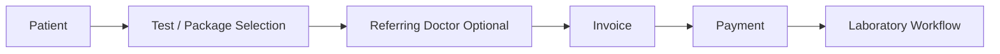

# 04 – Application Modules

**Purpose:** describes the user-facing product surface of LabFlow: modules, screens, role/permission experiences, public interfaces, and how product capabilities are exposed to users.

**Why it exists:** translates the domain rules in `03_Core_Domain_Design.md` into actual workflows and product surfaces while remaining compatible with Basic Cloud, Pro Cloud, and Offline / Enterprise.

**Read this:** when building or reviewing a screen, adding navigation, introducing a role, assigning permissions, adding a tier-specific capability, or deciding where a new product feature belongs.

---

## Executive Summary

LabFlow uses a shared application/module model across product tiers.

The internal staff application is browser-based and should expose capabilities according to:

1. the Tenant's product entitlements;
2. the User's permissions;
3. relevant operational context.

A user's interface should therefore be derived from capability, not hardcoded assumptions about one historical laboratory's staffing structure.

The current codebase contains substantial operational modules including Patient Management, Visit/Billing, Laboratory, Reporting, Catalog, Doctors, Settings, Analytics, Operator Dashboard, and Cash Shift. The independent public website was extracted to `zaighaumrana/labwebsitedemo` on 2026-10-01 and is outside this workspace.

Some modules described in the LabFlow product architecture, including Corporate Accounts, full Home Collection, notification administration, SaaS tenant administration, tier entitlement management, synchronization administration, and backup administration, remain partial or planned.

## UI/UX Principles

* **Speed over decoration.** Daily operational workflows should minimize unnecessary navigation.

* **Workflow continuity.** Common journeys such as patient selection → tests → invoice → payment should feel like one transaction rather than unrelated screens.

* **Permission-aware UI.** Navigation and actions should reflect backend permissions, but frontend hiding is never a substitute for backend authorization.

* **Entitlement-aware UI.** A tenant should not see or use a product module that its subscription/license does not include once entitlement enforcement is implemented.

* **Operational clarity.** Important payment, sample, result, report, and booking states should be visible without opening several screens.

* **Clinical visibility.** Abnormal and critical values must be visually distinguishable and should never depend solely on color.

* **Keyboard-friendly operation.** High-volume staff workflows should support efficient keyboard use.

* **Scanner/device readiness.** Future barcode/device workflows should integrate without redesigning core screens.

* **Responsive public experience.** Public pages should work well on mobile devices and low-bandwidth connections.

* **Configurable branding.** Tenant-facing/public branding should come from configuration rather than customer-specific frontend forks.

* **Shared product UI.** Basic Cloud, Pro Cloud, and Offline / Enterprise should reuse the same product components wherever possible.

* **Localization readiness.** English is currently the implemented language. Product architecture should permit localization without rewriting modules.

## Application Access Model

The user-facing product should eventually evaluate:

```text
Tenant exists and is active
        ↓
Subscription / License valid
        ↓
Feature entitlement enabled
        ↓
User authenticated
        ↓
User permission allows action
        ↓
Module / Action available
```

The current implementation already provides:

* authentication;
* ADMIN/LAB_OPERATOR role bundles;
* granular permissions;
* protected backend routes;
* frontend permission-based routing/navigation.

Full tier entitlement enforcement remains a platform requirement.

## Patient Management

### Current Implementation

Patient functionality includes:

* patient search;
* patient registration;
* patient updating;
* phone/CNIC information;
* demographic information;
* internal laboratory identifiers;
* patient list/detail foundations;
* reuse of existing patient records across visits.

### Product Direction

Patient Management should eventually additionally support:

* richer patient history;
* duplicate resolution;
* configurable identity/matching rules;
* patient-company relationships;
* branch-aware history;
* import/export;
* eventual patient account/portal linkage.

Patient records belong to the Tenant and must not be recreated merely because the same Patient returns for another Visit.

## Reception / Visit Workflow

The historical term "Reception Workflow" now represents the broader **front-office/visit workflow**.

It may be performed by different roles depending on the tenant's staffing model.

The currently active `LAB_OPERATOR` bundle performs much of this workflow.

### Current Screens / Capabilities

* Patient search/register
* Test/package selection
* Referring-doctor selection
* Manual discount entry/reason
* Invoice creation
* Payment recording
* Booking actions
* Current patient/invoice context

### Current Operational Journey



### Repeat Patient

The product should allow staff to reuse an existing Patient and create a new transaction.

A future convenience action may preload previous test selections, but previous invoices/results must remain historical records rather than being reused or mutated.

### Booking Workflow

Backend/public booking foundations exist.

Current booking capabilities include:

* create;
* view;
* confirm;
* check in;
* cancel;
* public `PENDING_REVIEW` creation.

A dedicated mature booking-management/review experience is still evolving.

Automatic booking expiry remains planned.

### Home Collection

Home-collection data concepts exist, but the complete user workflow is not yet implemented.

Future module requirements include:

* address;
* service area;
* preferred date/window;
* collection fee;
* assigned collector;
* status tracking;
* route/scheduling support where commercially required.

Do not present Home Collection as complete merely because fields exist in a booking record.

## Billing & Payments

### Current Implementation

Billing supports:

* Test selection;
* Package invoice-line selection;
* price snapshots;
* manual discounts;
* discount reasons;
* invoice creation;
* payment recording;
* full/partial/outstanding balance;
* multiple represented payment methods;
* invoice PDF generation.

### Current Gap

Package billing exists before full package laboratory expansion is complete.

Therefore the UI must eventually ensure package selection produces actual constituent laboratory work.

### Planned Product Expansion

* complete refund workflow;
* invoice void workflow;
* approval controls;
* richer pricing rules;
* Corporate billing;
* split/co-pay arrangements;
* payment-provider integrations;
* financial audit history.

## Laboratory Workflow

The Laboratory module handles physical sample processing and clinical result entry.

### Sample Workflow

### Current Implementation

Staff can work with sample operations including:

* view/search;
* collect;
* receive;
* accept;
* reject;
* start testing;
* outsource;
* remove outsourcing status;
* mark relevant workflow readiness through current service actions.

Outsourcing can capture external-lab and cost information.

### Planned / Partial

* full recollection flow;
* complete in-transit workflow;
* barcode generation;
* label printing;
* scanner-driven confirmation;
* retention/discard processing;
* advanced multi-sample requirements.

### Result Entry

Current result-entry functionality includes:

* parameter/value entry;
* reference ranges;
* abnormal flags;
* critical-value handling;
* save result;
* explicit finalize;
* reopen;
* amend.

The old "single-step release" UI rule has been superseded.

Current workflow is conceptually:

```text
Enter values
    ↓
Save Result
    ↓
Finalize Result
    ↓
Released / Report Eligible
```

### Clinical UX Rules

The UI should prevent accidental release as much as practical, but backend validation remains authoritative.

The UI must progressively ensure:

* required parameters are visible;
* missing data is obvious;
* abnormal/critical indicators are prominent;
* amendment clearly differs from normal editing;
* finalized state is visible;
* historical/superseded results are not presented as current active values.

## Reporting Module

Reporting converts eligible clinical results into patient-facing output.

### Current Implementation

* report readiness;
* report PDF generation;
* plain-paper mode;
* letterhead mode;
* configurable margins;
* continuous report layout;
* one-test-per-page layout;
* report viewing;
* printing;
* print count/history;
* reprint tracking;
* public PDF endpoint foundation;
* payment-gated public availability.

### Result/Report Relationship

Only the current applicable finalized/released result version should appear as current report content.

Superseded result versions belong to historical/amendment records.

### Payment Rule

Public access differs from clinical readiness.

Conceptually:

```text
Results not finalized
    → Report not ready

Results finalized + balance remaining
    → Ready / collection or payment message

Results finalized + fully paid
    → Eligible public report access
```

Internal staff printing policy may be controlled separately according to product/business requirements.

### Partial Reporting

Partial readiness exists as a domain concept.

Full configurable partial-release policy remains partial/planned.

## Admin Portal

The Admin experience is the management surface of a LabFlow tenant.

The current ADMIN role is a superuser.

### Current Implemented Admin Areas

#### Dashboard / Analytics

* financial overview;
* operational metrics;
* business insights;
* test analytics;
* doctor-share analytics;
* outsourcing analytics;
* date filtering;
* graphical visualizations.

#### User Management

* user creation/update foundations;
* role assignment.

**Important:** the current backend only activates permission bundles for:

* `ADMIN`;
* `LAB_OPERATOR`.

Reserved Role enum values must not be presented as fully usable product roles until their permission bundles are intentionally implemented.

#### Laboratory Settings / Catalog

* Test catalog;
* Test Parameters;
* Reference Ranges;
* Packages;
* Test/package pricing;
* related catalog management.

#### Branding / Printing Settings

* laboratory branding foundations;
* report/print configuration;
* margins/layout options.

#### Doctor Management

* Doctor records;
* share/commission configuration;
* statements;
* doctor analytics.

#### Finance / Operational Management

* invoice/payment visibility;
* management analytics;
* cash-shift information.

### Admin Areas Partial / Planned

* complete refund/void approval;
* audit-log viewer;
* backup management;
* synchronization status;
* SaaS subscription/tier administration;
* tenant entitlement management;
* Corporate Accounts;
* SMS provider/template configuration UI;
* public website CMS;
* advanced branch management;
* notification retry/abandoned queue;
* feature/entitlement administration.

The existence of supporting database entities must not cause these screens to be listed as implemented.

## Operator Dashboard

The Operator Dashboard is an implemented role-specific surface designed for operational staff who should not see management/business analytics.

Current intent includes:

* daily operational visibility;
* recent patients/work;
* quick access to operational modules;
* separation from owner/admin analytics.

This dashboard establishes the pattern for future role-specific home screens.

Future roles may receive their own dashboards without turning the Admin Dashboard into a universal home page.

## Cash Shift Module

Cash Shift is implemented as an operational reconciliation feature.

Current purpose includes:

* opening a shift;
* closing a shift;
* tracking expected versus counted cash;
* historical shift visibility.

Current implementation must continue to be hardened for:

* branch scoping;
* concurrency;
* auditability.

Cash Shift uses the `CASH_SHIFT_MANAGE` permission.

## Doctor Management

### Current Implementation

* doctor records;
* referring-doctor lookup;
* management configuration;
* multiple commission/share approaches;
* analytics;
* statements.

Operational users receive narrow referring-doctor visibility without automatically receiving sensitive commission/business data.

This permission split is intentional.

### Planned

* payout lifecycle;
* reversal/clawback;
* settlement history;
* possible doctor portal.

## Catalog Module

### Current Implementation

* Tests;
* Parameters;
* Reference Ranges;
* Packages;
* pricing/catalog configuration.

Operational staff may receive `CATALOG_VIEW` for test/package selection without receiving `CATALOG_MANAGE`.

This is an important RBAC pattern:

> viewing data required to perform a job is not the same permission as redefining that data.

## Analytics & Insights

Analytics is **implemented**, not planning-only.

Current surfaces include substantial functionality around:

* financial performance;
* operations;
* doctor/referrals;
* Tests;
* outsourcing;
* business insights.

Analytics should eventually become tier-entitled.

For example, Basic Cloud may receive a smaller management view while Pro/Offline Enterprise may receive expanded analytics.

The exact commercial entitlement matrix belongs to Doc 10 and future entitlement configuration, not hardcoded UI forks.

## Notification Module

### Current Backend Foundation

* Notification records;
* SendPK integration;
* delivery/failure information;
* selected automatic SMS triggers.

### Current Missing Admin Surface

There is not yet a complete Notification administration queue with:

* Queued;
* Sending;
* Failed;
* Retrying;
* Abandoned;

management/visibility as described in older documentation.

### Target Product Module

Future Admin notification tooling should provide:

* delivery history;
* failed attempts;
* retry state;
* provider error;
* recipient;
* trigger/source;
* manual retry where appropriate;
* abandoned-message alerts.

Ordinary staff should not need to manually send messages that are meant to arise from business events.

## SMS Module

### Current Implementation

SendPK is the currently implemented SMS provider behind the application's SMS gateway/service boundary.

Provider credentials currently come from deployment/environment configuration rather than a complete Admin settings screen.

### Future Configuration Surface

Potential Admin configuration includes:

* provider;
* credentials;
* sender ID;
* templates;
* enabled triggers;
* retry policy;
* consent behavior.

Future communication channels should reuse Notification architecture rather than being embedded separately inside every module.

## Public Portal (Website)

The public website is maintained independently in `zaighaumrana/labwebsitedemo`. It must never directly access the local API, PostgreSQL, laboratory LAN, filesystem, or locally stored report files. See Doc 07 for the implemented separation and future online service/bridge architecture.

### Legacy Public Pages

The historical combined implementation preserved on `main` and tag `legacy-combined-2026-10-01` included:

* Home;
* About;
* Services;
* Rates;
* Booking;
* Report Lookup;
* Contact.

### Product Direction

The public portal should eventually be tenant-brandable and may include:

* Branches;
* Doctors;
* News/Announcements;
* promotions;
* public catalog/rates;
* CMS-managed informational content.

These additional modules should not be described as currently implemented.

### Current Branding Gap

Any remaining placeholder/development branding such as `LabCare` should be replaced by tenant/product configuration before production productization.

## Online Test Booking

### Local Foundation and Legacy Integration

Local LabFlow retains booking models, services, and staff review/confirmation workflows.

In the legacy combined implementation, the website submitted booking requests and Test selections to the operational backend. That website transport has been removed; future online requests must use the online service and sync/bridge agent.

### Current Limitation

Selected Tests are not yet modeled as a complete mature booking-line subsystem.

The current implementation stores some booking selection context less formally than the final domain requires.

### Target Cloud Behavior

Hosted public booking may directly enter the tenant's managed LabFlow cloud workflow through the public API boundary.

### Target Offline / Enterprise Behavior

```text
Patient Website
    ↓
Hosted Booking Service
    ↓
Booking Queue
    ↓ sync
Local LabFlow
    ↓
Staff Review / Confirmation
```

The public website must never directly access the local API or operational database. The online service and sync/bridge agent shown above are future work.

## Report Lookup

### Future Online Service Direction

The future online service should distinguish report states such as:

* not ready;
* ready for collection/payment;
* available.

Local LabFlow retains report generation and authenticated PDF delivery. No website report endpoint remains in the local API.

### Future Website Integration

The independent website must use an online service contract based on approved synchronized data; it must never fetch report data or files directly from the local installation.

Production UX should use the backend's authoritative eligibility state rather than reconstructing the medical report independently in the browser.

### Security Requirements

* tracking identifier;
* strong secondary verification;
* normalized strict comparison;
* HTTPS;
* rate limiting;
* minimal public data exposure.

Rate limiting and verifier hardening remain implementation work.

## Patient Login

Not currently implemented.

The current model uses per-report lookup rather than full Patient accounts.

A future Patient Portal may provide:

* account authentication;
* report history;
* booking history;
* profile management;
* invoices/payments;
* notifications.

This should be added as a reusable LabFlow product module if commercially justified.

## Corporate Workflow

Corporate Accounts belong to the product roadmap but are **not currently a complete application module**.

Existing schema foundations should eventually support:

* Company setup;
* patient/employee linking;
* contract pricing;
* company-paid invoices;
* split/co-pay;
* consolidated statements;
* reconciliation;
* company-specific result-sharing rules.

Do not expose Corporate as an implemented tier capability until backend rules, UI, financial reconciliation, and permissions are complete.

## SaaS Platform Administration

A SaaS product introduces administrative surfaces beyond an individual laboratory tenant.

These are **planned platform capabilities** and are separate from the laboratory Admin role.

Potential platform/vendor administration includes:

* Tenant creation;
* Tenant suspension/reactivation;
* subscription/tier assignment;
* feature entitlements;
* tenant health;
* usage/limits;
* cloud deployment status;
* billing/subscription information;
* support tooling;
* platform audit;
* tenant impersonation/support access only under carefully controlled audited rules.

A Tenant Admin must not automatically become a LabFlow Platform Admin.

These are separate security domains.

## Branch Management

Branch is a first-class product concept.

Current schema foundations exist, but a complete branch administration product surface remains expandable.

Future functionality may include:

* branch creation/configuration;
* branch-specific branding/contact information;
* branch-specific users;
* branch-specific cash shifts;
* branch-filtered analytics;
* branch report/public information;
* inter-branch operational rules;
* Offline / Enterprise branch synchronization where applicable.

## Product Tier Entitlements

The application must eventually decide module visibility through tenant entitlement.

Illustrative concept only:

| Capability               |  Basic Cloud |   Pro Cloud  | Offline / Enterprise |
| ------------------------ | :----------: | :----------: | :------------------: |
| Patient Management       |       ✅      |       ✅      |           ✅          |
| Billing                  |       ✅      |       ✅      |           ✅          |
| Laboratory Workflow      |       ✅      |       ✅      |           ✅          |
| Reporting                |       ✅      |       ✅      |           ✅          |
| Core Dashboard           |       ✅      |       ✅      |           ✅          |
| Advanced Analytics       | Tier-defined |       ✅      |           ✅          |
| Advanced Roles           | Tier-defined |       ✅      |           ✅          |
| Multi-Branch             | Tier-defined |       ✅      |           ✅          |
| Corporate Accounts       | Tier-defined | Tier-defined |     Tier-defined     |
| Local Offline Server     |              |              |           ✅          |
| Hybrid Sync              |              |              |           ✅          |
| Windows Local Deployment |              |              |           ✅          |

This table is **architectural illustration**, not the final commercial tier matrix.

Final entitlements belong to `10_Product_Tiers_and_SaaS_Scope.md`.

## Future Modules

The following remain product extensions rather than requirements already completed by the current application:

* **Inventory / Reagents**
  consumables, lots, expiry, stock levels, suppliers, consumption;

* **Report Template Engine**
  configurable visual report design beyond current template settings;

* **Doctor Portal**
  referred-patient and financial/statement access under strict permissions;

* **Patient Portal / Mobile App**
  authenticated patient history and mobile workflows;

* **Analyzer Integration**
  machine-to-LabFlow result ingestion;

* **WhatsApp / Email / Push**
  additional Notification channels;

* **Advanced Home Collection**
  scheduling, routing, collector application, service areas;

* **Corporate Portal**
  authorized company-side billing/result functionality;

* **Inventory Forecasting / Advanced Analytics**
  enabled once corresponding source data exists;

* **Platform Administration**
  SaaS tenant/subscription/entitlement control plane;

* **Extension/Plugin Architecture**
  integrations and product ecosystem capabilities where commercially justified.

## Patient Journey (cross-reference)

Detailed business logic belongs in `03_Core_Domain_Design.md`.

This module document defines **where users interact with those rules**.

The UI should never become a second independent implementation of billing, clinical, authorization, or report-eligibility logic.

---

**Dependencies:** `03_Core_Domain_Design.md` defines the business rules these modules expose; `01_Product_Specification.md` and `10_Product_Tiers_and_SaaS_Scope.md` define the product/tier context.

**Related chapters:** `02_Technical_Architecture.md` defines deployment, authorization infrastructure, integrations, public trust boundaries, and background architecture; `12_RBAC_and_Operator_Dashboard.md` defines the current permission implementation.

**Current implementation summary:** Patient Management, Visit/Billing, Laboratory, Reporting, Doctor Management, Catalog, Admin analytics, Operator Dashboard, Cash Shift, Settings, Insights, public informational pages, public booking foundations, and report lookup foundations exist. Corporate, complete Home Collection, barcode/device workflow, Notification Admin, SMS Admin configuration, public CMS, branch administration, SaaS platform administration, entitlement management, backup administration, and synchronization administration remain partial or planned.

**Future extensions:** additional role-specific dashboards, portals, inventory, analyzers, corporate workflows, patient accounts, richer public CMS, advanced device support, SaaS administration, and tier-driven module configuration.

**Remaining open questions:** exact Basic/Pro entitlement boundaries, future role bundles, SaaS platform-admin UX, and detailed module packaging should be resolved through the Product Tiers document and entitlement architecture rather than customer-specific forks.
