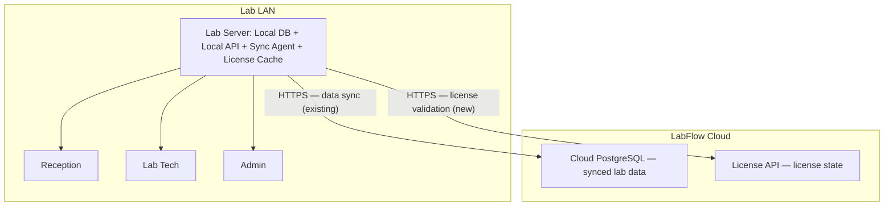
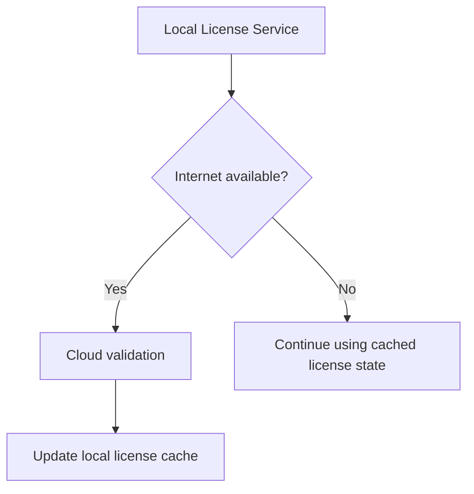

# 09 — LabFlow Licensing & Subscription Architecture

**Purpose:** defines how LabFlow's subscription/license system is intended to work — activation, periodic validation, offline grace behavior, clock-tamper resistance, and the boundary between licensing and cloud sync — so implementation later follows one agreed design instead of ad hoc decisions made module-by-module.
**Why it exists:** LabFlow is sold as a one-year (or similar) subscription on software that is, by design, offline-first (see `02_Technical_Architecture.md § Offline-First Strategy`). Those two facts are in tension unless the licensing model is deliberately designed around the same offline guarantee the rest of the product protects — this document is that design.
**Read this:** before writing any licensing code, cloud licensing API, or license-related UI. If code and this document disagree, this document wins until deliberately revised — same convention as `03_Core_Domain_Design.md`.

**Status: design only, nothing in this document has been built.** No migrations, schema changes, API endpoints, UI, or licensing logic exist yet as a result of this document. It exists so implementation can start from an agreed shape instead of ad hoc decisions per feature, matching the intent already set by `05_Analytics_Architecture.md`. This is a **conceptual/architectural design**, not a database schema or API contract — anywhere this document names a field or state, treat it as "this concept needs to exist," not "build exactly this column."

**Scope correction:** this document applies only to the **offline/self-hosted tier** of the product (see `10_Product_Tiers_and_SaaS_Scope.md`). Everything in this document — the trusted-cloud-timestamp mechanism, clock rollback detection, signed license responses — exists specifically to solve tamper-resistant licensing on hardware the client owns and administers, with no guaranteed connection back to the vendor. That problem does not exist for a cloud-hosted tier: a hosted product's usage/license state lives entirely in infrastructure the vendor controls, so ordinary hosted-SaaS metering and billing apply there, not this document. Read `10_Product_Tiers_and_SaaS_Scope.md` first if you're unsure which tier you're building for.

---

## 1. Purpose

LabFlow is an offline-first laboratory management system, sold on a subscription/license basis — typically a one-year term. The core commercial constraint driving this whole document:

> **Licensing must not depend on continuous internet connectivity**, because the product it's protecting is explicitly built to keep working without it (`02_Technical_Architecture.md § Offline-First Strategy`, `07_Website_Separation_and_Offline_Online_Hybrid.md § 3.4`).

The lab server must remain capable of running LabFlow fully offline, while periodically validating its license with the LabFlow cloud service whenever internet connectivity happens to be available. The system must also be resilient to an incorrect Windows system clock — a realistic condition on lab-server-grade hardware (see §8), not an edge case.

---

## 2. High-Level Architecture

Licensing sits alongside the existing sync relationship already documented in `02_Technical_Architecture.md § Synchronization Strategy` and `07_Website_Separation_and_Offline_Online_Hybrid.md` — it is a **second, independent HTTPS relationship** between the lab server and LabFlow's cloud, not a repurposing of the data-sync channel.



**Licensing is fundamentally server-side.** Workstations do not independently hold or validate a license — they simply use the licensed local server, the same way they're already thin clients of it for every other function (`02_Technical_Architecture.md § Components`, `08_Windows_Packaging_and_Installer_Roadmap.md § 2`). **The Lab Server is the licensed installation.** A license is not per-workstation and is not a concept the workstation Tauri shell needs to know anything about.

---

## 3. License Record (Conceptual)

The following are the pieces of information a license conceptually needs to carry. This is **not a schema** — no table, column names, or types are being decided here; that's a future implementation decision, made when Phase 2/3 (§18) actually begins, informed by whatever the local database and cloud API look like at that time.

Conceptual fields:
- License ID
- Laboratory/tenant ID (ties into the existing `tenant_id` model already present throughout the schema — see `02_Technical_Architecture.md § Multi-Tenant-Ready, Single-Tenant-Deployed`)
- Status
- Activation date
- Expiry date
- Plan
- Last successful validation (timestamp)
- Last trusted cloud timestamp (distinct from "last successful validation" — see §8)
- Grace-period state
- Possibly an installation/server identity (to distinguish which physical server activated the license, relevant if a license is ever moved between machines)

**Conceptual vs. future implementation, explicitly separated:** everything above is the *concept* a license needs to represent. Exact storage (a local table vs. a config/cache file, exact field names, exact types) is deferred to implementation phases in §18 and should be decided then, against the actual codebase at that time — not pre-committed here.

---

## 4. Activation

Intended flow:

1. LabFlow is installed on the lab server (per `08_Windows_Packaging_and_Installer_Roadmap.md § 4`).
2. A license key is entered during activation or first-run setup.
3. The local server contacts the LabFlow cloud licensing endpoint over HTTPS.
4. The cloud validates the license.
5. The cloud returns the license state and a trusted server timestamp (see §8).
6. The local server stores the license state locally (the "license cache" in the architecture diagram above).
7. Workstations simply use the licensed local server — no activation step happens on any workstation.

**The local server must not require an internet connection for every application launch.** Activation is a one-time (or infrequent) event; day-to-day startup reads the local license cache, consistent with the zero-runtime-internet-dependency principle already established for the rest of the product.

---

## 5. Periodic Validation

The local server periodically validates its license with the cloud whenever internet connectivity exists — not on every request, and not on every application launch.



Explicitly:
- Validation is **periodic**, not per-request or per-launch.
- A temporary internet outage must **not** immediately disable the laboratory — this is the same tolerance already accepted for data sync (`02_Technical_Architecture.md § Synchronization Strategy`: "a report appearing on the website a minute or two after release is acceptable"); licensing extends that same tolerance to however long the outage lasts, bounded by the grace period in §7.
- The exact validation interval is left as an implementation decision, to be set when Phase 5 (§18) is built.

---

## 6. Offline Operation

This is the section that most directly protects the product's core commercial promise, and it is treated as a hard requirement, not a preference.

**The following MUST continue working with zero internet connectivity, license validation included:**
- Patient registration
- Patient search/history
- Test ordering
- Billing, discounts
- Sample collection
- Result entry
- Result finalization
- Report generation
- Printing
- All local database operations

Licensing continues operating on the **last trusted local license state** during an allowed offline/grace period (§7). Internet availability is not a prerequisite for normal LMS operation — full stop, no exception carved out for licensing. This list is intentionally the same category of operations already protected by `02_Technical_Architecture.md § Offline-First Strategy`; licensing does not get to be the one thing that breaks this guarantee.

---

## 7. Expiry + Grace Period

Intended commercial behavior, illustrated with an example term (not a real date):

```text
License term:  1 January 2027 → 31 December 2027

Before expiry:
  - normal operation
  - progressively visible renewal warnings as expiry approaches

At expiry:
  - show "Subscription expired / renewal required"
  - do NOT immediately destroy or disable the database
  - allow a short grace period — currently envisioned as approximately 2–3 days

After grace period:
  - normal LMS access is blocked
  - a clear renewal screen is shown
  - data remains intact — database is NOT deleted, reports/data are NOT destroyed
```

The exact grace-period duration is left configurable, not hardcoded into this design.

---

## 8. Clock Tampering / Bad Windows Clock

This deserves particular weight given the deployment environment described in `08_Windows_Packaging_and_Installer_Roadmap.md` — lab-purchased mini-PCs, not managed corporate hardware. A PC in this environment can plausibly have an incorrect system time, a dead/weak CMOS battery, an accidental clock change, or Windows time-sync issues. None of these should be able to either falsely lock out a paying customer or be exploitable as a way to bypass expiry.

**The license system must not depend solely on `current Windows time > expiry date`.**

Instead, the design centers on a **trusted cloud timestamp**: whenever the local server successfully communicates with the cloud, the cloud's response includes its own current timestamp alongside the license expiry and state. The local server stores this as the last trusted cloud timestamp — distinct from, and more authoritative than, the local machine's own clock.

```text
Last trusted cloud timestamp: 28 Dec 2027

If the machine's local clock later reports: 3 Jan 2026
   → the system can detect the local clock has moved backwards
     relative to the last trusted timestamp.
```

When this kind of rollback is detected, the system should **not** silently trust the local clock. The exact response is left as an implementation decision (§18, Phase 7), but must include:
- Detection of the anomaly
- A clear administrative warning (not a silent block, not a silent bypass)
- Cloud revalidation when the network allows it
- Protection against trivially bypassing expiry by winding the Windows clock back

**Explicitly not wanted:** an aggressive, destructive response (e.g. locking out or wiping data the moment a clock anomaly is detected). A miscalibrated CMOS battery is a hardware fact of life in this deployment context, not evidence of fraud, and the response needs to reflect that.

---

## 9. Signed License Responses

Cloud license validation responses should be cryptographically authenticated, so the local server is not trusting arbitrary/spoofable data.

```text
Cloud
  → license state, expiry, trusted timestamp, license identity
  → cryptographic signature over that payload
Local server
  → verifies the signature
  → only then stores the result as trusted license state
```

The local server must not blindly trust a response merely because it arrived over HTTPS — the signature is a second, independent check on top of transport security. No specific cryptographic library or algorithm is prescribed here; that's an implementation decision for Phase 8 (§18).

---

## 10. License State Machine (Conceptual)

Conceptual states, not a coded enum yet:

- **ACTIVE** — normal operation, no restrictions
- **EXPIRING_SOON** — normal operation, renewal warnings visible
- **EXPIRED_GRACE** — within the grace period (§7): a clear "expired, renew" notice shown, but the LMS still functions
- **EXPIRED** — grace period elapsed: normal LMS access blocked, renewal screen shown, data intact
- **SUSPENDED / INVALID** — cloud has explicitly flagged the license (e.g. revoked, fraudulent key) — distinct from a simple time-based expiry
- **CLOCK_ANOMALY** — a rollback per §8 has been detected and not yet resolved via revalidation

Each state's exact behavior (which UI shows, which actions are blocked) is intentionally left conceptual here — this section exists to establish that these are the states that need to exist and be reasoned about, not to fully specify the state machine's implementation.

---

## 11. Cloud Database vs. Licensing

These are two different systems and must stay architecturally separate:

- **Cloud PostgreSQL** may contain synchronized laboratory data — this is the existing sync relationship from `02_Technical_Architecture.md § Synchronization Strategy` and `07_Website_Separation_and_Offline_Online_Hybrid.md`.
- **The licensing service** determines whether a given LabFlow installation is authorized to operate at all.

The licensing system must **not** depend on direct PostgreSQL access from the local application — the local server communicates with the cloud exclusively through authenticated HTTPS APIs (the License API in the diagram in §2), the same principle already applied to the data-sync relationship. PostgreSQL is never exposed directly to laboratory workstations, and the same holds for any cloud-side database used for licensing.

---

## 12. Public Website

The public LabFlow website / report lookup (see `07_Website_Separation_and_Offline_Online_Hybrid.md`) may use the same cloud-side infrastructure, but the data path stays exactly as already documented there:

```text
Patient → Local LabFlow → Local PostgreSQL → Sync → Cloud PostgreSQL → Cloud API → labflow.com report lookup
```

The public website must not connect directly to any individual laboratory's local PostgreSQL database, and exposes only the minimum data required for report lookup — matching the data-minimization principle already established in `07_Website_Separation_and_Offline_Online_Hybrid.md § 3.3`. Licensing state itself has no reason to be exposed to the public website at all.

---

## 13. Backup / Recovery

**Cloud synchronization is not backup.** A concrete failure mode this document wants to head off explicitly:

```text
Bad deletion happens locally → deletion synchronizes → cloud copy also contains the deletion.
```

Sync propagates whatever happened locally, mistakes included — it doesn't protect against them. LabFlow should eventually maintain **independent** backups of the cloud database, separate from the sync mechanism:

```text
Cloud PostgreSQL → periodic encrypted pg_dump → off-site backup storage
```

Google Drive (or similar) may be used as an additional backup destination, provided the dump itself is appropriately protected/encrypted before it leaves LabFlow's infrastructure. This is **not being implemented now** — this section exists to record the intended model so it isn't decided ad hoc later. Backup retention and frequency are left as future implementation/configuration decisions. This is a cloud-side backup concern; it's separate from (and doesn't replace) the lab-side local/offsite backup responsibility already documented in `02_Technical_Architecture.md § Backup, Disaster Recovery, Ransomware Protection`.

---

## 14. Security Principles

- TLS/HTTPS for all cloud communication (license validation and data sync alike).
- No direct public PostgreSQL access from client workstations — ever, for either the operational database or any cloud-side database.
- License validation logic is server-side (on the lab server), never delegated to the frontend.
- Cryptographically authenticated license responses (§9).
- Least-privilege cloud credentials wherever the licensing/sync services authenticate to cloud infrastructure.
- License secrets must never be exposed in frontend JavaScript.
- Expiry dates must not be the frontend's (React/Vite) sole enforcement mechanism — a client-side date check is UX, not security; enforcement lives server-side.
- Cloud database credentials are never stored in the workstation application — workstations don't talk to the cloud at all (§2).
- The local license cache must be protected appropriately (exact mechanism deferred to implementation).
- License failure must never delete patient data — this is non-negotiable and repeated deliberately from §6/§7, because it's the single most important guarantee in this whole document.

This document does not claim legal/regulatory compliance merely because a managed cloud provider is being used — that would need its own separate evaluation, not an assumption inherited from infrastructure choice.

---

## 15. What Must Not Happen

Explicit anti-patterns this design rules out:

- Requiring internet on every application launch.
- Disabling the LMS immediately the moment internet disappears.
- Trusting only the Windows system clock for expiry decisions.
- Putting the master license secret in the frontend.
- Exposing PostgreSQL directly to the internet.
- Exposing PostgreSQL credentials to workstations.
- Deleting patient records when a license expires.
- Making license expiry destructive in any way.
- Relying solely on a frontend JavaScript expiry check.
- Making the local LMS unusable because the cloud sync or license service is temporarily offline.

---

## 16. Relationship to Offline-First Architecture

Licensing must respect the exact same principle that governs the rest of LabFlow: **local operation is primary.** Cloud services — sync, online report lookup, cloud backup/recovery, and now license validation — are secondary infrastructure layered on top of a product that works without them.

```text
Internet outage:
    cloud functionality degrades
    local LMS continues

License expiration:
    commercial access eventually stops (per the grace period in §7)
    data remains intact, always
```

This distinction — *cloud unavailable* degrades gracefully, while *license expired* is a deliberate, bounded, non-destructive commercial stop — is the core design tension this whole document exists to resolve, and every other section here is in service of keeping that distinction intact.

---

## 17. Commercial Model

Intended shape, without hardcoding prices:

```text
1-year LabFlow license
  = Local offline LMS
  + Cloud synchronization
  + Online report lookup
  + License validation
  + Cloud data copy
```

Near expiry: renewal warnings become progressively more visible (§7). After expiry plus grace period: application access requires renewal, data remains intact.

The system should be able to support future commercial variations — monthly terms, annual terms, different laboratory tiers, potentially different feature entitlements per tier — but **none of these are being implemented now**. This section records intent for future commercial flexibility, not a spec to build against yet. See `10_Product_Tiers_and_SaaS_Scope.md` for the current thinking on what those tiers are — this document's mechanisms (clock-tamper resistance, offline license cache, etc.) remain scoped to the offline tier specifically, regardless of how many cloud tiers exist alongside it.

---

## 18. Future Implementation Phases

| Phase | Scope |
|---|---|
| 1 | Architecture/documentation (this document) |
| 2 | Cloud licensing API |
| 3 | Local license service/cache |
| 4 | Activation |
| 5 | Periodic validation |
| 6 | Expiry/grace-period behavior |
| 7 | Clock rollback detection |
| 8 | Cryptographically signed license responses |
| 9 | Admin/license status UI |
| 10 | Real-world testing: internet available; internet unavailable; internet returns; expired license; grace period; incorrect Windows clock; server reboot; workstation reboot; cloud temporarily unavailable; license API unavailable; local database remains operational throughout all of the above |

Phase 10 in particular should reuse the same "clean Windows machine, real conditions" testing discipline already established in `08_Windows_Packaging_and_Installer_Roadmap.md § 10` — licensing needs the same real-hardware verification as the installer itself, not just unit tests against mocked network conditions.

---

## Important Architectural Boundary

**This document is documentation only.** Nothing in it has been implemented as a result of writing it. Specifically, none of the following have been created or modified by this document:

- Database migrations
- Prisma schema changes
- API endpoints
- License tables
- UI
- Authentication changes
- Sync logic
- Dependencies
- Any application behavior

This document exists purely so that when licensing implementation eventually begins, it starts from an agreed architecture — consistent with the offline-first principle already governing every other part of LabFlow — rather than from decisions made ad hoc, module by module, under deadline pressure.
