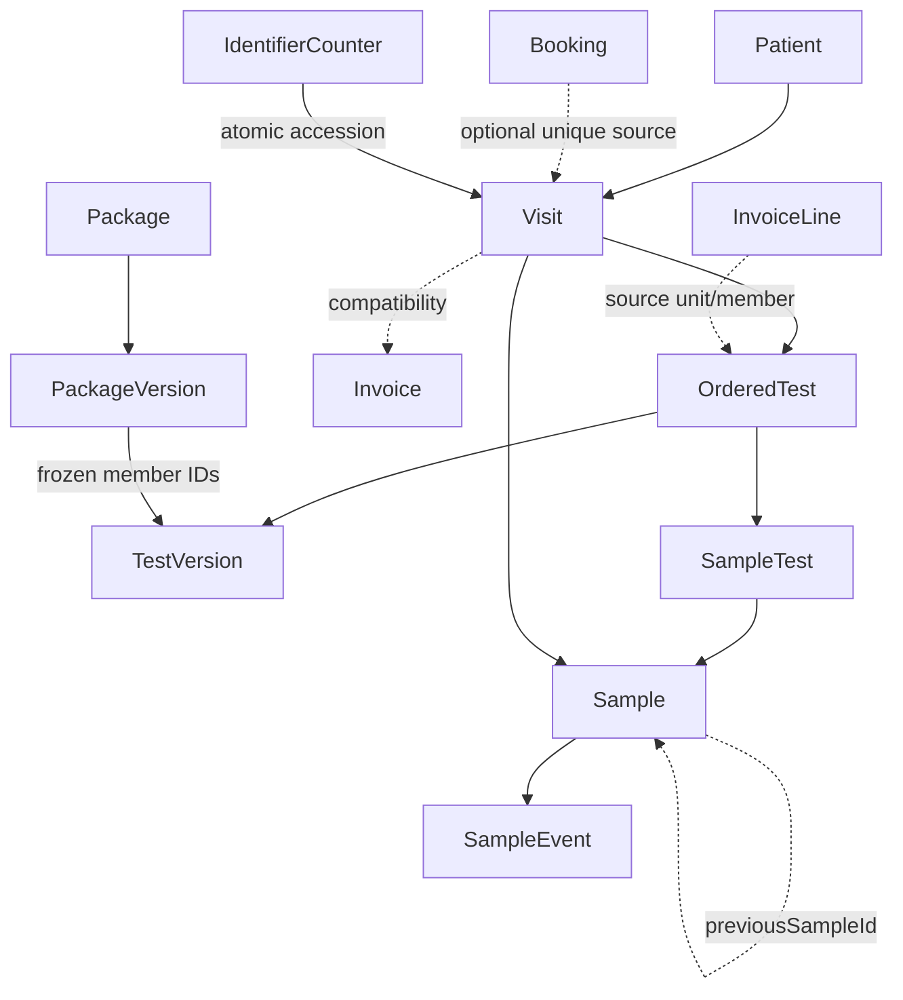

# Database V2 Phase A — clinical backbone implementation, 2026-10-02

Date: Asia/Karachi. Baseline: clean `development`, `a6cfe56`. **Completed additive foundation and operational deployment; clinical cutover is deferred.** The architecture reports were read completely and the actual 29-model schema/all five old migrations reviewed before editing. The user authorized these seven structures and deployment only after backup recovery, reviewed SQL and disposable acceptance. No commit, push, staging or branch/history change.

## Implemented schema

The database now has 36 application tables. Existing IDs, scalar fields, enums, column types/defaults and old relations remain. All original schema lines remain present; additions are compatibility fields/relations, scoped integrity keys and these seven models.

| Model | New/modified | Purpose |
|---|---|---|
| Visit | New | Scoped encounter identity, optional unique source Booking, accession, minimal current-master name/LAB/MRC/referrer/payer snapshots, source/status/review evidence |
| OrderedTest | New | One distinct occurrence; Visit, frozen TestVersion, optional InvoiceLine/PackageVersion provenance; positive occurrence/unit/member identity |
| TestVersion | New | Immutable typed current-definition capture, revision, code/name/specimen snapshots, canonical SHA-256; approval/effective/container fields unknown until authoring |
| PackageVersion | New | Immutable captured direct-member composition with exact TestVersion IDs; unsupported members retained with review reason |
| SampleTest | New | Explicit retained physical specimen/occurrence assignment with tenant/branch/Visit composite FKs |
| SampleEvent | New | Append-only recorded specimen transitions, actor when known, previous/new status, occurred/recorded times and retry key |
| IdentifierCounter | New | Natural composite key tenant/namespace/scope/period; atomic monotonic next-unused value |
| Tenant | Modified | Visit/counter reverse relations |
| Branch | Modified | Scoped identity key and Visit/counter reverse relations |
| User | Modified | Same-tenant event actor key/relation |
| Patient | Modified | Same-tenant Visit identity key/relation |
| Doctor | Modified | Same-tenant Visit referrer key/relation |
| Company | Modified | Same-tenant optional Visit payer key/relation; corporate workflows remain dormant |
| Test | Modified | Scoped version parent key/relation; no published pointer or editor cutover |
| TestParameter | Modified | Nullable initial TestVersion compatibility FK/index; existing testId/parameter IDs preserved |
| Package | Modified | Scoped version parent key/relation |
| PackageItem | Modified | Nullable captured PackageVersion/TestVersion compatibility FKs/indexes; old identity/relations remain |
| Booking | Modified | Scoped source identity key and optional Visit reverse relation; no BookingItem |
| Invoice | Modified | Nullable unique scoped Visit link and additive review reason |
| InvoiceLine | Modified | OrderedTest reverse relation and additive review reason; amounts/quantity/price logic untouched |
| Sample | Modified | Nullable scoped Visit, same-Visit previousSampleId, explicit assignments/events and review reason |
| Report | Modified | Nullable unique scoped Visit link; output/status/amendment semantics unchanged |

Result, ResultValue, reference-range/choice models, Payment, CashShift, DoctorShare, auth, notifications, audit, sync and frontend schemas/algorithms were not redesigned. Result linkage is evidenced through `SampleTest.evidenceResultId`, a legacy provenance scalar; it does **not** replace Result identity or enforce Phase B result-context rules.

## Catalog decision and smallest architecture corrections

**Choice A:** backfill/capture foundation while the existing editor continues to edit current Test/parameters/ranges. There is no clinical publishing endpoint, invented approver/time, or misleading currentPublishedVersionId. Captures are labeled `LEGACY_CURRENT` or `PROSPECTIVE_CURRENT`; effectiveAt/approvedAt remain NULL. Revision 1 means **first captured current definition**, not historically first approved definition.

Concrete contradiction: the legacy editor deletes/replaces unused parameter rows, whereas versioned definitions must survive that edit. Therefore Phase A freezes a typed, schemaVersion-1 definition payload inside TestVersion, including parameter/choice/range IDs, ordering, units/requiredness and exact Decimal range strings. SHA-256 and native UPDATE/DELETE guards preserve it independently of mutable compatibility rows. Existing TestParameter.testVersionId marks the initial capture; that relation is **not** a promise that the legacy row thereafter becomes immutable. ResultValue's original FK/ID remains valid. Full normalized immutable parameter authoring is required before clinical cutover; no threshold/age unit/selector change was made.

PackageVersion similarly owns a typed immutable composition payload of direct members and frozen TestVersion IDs, with native insertion checks for definition/tenant/ordinal/quantity. Legacy PackageItem IDs/fields remain readable and receive initial compatibility links. There is no nested expansion: unsupported/empty/cross-tenant members retain review evidence and cannot be prospectively expanded by the factory. Historical package sales remain unmapped because today's composition is insufficient evidence of composition at sale.

Timestamp contradiction found by an actual failing native UTC check: pinned PrismaPg 7.10.0 formats datetime bindings without offsets and normalizes timestamptz outputs by replacing the offset. A Karachi session stored a requested `2030-01-01T19:00:00.123Z` event as `14:00:00.123Z` while the ordinary round trip looked correct. `src/instant-adapter.ts` narrowly preserves explicit offset bindings and the pg scalar timestamptz parser at the database facade. It uses public adapter/pg interfaces, the same owned pool and unchanged pool limit. **No session TimeZone change**, dependency override or conversion of old TIMESTAMP columns. Tests compare generated reads to native UTC values and preserve legacy wall values in a forced Karachi session. This compatibility fix is required for the newly authorized instant types; it is not a memory redesign.

## Migrations and native integrity

| New migration | Work |
|---|---|
| 20261002010000_phase_a_foundation | Transactional additive DDL: seven tables, five new enums, nullable compatibility fields, scoped keys/FKs and required lookup indexes |
| 20261002020000_phase_a_capture_and_backfill | Transactional native counter/capture/materialization factories and deterministic legacy backfill |
| 20261002030000_phase_a_native_integrity | Transactional CHECKs and retention/provenance/member/counter guards |
| 20261002040000_phase_a_assignment_lookup | Additive direct reverse OrderedTest-ID lookup index; preceding applied SQL preserved byte-identically |

Manual SQL review found no DROP TABLE/COLUMN, destructive enum/default/type change, table rebuild, old FK removal, new delete cascade, reset/reseed, or tightening an existing populated column to NOT NULL. All new FK deletes/updates restrict. Native CHECK/trigger expectations are tested separately from Prisma's supported-DDL diff, which reports no difference on fresh/populated/operational databases.

Important invariants (12 validated CHECKs, 11 native triggers):

- Same-tenant Branch/Patient/optional Doctor/Company/Booking Visit ownership; source Booking matches patient/branch; one Visit per source Booking.
- Positive Visit/work rowVersion and revision/occurrence numbers; prospective Visit requires an instant.
- Unique parent/revision, Visit/occurrence and source InvoiceLine/unit/member tuples; frozen occurrence identity and source definition/membership agree with its invoice's Visit.
- Immutable TestVersion/PackageVersion payloads and append-only SampleEvent/SampleTest history; retained parent FKs prevent cascading loss.
- Canonical payload shape/hash; package member version/test/tenant consistency and positive unique ordinals/unit member quantities.
- Nonempty positive counter scope/period; VISIT requires branch scope and day; counters cannot decrement, change scope or be deleted.
- SampleTest's required tenant/branch/Visit appears in both specimen and occurrence FKs; NULL Visit cannot bypass assignment integrity. Recollection requires a Visit, same scope and a non-self predecessor.
- Sample/report Visit links match their legacy Invoice; captured compatibility links and funded source identities cannot be reassigned.
- Event type/target compatibility, nonempty per-sample unique source key, required prospective instant and same-tenant optional actor.

These protections do not certify result completeness/range applicability, current-primary specimen allocation, laboratory method/container compatibility or report/payment concurrency. Privileged administrators can still explicitly change schema/disable guards; maintenance authorization/least-privilege role deployment remains a later operational concern.

### Old migration byte integrity

All five old SQL files and migration_lock.toml match their pre-edit **raw-byte** SHA-256 hashes. Prisma's stored SQL checksums normalize line endings and also remain unchanged. Old migrations modified: **NO**.

| File | Raw SHA-256 before = after |
|---|---|
| migration_lock.toml | bc487c02c71ad9cae8694647129e3ea7f32b1fe7007d0a6ced064e51022cd3fb |
| 20260807232849_init/migration.sql | bc35b59d78b5985a009aac5745d57282f412a41a16d8dbaa4fb19a0140c897f6 |
| 20260810021010_added_out_source_test/migration.sql | 436e7f415e3f2c5cf8f4e4a61a126fb12cc0f157052d8c785eda9e9e4dbffbca |
| 20260822000000_add_report_print_tracking/migration.sql | fede831c675a17dbfec4fee7d005330aa0a72aebc6e43b8f5cf6493a65a93e08 |
| 20260822010000_add_cash_shifts/migration.sql | 2038eb552edf8bf4f00a2bc0973eed29e5685ba81b3eb65bce73bb10e51669a3 |
| 20260926000000_sms_templates_sendpk_v2/migration.sql | f97f211e3d335cef92cf11f56b7d67e9227416eaf8ac09767654483691696f43 |

Prisma source schema SHA-256 intentionally changes from `bb1ec61fdfc55bbdbdf12969076a7863d274a866098bcbf6154f710df473fa18` to `b7f1b2538d077f5b7d559afd1716ad1850e19f3383bc7f998aab03682a260975`. The legacy business columns/models remain; this is authorized additive Phase A schema change.

## Identifiers and backfill

New surrogate IDs are PostgreSQL-generated random UUID v4 **TEXT**, without extensions or rekeying existing CUIDs. IdentifierCounter uses its natural tenant/namespace/scope/period PK. VISIT allocation is INSERT ON CONFLICT increment+RETURNING under lock in the same transaction. Scope is `branch:<stable branch ID>`, namespace VISIT, period YYYYMMDD in Asia/Karachi. Accession is `V-<branch code>-<day>-<sequence>` with minimum six digits and no truncation above 999999. Branch codes should remain stable for issued prefixes; tenant uniqueness prevents reuse after conflicting renames/restores. Future multi-authority numbering/counter restore reconciliation is not activated. LAB/MRC/invoice/booking/sample/report generators are unchanged.

Capture/backfill mapping uses durable natural keys (catalog/revision, unique Booking, source line/unit/member, sample/source event key). First materialization generates crypto IDs; retries reuse existing keys/IDs. It does not promise identical random IDs across independent fixture databases. Five staged migrations remain intact, followed by four new migrations.

Direct legacy lines with an unambiguous same-tenant Test and quantity 1..1000 materialize one occurrence per unit in stable sortOrder/ID order. Repeated catalog IDs across lines remain separate. Their assigned captured definition is explicitly **historical-definition/repeat-intent unverified**, not proof of the definition used at old sale. Invalid/large quantities, both/no target, crossed ownership and unsnapshotted packages are preserved with review reasons. Unconverted requests do not gain invented Visits/BookingItems.

Samples acquire a Visit only from a matching tenant/branch Invoice. SampleTest links are created only from consistent Result/sample/line/test evidence with exactly one candidate occurrence. Quantity ambiguity remains unassigned. Raw legacy collected/received/accepted/rejected/discarded timestamps create evidence events with unknown fromStatus/instant; only a same-tenant recorded collector is attributed. No synthetic acceptance, historical instant/approval, or recollection lineage is invented. Legacy Visit/event times retain raw text and NULL occurredAt because the old timezone interpretation is unresolved; new instants use timestamptz(3). All 82 old timestamp-without-time-zone columns remain unchanged.

## Compatibility and write activation

The facade exports transaction-only accession/capture/materialization/assignment/event factories. Catalog/revision locks serialize capture; Invoice/Booking locks serialize Visit retries; source tuple uniqueness makes expanded work identity explicit. Factories use caller transactions and never create another client/pool. The package factory supports frozen direct-member expansion prospectively in tests (quantity two × two members = four occurrences).

**Automatic Visit/OrderedTest creation in the legacy billing endpoint and live package expansion are deferred.** The current editor has no approved-version publication, quantity results/readiness still use catalog IDs, and package-only laboratory/report processing is unfinished. Activating that path would present partially integrated clinical work. No feature flag/endpoint/front-end selection or BookingItem was silently introduced. The smoke test explicitly verifies legacy invoice issuance leaves the V2 work path inactive. Future activation must use the provided factory inside the existing invoice transaction and approved authoring/occurrence-aware reads.

Prospective **SampleEvent history is active**: collection and its event share one transaction; receive/accept/reject/start-testing lock the specimen, retain the existing allowed status transitions and atomically update projection+event. Authenticated controller actors are passed, including the previously omitted collector argument. Result entry's existing accepted→testing transition conditionally records its event within the existing transaction; result statuses/reopen/range/release semantics are unchanged. SMS remains outside the specimen transaction. No assignment to all invoice tests is inferred.

## Preservation, backup and operational deployment

Database: local PostgreSQL 18.4, `lms_v2`, session Asia/Karachi. Preflight confirmed all five old migrations completed, no rolled-back/failed migration or baseline drift; the status command's pending-three exit 1 was expected. All tests/SQL review/backup recovery completed before normal `prisma migrate deploy`; no reset/push/seed/operational fixture writes.

Custom-format pg_dump was stored outside Git under the user's temporary directory and restored into a newly created guarded disposable database. The restore reproduced all 30 old table fingerprints and the native column/constraint schema hash. Backup: 98,082 bytes, SHA-256 `69b15bf1665b4d63cf41f02726d10e3e063c4969b5de7577b2af25775cc3eb5a`. The backup/evidence may contain sensitive data and are not committed. This is a verified development recovery drill, not offsite retention, WAL/PITR or an approved RPO/RTO program. Stop writers and preserve post-backup work before any future recovery; no destructive down migration was created.

Fingerprint method: read-only REPEATABLE READ; ordered original-column projection, PostgreSQL row_to_json text, C collation sort, newline-joined SHA-256. After deployment compare only **original columns**; new authorized compatibility links are measured separately. Original migration rows are compared by their original IDs, with the four new rows reported separately. No operational row values/credentials appear in evidence published here.

Native column/constraint schema hash changes intentionally from `c29924de69c039f5e26a6ef9e15f32b357da81175a78730b3ac694a5b1e214de` to `b007abd233e4b58402038e2dd17e15d10d03dc44096137e840ec087e224c36ca`. This hash covers catalog columns/constraints, not a claim to hash every function/index object. Prisma supported-DDL diff is empty; native guards are introspected separately.

### Exact operational legacy counts and row hashes

Every row below has the same original-column SHA-256 before and after. `_prisma_migrations` here is the preserved five-row subset; total migration rows grew 5 → 9.

| Legacy table / projection | Before count | After count | SHA-256 before = after |
|---|---:|---:|---|
| _prisma_migrations (original rows) | 5 | 5 | 45a2c50df35406a4279dad4a53de3a602ecafc6f46d47714b4b799b6a6ddde97 |
| audit_logs | 0 | 0 | e3b0c44298fc1c149afbf4c8996fb92427ae41e4649b934ca495991b7852b855 |
| bookings | 0 | 0 | e3b0c44298fc1c149afbf4c8996fb92427ae41e4649b934ca495991b7852b855 |
| branches | 1 | 1 | 6fa9024e55608635c61ec3553f77c6743f005e937c268e70b204fb66ddd3ed77 |
| cash_shifts | 0 | 0 | e3b0c44298fc1c149afbf4c8996fb92427ae41e4649b934ca495991b7852b855 |
| companies | 0 | 0 | e3b0c44298fc1c149afbf4c8996fb92427ae41e4649b934ca495991b7852b855 |
| configurations | 0 | 0 | e3b0c44298fc1c149afbf4c8996fb92427ae41e4649b934ca495991b7852b855 |
| doctor_shares | 0 | 0 | e3b0c44298fc1c149afbf4c8996fb92427ae41e4649b934ca495991b7852b855 |
| doctors | 1 | 1 | bdcb8b66d29b5f8fd08241c83189d94d5eb5cbaa31bb34c16b3c71857a56e09b |
| feature_flags | 6 | 6 | 0971b86d3504da09cc5f9c8fd4dcdf063b53965478b5559a3fd8d4509d5fd37d |
| invoice_lines | 0 | 0 | e3b0c44298fc1c149afbf4c8996fb92427ae41e4649b934ca495991b7852b855 |
| invoices | 0 | 0 | e3b0c44298fc1c149afbf4c8996fb92427ae41e4649b934ca495991b7852b855 |
| notifications | 0 | 0 | e3b0c44298fc1c149afbf4c8996fb92427ae41e4649b934ca495991b7852b855 |
| package_items | 3 | 3 | 36a0cf8aa87aba0c71dd5271bdbaa246caff4f3f3012766ab243069d055ab449 |
| packages | 1 | 1 | 6a7b89163d7833543bf019d317b4a23ef8db5bfbfebffd00b0924faaaa395c5c |
| patient_companies | 0 | 0 | e3b0c44298fc1c149afbf4c8996fb92427ae41e4649b934ca495991b7852b855 |
| patients | 0 | 0 | e3b0c44298fc1c149afbf4c8996fb92427ae41e4649b934ca495991b7852b855 |
| payments | 0 | 0 | e3b0c44298fc1c149afbf4c8996fb92427ae41e4649b934ca495991b7852b855 |
| reports | 0 | 0 | e3b0c44298fc1c149afbf4c8996fb92427ae41e4649b934ca495991b7852b855 |
| result_values | 0 | 0 | e3b0c44298fc1c149afbf4c8996fb92427ae41e4649b934ca495991b7852b855 |
| results | 0 | 0 | e3b0c44298fc1c149afbf4c8996fb92427ae41e4649b934ca495991b7852b855 |
| samples | 0 | 0 | e3b0c44298fc1c149afbf4c8996fb92427ae41e4649b934ca495991b7852b855 |
| sms_templates | 2 | 2 | d8aa64b667d4b4ec06a43f1088da224420d714e130795ac796d6634f6d7cde8d |
| sync_outbox | 0 | 0 | e3b0c44298fc1c149afbf4c8996fb92427ae41e4649b934ca495991b7852b855 |
| tenants | 1 | 1 | ab0d3b4e35505437cd382903ebc4ffd913052ad6f12b4eb7e198d29a9a46d4cb |
| test_parameter_choices | 0 | 0 | e3b0c44298fc1c149afbf4c8996fb92427ae41e4649b934ca495991b7852b855 |
| test_parameters | 12 | 12 | fe61779014da72c5a001659f29a11f8c807790d80d287f2ab4cbf438d6eca71e |
| test_reference_ranges | 15 | 15 | 474467dad0ca892533387a72c2238c24a73a07b2d12ef5b8a172a54e5323daa5 |
| tests | 8 | 8 | 6ea7eca593ea23326b07a5c50d35e66336b4262d84737abbb513a969d6e8d240 |
| users | 2 | 2 | e1875eb16cbfad76685022422c211912b7799cc599d6e7956fd4932226cda689 |

### Exact new operational counts and backfill hashes

All these tables were absent before Phase A; old-content preservation is reported separately.

| New table | After count | After SHA-256 |
|---|---:|---|
| identifier_counters | 0 | e3b0c44298fc1c149afbf4c8996fb92427ae41e4649b934ca495991b7852b855 |
| ordered_tests | 0 | e3b0c44298fc1c149afbf4c8996fb92427ae41e4649b934ca495991b7852b855 |
| package_versions | 1 | 1f4de2452b46c7eeb2af5e01438787be0710731d2a849220437d44751832e1d6 |
| sample_events | 0 | e3b0c44298fc1c149afbf4c8996fb92427ae41e4649b934ca495991b7852b855 |
| sample_tests | 0 | e3b0c44298fc1c149afbf4c8996fb92427ae41e4649b934ca495991b7852b855 |
| test_versions | 8 | 1ccde2c7b9d29d5dc5e883e393380f2c1de0b930825acdc7c3517d8725b59b91 |
| visits | 0 | e3b0c44298fc1c149afbf4c8996fb92427ae41e4649b934ca495991b7852b855 |

Compatibility backfill: 12 existing TestParameter rows linked to initial TestVersion; 3 existing PackageItem rows linked to initial PackageVersion/TestVersion. No operational Visits, occurrences, specimen assignments/events or counters were invented because transactions were empty. Nine finished migrations, zero failed/rolled back, operational status up to date and supported-DDL diff empty.

## Disposable acceptance and exact test results

Fresh scenario applies all nine migrations from zero: all 36 application tables exist and remain empty (no seed). Populated scenario deploys **only the five old SQL migrations**, verifies 30 actual old tables/no Visit, inserts raw OLD-schema synthetic patient/booking/doctor/catalog/parameters/ranges/choice/package/invoice/receipt/specimen/result/value/report/share/notification fixtures, then deploys the four additions across 55 synthetic legacy application rows. Before any behavior-test mutations, every original-column table count/hash and every old migration record is identical. Repeating the data backfill preserves new row IDs/hashes as well. Native constraints and supported-DDL no-drift pass in both scenarios. Disposal is guarded by generated database names; shutdown leaves zero pool connections.

Populated initial outcome: 5 Visits, 7 OrderedTests, 2 TestVersions, 1 PackageVersion, 3 SampleTests, 7 SampleEvents, 1 counter row (nextValue 6). Fixture contains six invoices: two direct tests, repeated CBC on separate lines, quantity-three CBC, unknown historical package, partial/ambiguous selections and crossed legacy booking ownership. Five map to Visits; crossed ownership is held. Package creates zero invented work; quantity-three result remains unassigned. Financial and clinical values are preserved, including grandTotal 300.00, receipt 100.10, due 199.90, doctor share 37.50, result 0.123399 and printCount 2.

| Check | Suites | Tests passed | Failed/skipped |
|---|---:|---:|---:|
| API Jest | 5 | 25 | 0/0 |
| Shared Jest | 3 | 19 | 0/0 |
| Database client unit | 0 node:test suites | 4 | 0/0 |
| Database ORM integration | 0 node:test suites | 5 | 0/0 |
| Built API smoke | 0 node:test suites | 1 | 0/0 |
| Phase A DB behavior | 0 node:test suites | 21 | 0/0 |
| Total | 8 Jest suites; no node:test describe suites | **75** | **0/0** |

Fresh/populated upgrade, all-table fingerprints, backfill retry and supported-DDL diffs are additional harness assertions, not fabricated node:test counts. Tests include 50 concurrent counter allocations with exact nextValue/no loss, 12 concurrent source retries/one Visit, duplicate occurrences/source tuples, concurrent catalog/package revision claims, native cross-Visit assignments, version/event/assignment retention, recollection scope/self protection, source provenance and native counter/member safeguards. Forced Visit/direct/package/specimen failures roll back both representations/counter/events. Native/generated absolute-time checks caught and now prevent the adapter offset issue.

Frozen install, generate, validate, all four workspace builds and all four typechecks pass. CLI/client/adapter **7.10.0**, pg **8.23.1**, Node **24.21.0**, TypeScript **6.0.3**; lockfile/dependencies unchanged, no Prisma 8 configuration/package added. New command: `pnpm --filter @lms/database test:phase-a`. Existing tests were preserved and the API smoke strengthened. Existing Jest VM/pg concurrent-query deprecation warnings remain; no forced resolutions.

## Runtime verification and measured performance

**Fixture-verified:** built Nest API/Prisma/PostgreSQL startup, login/session read, HTTP booking create/read, patient lookup, invoice create/read, exact discounted quantity billing/commission/partial payment/rejection, collection/receive/accept/result testing events with real authenticated actor, result write/read/release, report read, Socket.IO authenticated connect and shutdown. No external HTTP is allowed by the smoke harness. Operational verification is read-only structural/capture/status proof; no real operational patient, bill or specimen was created. Actual browser/clinical workflow, real SMS delivery, print/PDF amendment and representative LAN/load acceptance are **not tested**; unchanged front end/ancillary paths are compile-verified.

One local synthetic measured run (not capacity certification):

| Observation | Measured value |
|---|---:|
| Fresh deploy, including CLI launch | 3,507.8 ms |
| Populated additive deploy, including CLI launch | 3,197.1 ms |
| Operational foundation/capture/integrity deploy, including CLI launch | 4,049.0 ms |
| Operational reverse lookup index deploy, including CLI launch | 3,356.1 ms |
| Nest create/listen after module import | 1,231.59 ms |
| Patient / booking / invoice GET | 19.78 / 12.71 / 12.02 ms |
| Invoice create | 263.44 ms, 18 pg transport queries |
| Sample collect / receive / accept | 115.67 / 17.23 / 19.68 ms, 9 / 6 / 6 queries |
| One Visit + four package occurrences factory | 56.36 ms, one client SQL round trip; internal function statements not counted |
| 50 parallel accession test | 261.41 ms including setup/assertion work |
| Full smoke-process RSS | 230.37 MiB |

pg query counts include transaction control and relation reads, measured without logging arguments; they are not an EXPLAIN-based execution cost. The smoke process includes a fixture client, full Nest dependencies and socket/report modules: its RSS is not comparable to the prior minimal Prisma migration probe. The **previous observed Prisma 7 increase (~112–124 MiB versus ~51 MiB)** remains documented and unresolved. No extra application client/pool or leak was found; pool limit remains 10, fixture shutdown leaves zero connections. No cache, denormalization, memory-only redesign or performance index wishlist was implemented.

## Deferred work and Phase B prerequisites

Explicitly deferred: clinical approval/publishing/immutable normalized parameter authoring and current-published pointers; automatic invoice/Visit/ordered-work activation; active package processing/readiness and nested packages; BookingItem; demographic/DOB/container/method/instrument decisions; definitive historical package/definition/quantity-result mapping; current-primary specimen policy and clinical compatibility; immutable result revisions/reopen correction; reference-range selector correction; ReportVersion/ReportVersionResult/ReportEvent/report amendment history; payment concurrency/immutable movements/InvoiceAdjustment; cash-shift and commission settlement redesign; Session/PatientConsentEvent/OperationRequest; audit transaction coupling; NotificationAttempt/notification worker; SyncInbox/outbox bridge; 82-column legacy timezone conversion; frontend UX. Do not treat this foundation as remediation of those previously identified risks.

Before activation, clinical owners must approve definitions/ranges/container/duplicate policies, migrate authoring safely, resolve review queues and implement occurrence-aware laboratory/report reads. Future scope must separately authorize clinical/financial/history/auth/queue changes. Existing Prisma advisory classifications/RSS/deployment limitations in the migration report remain unchanged.

## Git and review evidence

No staging, commit, push, branch creation/switch, main/tag modification, reset or rebase. Branch remains development at a6cfe56. Changed code is limited to schema/migrations, the public database helpers/instant compatibility layer, specimen history plumbing and tests. Proposal history is preserved with an appended implementation-status section; this report and upgratdaion record results.

`git diff --check` passes. The schema diff was inspected; all old schema lines and all old SQL/lock hashes are preserved. Git's normal diff/stat omits untracked additions, so the final report separately lists all new files/migrations. Local temporary backup, source/DB fingerprints, validation/deployment transcripts and full schema diff are outside Git.

Primary implementation references: [PostgreSQL 18 UUID generation](https://www.postgresql.org/docs/18/functions-uuid.html), [binary SHA-256 functions](https://www.postgresql.org/docs/18/functions-binarystring.html), [atomic INSERT ON CONFLICT](https://www.postgresql.org/docs/18/sql-insert.html), [pg type parsers](https://node-postgres.com/features/types) and [pool connect event](https://node-postgres.com/apis/pool).

## Final hardening review — 2026-10-03 (Asia/Karachi)

**Ready to commit as the local Phase A foundation, with the runtime-owner limitation below explicitly retained.** No commit, push, staging, operational data write, new migration or applied-SQL edit occurred during this review. This does not certify a least-privilege production deployment. The original implementation/evidence above remain historical records; the current source schema SHA-256 after mapped naming is `7d2a6d877a10669c2cd3429966177712be0eedfd355925a5109337f45a676770`.

### Application-facing provenance naming

Prisma now exposes `CaptureProvenance` mapped with `@@map("DefinitionCaptureSource")`. TestVersion, PackageVersion, OrderedTest, SampleTest and SampleEvent expose `captureProvenance @map("source")`; Visit exposes `demographicCaptureProvenance @map("demographicSource")`. PostgreSQL enum/type/column names, values, function signatures and existing migration SQL stay byte-identical. Raw SQL deliberately still uses deployed physical names. Visit.source and Booking.source retain their independent domain meanings. Helpers, generated exports and regression/smoke assertions use the clearer mapped properties. No compatibility alias to the confusing generated enum is needed by existing application consumers.

Generate, validate and status pass; nine migrations remain up to date; supported-DDL diff says **No difference detected** on operational, fresh and populated databases. No migration was needed for naming.

### Timestamp workaround review

`src/instant-adapter.ts` remains entirely inside the public database boundary; API modules have no adapter knowledge. Its runtime logic was unchanged by this hardening pass. Inspection of pinned adapter-pg 7.10.0 confirmed offset-free datetime formatting and replacement of non-UTC timestamptz offsets. Source comments now reference [Prisma #28629](https://github.com/prisma/prisma/issues/28629) and [#26786](https://github.com/prisma/prisma/issues/26786), and require reevaluation after any Prisma/client/adapter upgrade beyond 7.10.0. Remove only when the **unwrapped** upgraded adapter passes both-zone native storage/default/legacy-wall regressions; a version number alone is insufficient.

The existing owned pool alone is wrapped; no global pg parser mutation, global Date monkey patch, session/database TimeZone change, new client/pool or dependency change. Only scalar TIMESTAMPTZ/unknown-type raw Date binding and scalar OID 1184 text output are corrected; explicit legacy TIMESTAMP, Decimal/JSON/other parsers, arrays and binary formats remain untouched. Unknown raw Date metadata is documented because Prisma does not supply the SQL cast type; callers requiring wall-time semantics must use explicit casts, as exercised by the regression. Array/binary/infinite or out-of-JS-range timestamp support is not asserted by this scalar Phase A workaround.

One existing regression test was expanded, without increasing test count, to run in both UTC and Asia/Karachi on disposable transactions. It compares generated instants and native PostgreSQL UTC strings for explicit occurredAt and DB-created recordedAt/createdAt, checks legacy timestamp values/readbacks, mapped physical provenance and Visit's separate BOOKING domain source, and verifies the global pg OID parser reference remains unchanged. SET LOCAL is confined to tests and reverts with the test transaction.

### Native function/trigger safety review and privilege limits

All four Phase A migrations were read in full and their objects matched live read-only catalog inspection. All ten functions have `prosecdef=false`: **SECURITY INVOKER**, PostgreSQL's default, rather than SECURITY DEFINER. All are default VOLATILE/parallel-unsafe, appropriate for mutating factories and conservative integrity-trigger reads/errors. Eight functions accessing relations have fixed `search_path=pg_catalog, public`; retain_capture and guard_counter only inspect trigger rows/raise and need no relation lookup. No dynamic EXECUTE, injected identifier/string construction, network/extension action, error-catching block swallowing integrity failures or unrelated financial/result/report algorithm exists. Factories only create authorized foundation data and compatibility links; triggers do not write other rows. Accession period conversion explicitly uses Asia/Karachi; new instants use timestamptz/CURRENT_TIMESTAMP; raw legacy time evidence stays unconverted.

References to application relations are **not individually schema-qualified** in applied SQL: they rely on the fixed path and trusted public schema. PUBLIC cannot CREATE in public on this local database; the configured connection can. PostgreSQL can resolve temporary relation names before public when pg_temp is implicit. No application path creates shadowing temporary objects, and invoker functions confer no elevated privilege, but arbitrary SQL/DDL-capable connections are outside this integrity threat boundary. Before a separate untrusted SQL or least-privilege runtime rollout, qualify public references or explicitly place pg_temp last in a **new reviewed follow-up migration** and audit grants. Applied SQL was not rewritten merely to alter style. This is a recorded limitation, not a claim that search_path prevents owner/session-level tampering.

All 11 triggers are enabled ordinary BEFORE ROW triggers. Events are itemized below. Guards only compare/read/raise or return NEW; there is no recursive row-write path. Multiple trigger ordering is irrelevant: package member validation is INSERT-only while its immutability guard is UPDATE/DELETE-only. No hidden ordering contract exists with legacy triggers. Normal UPDATE/DELETE fail even for the owner; retry backfill and INSERT-only prospective history continue to pass. Future authorized data repair requires an explicit owner migration with narrowly scoped transactional ALTER TABLE DISABLE/ENABLE TRIGGER and post-repair validation, rather than a built-in application/owner bypass flag. No trigger was disabled here.

**Material privilege concern:** the inspected configured local connection is not superuser and cannot create roles, but can create databases/public objects and has owner privileges plus TRUNCATE privilege on all four retained-history tables. Therefore it can deliberately ALTER/disable guards or TRUNCATE; row DELETE triggers do not protect TRUNCATE. Ordinary tested ORM mutations cannot bypass the guards, but a non-owner restricted runtime role has **not** been provisioned or verified. Production deployment should separate migration owner from runtime, omit CREATE/ALTER/TRUNCATE/trigger-disabling privileges and review function EXECUTE grants. Operational permissions were left unchanged under this read-only review. See [PostgreSQL function security](https://www.postgresql.org/docs/18/sql-createfunction.html), [schema search paths](https://www.postgresql.org/docs/18/ddl-schemas.html) and [TRUNCATE semantics](https://www.postgresql.org/docs/18/sql-truncate.html). No follow-up migration was required for this bounded naming/comments/test change; privilege rollout and deliberate hostile-session protection remain explicit deployment prerequisites.

### Unique/index review

All scoped identity targets such as tenant/id and tenant/branch/id remain: composite FKs need those declared keys even though a global PK already identifies the row. Retained globals on Visit.bookingId, Invoice.visitId and Report.visitId expose stable single-ID unique selectors/global one-to-one guarantees. Their scoped composites declare the defining-side Prisma one-to-one relationships. Removing just those three composite keys from a temporary schema produced **three expected P1012 one-to-one relation errors** despite the single-field uniques; the real schema was never changed by the probe. Both declarations serve different generated-client/relation guarantees, with acknowledged overlapping physical uniqueness and write/storage costs. No integrity index was removed speculatively. The A4 OrderedTest-ID reverse lookup remains. Other normal indexes are itemized below and should be revisited using measured plans if workload changes; this review adds no indexes.

### Scope, validation and operational preservation

No Phase B leakage: no range-selector correction, normalized immutable authoring/publishing, result amendment/revision redesign, ReportVersion, payment concurrency/InvoiceAdjustment/cash-shift/commission settlement redesign, session persistence, NotificationAttempt worker, SyncInbox, automatic legacy billing Visit/OrderedTest activation or frontend workflow change. Prospective SampleEvent history remains the sole intentionally activated domain behavior; the timestamp adapter is compatibility plumbing. API consumers still import @lms/database. Old semantic limitations and the prior Prisma 7 RSS increase remain documented; no memory redesign was performed.

Frozen install, generate, validate, operational migrate status/supported-DDL diff, all **four workspace builds and four typechecks** pass. Exact final tests: API 25 across five Jest suites; shared 19 across three Jest suites; DB unit four; ORM five; built API smoke one; Phase A 21. **75 passed, zero failed/cancelled/skipped/todo in the final runs**, eight Jest suites and no node:test describe suites. Fresh/populated migration/fingerprint assertions are additional harness gates, not added test counts. The first smoke rerun caught a stale e.source assertion after mapping; changing it to e.captureProvenance preserved the same actor/provenance assertion and the final complete disposable rerun passed. Existing Jest VM and pg concurrent-query warnings remain. No suppressed tests or weakened assertions.

Read-only REPEATABLE READ checks before/after this review matched all **37 stored table projections** (29 legacy applications, preserved original migration subset and seven Phase A tables) against the preceding implementation evidence. A separate full-current-column hash for every table, including all compatibility links and all nine migration rows, was identical before/after hardening. All five old SQL/migration-lock raw hashes and all four Phase A SQL raw hashes were unchanged; original stored checksums and all nine finished, non-rolled-back migrations match. TestVersion remains eight, PackageVersion one; Visit/OrderedTest/SampleTest/SampleEvent/IdentifierCounter remain zero. No operational seed, fixture, ALTER privilege or migrate-deploy was run in this review. Native structure is unchanged.

Evidence outside Git: %TEMP%/labflow-phase-a-hardening-20261003 contains validation transcript, migration hash baseline, before/after full fingerprints and native catalog/privilege inventories. Final fresh/populated harness evidence is %TEMP%/labflow-phase-a-Au79eP/evidence.json. No credentials/row values are reproduced in these tracked reports.

### Complete native-object inventory

Migration legend: A1 foundation; A2 capture_and_backfill; A3 native_integrity; A4 assignment_lookup. These refer to the four exact migration filenames above.

functions: 10; triggers: 11; checks: 12; fks: 25; primaryKeys: 7; unique: 29; normal: 20. All objects matched the live read-only catalog.

| Object | Migration | Purpose | Runtime impact | Future removal/change point |
|---|---|---|---|---|
| Function `phase_a_capture_package` | A2 | Capture direct-member frozen composition | Parent/catalog locks; invokes test capture | Replace capture authoring at Phase B publication |
| Function `phase_a_capture_test` | A2 | Capture typed current definition/hash | Catalog lock; JSON aggregation; new version only on change | Replace capture authoring at Phase B approved publication |
| Function `phase_a_guard_compatibility` | A3 | Retain Visit links; check legacy source agreement | Invoice/Visit lookups; no writes | Remove only after legacy links retire with equivalent integrity |
| Function `phase_a_guard_counter` | A3 | Forbid decrement/scope change/delete | Constant-time comparison; no writes | Keep; authorized restore reconciliation must be explicit |
| Function `phase_a_guard_order_source` | A3 | Freeze occurrence identity and verify source definition/membership | Source/Visit/version lookups; no writes | Keep through source deprecation; replace equivalent integrity first |
| Function `phase_a_guard_package_members` | A3 | Validate captured member ordinal/quantity/version/tenant | JSON loop and version lookup; no writes | Replace only when normalized immutable membership is authorized |
| Function `phase_a_guard_source_line` | A3 | Retain referenced source-line ownership | Assignment existence lookup; no writes | Retire only with legacy provenance removal |
| Function `phase_a_materialize_invoice` | A2 | Explicit Visit/occurrence materialization; historical review | Invoice/Booking/catalog locks; writes new work + compatibility links | Revise only with occurrence-aware activation; not called by billing |
| Function `phase_a_retain_capture` | A3 | Reject history UPDATE/DELETE | Constant-time exception; no writes | Retain; controlled owner migration for authorized repairs |
| Function `phase_a_visit_accession` | A2 | Allocate VISIT accession in explicit Karachi day | Counter UPSERT/row lock | Keep; replace for separately authorized distributed numbering |
| Trigger `identifier_counters_monotonic` | A3 | Forbid decrement/scope change/delete; DELETE OR UPDATE on identifier_counters | BEFORE ROW; Constant-time comparison; no writes | Keep; authorized restore reconciliation must be explicit |
| Trigger `invoice_lines_order_source_guard` | A3 | Retain referenced source-line ownership; UPDATE on invoice_lines | BEFORE ROW; Assignment existence lookup; no writes | Retire only with legacy provenance removal |
| Trigger `invoices_visit_guard` | A3 | Retain Visit links; check legacy source agreement; INSERT OR UPDATE on invoices | BEFORE ROW; Invoice/Visit lookups; no writes | Remove only after legacy links retire with equivalent integrity |
| Trigger `ordered_tests_source_guard` | A3 | Freeze occurrence identity and verify source definition/membership; INSERT OR UPDATE on ordered_tests | BEFORE ROW; Source/Visit/version lookups; no writes | Keep through source deprecation; replace equivalent integrity first |
| Trigger `package_versions_immutable` | A3 | Reject history UPDATE/DELETE; DELETE OR UPDATE on package_versions | BEFORE ROW; Constant-time exception; no writes | Retain; controlled owner migration for authorized repairs |
| Trigger `package_versions_member_guard` | A3 | Validate captured member ordinal/quantity/version/tenant; INSERT on package_versions | BEFORE ROW; JSON loop and version lookup; no writes | Replace only when normalized immutable membership is authorized |
| Trigger `reports_visit_guard` | A3 | Retain Visit links; check legacy source agreement; INSERT OR UPDATE on reports | BEFORE ROW; Invoice/Visit lookups; no writes | Remove only after legacy links retire with equivalent integrity |
| Trigger `sample_events_append_only` | A3 | Reject history UPDATE/DELETE; DELETE OR UPDATE on sample_events | BEFORE ROW; Constant-time exception; no writes | Retain; controlled owner migration for authorized repairs |
| Trigger `sample_tests_retain` | A3 | Reject history UPDATE/DELETE; DELETE OR UPDATE on sample_tests | BEFORE ROW; Constant-time exception; no writes | Retain; controlled owner migration for authorized repairs |
| Trigger `samples_visit_guard` | A3 | Retain Visit links; check legacy source agreement; INSERT OR UPDATE on samples | BEFORE ROW; Invoice/Visit lookups; no writes | Remove only after legacy links retire with equivalent integrity |
| Trigger `test_versions_immutable` | A3 | Reject history UPDATE/DELETE; DELETE OR UPDATE on test_versions | BEFORE ROW; Constant-time exception; no writes | Retain; controlled owner migration for authorized repairs |
| PK `identifier_counters_pkey` | A1 | identifier_counters identity: PRIMARY KEY ("tenantId", namespace, "scopeKey", "periodKey") | Unique B-tree write/check | Permanent identity; no rekey planned |
| FK `identifier_counters_tenantId_branchId_fkey` | A1 | FOREIGN KEY ("tenantId", "branchId") REFERENCES branches("tenantId", id) ON UPDATE RESTRICT ON DELETE RESTRICT | Referenced-key check; RESTRICT updates/deletes | Keep scoped integrity; compatibility FKs retire only with legacy relation |
| FK `identifier_counters_tenantId_fkey` | A1 | FOREIGN KEY ("tenantId") REFERENCES tenants(id) ON UPDATE RESTRICT ON DELETE RESTRICT | Referenced-key check; RESTRICT updates/deletes | Keep scoped integrity; compatibility FKs retire only with legacy relation |
| CHECK `identifier_counters_valid` | A3 | CHECK ((("nextValue" > 0) AND (namespace <> ''::text) AND ("scopeKey" <> ''::text) AND ("periodKey" <> ''::text) AND ((namespace <> 'VISIT'::text) OR (("branchId" IS NOT NULL) AND ("scopeKey" = ('branch:'::text &#124;&#124; "branchId")) AND ("periodKey" ~ '^[0-9]{8}$'::text))))) | Per-row expression; rejects invalid values | Keep until equivalent explicit replacement in authorized phase |
| FK `invoices_tenantId_branchId_visitId_fkey` | A1 | FOREIGN KEY ("tenantId", "branchId", "visitId") REFERENCES visits("tenantId", "branchId", id) ON UPDATE RESTRICT ON DELETE RESTRICT | Referenced-key check; RESTRICT updates/deletes | Keep scoped integrity; compatibility FKs retire only with legacy relation |
| FK `ordered_tests_invoiceLineId_fkey` | A1 | FOREIGN KEY ("invoiceLineId") REFERENCES invoice_lines(id) ON UPDATE RESTRICT ON DELETE RESTRICT | Referenced-key check; RESTRICT updates/deletes | Keep scoped integrity; compatibility FKs retire only with legacy relation |
| CHECK `ordered_tests_occurrence_positive` | A3 | CHECK ((("occurrenceNo" > 0) AND ("rowVersion" > 0))) | Per-row expression; rejects invalid values | Keep until equivalent explicit replacement in authorized phase |
| PK `ordered_tests_pkey` | A1 | ordered_tests identity: PRIMARY KEY (id) | Unique B-tree write/check | Permanent identity; no rekey planned |
| CHECK `ordered_tests_source_tuple` | A3 | CHECK (((("invoiceLineId" IS NULL) AND ("sourceUnitNo" IS NULL) AND ("sourceMemberNo" IS NULL)) OR (("invoiceLineId" IS NOT NULL) AND ("sourceUnitNo" IS NOT NULL) AND ("sourceUnitNo" > 0) AND ("sourceMemberNo" IS NOT NULL) AND ("sourceMemberNo" >= 0)))) | Per-row expression; rejects invalid values | Keep until equivalent explicit replacement in authorized phase |
| FK `ordered_tests_tenantId_branchId_visitId_fkey` | A1 | FOREIGN KEY ("tenantId", "branchId", "visitId") REFERENCES visits("tenantId", "branchId", id) ON UPDATE RESTRICT ON DELETE RESTRICT | Referenced-key check; RESTRICT updates/deletes | Keep scoped integrity; compatibility FKs retire only with legacy relation |
| FK `ordered_tests_tenantId_packageVersionId_fkey` | A1 | FOREIGN KEY ("tenantId", "packageVersionId") REFERENCES package_versions("tenantId", id) ON UPDATE RESTRICT ON DELETE RESTRICT | Referenced-key check; RESTRICT updates/deletes | Keep scoped integrity; compatibility FKs retire only with legacy relation |
| FK `ordered_tests_tenantId_testVersionId_fkey` | A1 | FOREIGN KEY ("tenantId", "testVersionId") REFERENCES test_versions("tenantId", id) ON UPDATE RESTRICT ON DELETE RESTRICT | Referenced-key check; RESTRICT updates/deletes | Keep scoped integrity; compatibility FKs retire only with legacy relation |
| FK `package_items_packageId_packageVersionId_fkey` | A1 | FOREIGN KEY ("packageId", "packageVersionId") REFERENCES package_versions("packageId", id) ON UPDATE RESTRICT ON DELETE RESTRICT | Referenced-key check; RESTRICT updates/deletes | Keep scoped integrity; compatibility FKs retire only with legacy relation |
| FK `package_items_testId_testVersionId_fkey` | A1 | FOREIGN KEY ("testId", "testVersionId") REFERENCES test_versions("testId", id) ON UPDATE RESTRICT ON DELETE RESTRICT | Referenced-key check; RESTRICT updates/deletes | Keep scoped integrity; compatibility FKs retire only with legacy relation |
| PK `package_versions_pkey` | A1 | package_versions identity: PRIMARY KEY (id) | Unique B-tree write/check | Permanent identity; no rekey planned |
| CHECK `package_versions_revision_positive` | A3 | CHECK (("revisionNo" > 0)) | Per-row expression; rejects invalid values | Keep until equivalent explicit replacement in authorized phase |
| CHECK `package_versions_snapshot_valid` | A3 | CHECK (((jsonb_typeof("compositionSnapshot") = 'object'::text) AND (("compositionSnapshot" ->> 'schemaVersion'::text) = '1'::text) AND (jsonb_typeof(("compositionSnapshot" -> 'members'::text)) = 'array'::text) AND (("compositionHash" = encode(sha256(convert_to(("compositionSnapshot")::text, 'UTF8'::name)), 'hex'::text)) IS TRUE) AND ((("compositionSnapshot" ->> 'schemaVersion'::text) = '1'::text) IS TRUE) AND (jsonb_typeof(("compositionSnapshot" -> 'members'::text)) IS NOT NULL))) | Per-row expression; rejects invalid values | Keep until equivalent explicit replacement in authorized phase |
| FK `package_versions_tenantId_packageId_fkey` | A1 | FOREIGN KEY ("tenantId", "packageId") REFERENCES packages("tenantId", id) ON UPDATE RESTRICT ON DELETE RESTRICT | Referenced-key check; RESTRICT updates/deletes | Keep scoped integrity; compatibility FKs retire only with legacy relation |
| FK `reports_tenantId_branchId_visitId_fkey` | A1 | FOREIGN KEY ("tenantId", "branchId", "visitId") REFERENCES visits("tenantId", "branchId", id) ON UPDATE RESTRICT ON DELETE RESTRICT | Referenced-key check; RESTRICT updates/deletes | Keep scoped integrity; compatibility FKs retire only with legacy relation |
| PK `sample_events_pkey` | A1 | sample_events identity: PRIMARY KEY (id) | Unique B-tree write/check | Permanent identity; no rekey planned |
| CHECK `sample_events_source_valid` | A3 | CHECK ((("sourceKey" <> ''::text) AND ((source <> 'PROSPECTIVE_CURRENT'::"DefinitionCaptureSource") OR ("occurredAt" IS NOT NULL)))) | Per-row expression; rejects invalid values | Keep until equivalent explicit replacement in authorized phase |
| CHECK `sample_events_target_valid` | A3 | CHECK (((("eventType" = 'COLLECTED'::"SampleEventType") AND ("toStatus" = 'COLLECTED'::"SampleStatus")) OR (("eventType" = 'RECEIVED'::"SampleEventType") AND ("toStatus" = 'RECEIVED_AT_LAB'::"SampleStatus")) OR (("eventType" = 'ACCEPTED'::"SampleEventType") AND ("toStatus" = 'ACCEPTED'::"SampleStatus")) OR (("eventType" = 'REJECTED'::"SampleEventType") AND ("toStatus" = 'REJECTED'::"SampleStatus")) OR (("eventType" = 'TESTING_STARTED'::"SampleEventType") AND ("toStatus" = 'IN_TESTING'::"SampleStatus")) OR (("eventType" = 'COMPLETED'::"SampleEventType") AND ("toStatus" = 'COMPLETED'::"SampleStatus")) OR (("eventType" = 'RECOLLECTION_REQUESTED'::"SampleEventType") AND ("toStatus" = 'REJECTED'::"SampleStatus")) OR (("eventType" = 'DISCARDED'::"SampleEventType") AND ("toStatus" = 'DISCARDED'::"SampleStatus")))) | Per-row expression; rejects invalid values | Keep until equivalent explicit replacement in authorized phase |
| FK `sample_events_tenantId_actorId_fkey` | A1 | FOREIGN KEY ("tenantId", "actorId") REFERENCES users("tenantId", id) ON UPDATE RESTRICT ON DELETE RESTRICT | Referenced-key check; RESTRICT updates/deletes | Keep scoped integrity; compatibility FKs retire only with legacy relation |
| FK `sample_events_tenantId_sampleId_fkey` | A1 | FOREIGN KEY ("tenantId", "sampleId") REFERENCES samples("tenantId", id) ON UPDATE RESTRICT ON DELETE RESTRICT | Referenced-key check; RESTRICT updates/deletes | Keep scoped integrity; compatibility FKs retire only with legacy relation |
| PK `sample_tests_pkey` | A1 | sample_tests identity: PRIMARY KEY (id) | Unique B-tree write/check | Permanent identity; no rekey planned |
| FK `sample_tests_tenantId_branchId_visitId_orderedTestId_fkey` | A1 | FOREIGN KEY ("tenantId", "branchId", "visitId", "orderedTestId") REFERENCES ordered_tests("tenantId", "branchId", "visitId", id) ON UPDATE RESTRICT ON DELETE RESTRICT | Referenced-key check; RESTRICT updates/deletes | Keep scoped integrity; compatibility FKs retire only with legacy relation |
| FK `sample_tests_tenantId_branchId_visitId_sampleId_fkey` | A1 | FOREIGN KEY ("tenantId", "branchId", "visitId", "sampleId") REFERENCES samples("tenantId", "branchId", "visitId", id) ON UPDATE RESTRICT ON DELETE RESTRICT | Referenced-key check; RESTRICT updates/deletes | Keep scoped integrity; compatibility FKs retire only with legacy relation |
| CHECK `samples_recollection_scope` | A3 | CHECK ((("previousSampleId" IS NULL) OR (("visitId" IS NOT NULL) AND ("previousSampleId" <> id)))) | Per-row expression; rejects invalid values | Keep until equivalent explicit replacement in authorized phase |
| FK `samples_tenantId_branchId_visitId_fkey` | A1 | FOREIGN KEY ("tenantId", "branchId", "visitId") REFERENCES visits("tenantId", "branchId", id) ON UPDATE RESTRICT ON DELETE RESTRICT | Referenced-key check; RESTRICT updates/deletes | Keep scoped integrity; compatibility FKs retire only with legacy relation |
| FK `samples_tenantId_branchId_visitId_previousSampleId_fkey` | A1 | FOREIGN KEY ("tenantId", "branchId", "visitId", "previousSampleId") REFERENCES samples("tenantId", "branchId", "visitId", id) ON UPDATE RESTRICT ON DELETE RESTRICT | Referenced-key check; RESTRICT updates/deletes | Keep scoped integrity; compatibility FKs retire only with legacy relation |
| FK `test_parameters_testId_testVersionId_fkey` | A1 | FOREIGN KEY ("testId", "testVersionId") REFERENCES test_versions("testId", id) ON UPDATE RESTRICT ON DELETE RESTRICT | Referenced-key check; RESTRICT updates/deletes | Keep scoped integrity; compatibility FKs retire only with legacy relation |
| PK `test_versions_pkey` | A1 | test_versions identity: PRIMARY KEY (id) | Unique B-tree write/check | Permanent identity; no rekey planned |
| CHECK `test_versions_revision_positive` | A3 | CHECK (("revisionNo" > 0)) | Per-row expression; rejects invalid values | Keep until equivalent explicit replacement in authorized phase |
| CHECK `test_versions_snapshot_valid` | A3 | CHECK (((jsonb_typeof("definitionSnapshot") = 'object'::text) AND (("definitionSnapshot" ->> 'schemaVersion'::text) = '1'::text) AND (jsonb_typeof(("definitionSnapshot" -> 'parameters'::text)) = 'array'::text) AND (("definitionHash" = encode(sha256(convert_to(("definitionSnapshot")::text, 'UTF8'::name)), 'hex'::text)) IS TRUE) AND ((("definitionSnapshot" ->> 'schemaVersion'::text) = '1'::text) IS TRUE) AND (jsonb_typeof(("definitionSnapshot" -> 'parameters'::text)) IS NOT NULL))) | Per-row expression; rejects invalid values | Keep until equivalent explicit replacement in authorized phase |
| FK `test_versions_tenantId_testId_fkey` | A1 | FOREIGN KEY ("tenantId", "testId") REFERENCES tests("tenantId", id) ON UPDATE RESTRICT ON DELETE RESTRICT | Referenced-key check; RESTRICT updates/deletes | Keep scoped integrity; compatibility FKs retire only with legacy relation |
| PK `visits_pkey` | A1 | visits identity: PRIMARY KEY (id) | Unique B-tree write/check | Permanent identity; no rekey planned |
| CHECK `visits_prospective_instant` | A3 | CHECK (((source = 'LEGACY_INVOICE'::"VisitSource") OR ("occurredAt" IS NOT NULL))) | Per-row expression; rejects invalid values | Keep until equivalent explicit replacement in authorized phase |
| CHECK `visits_row_version_positive` | A3 | CHECK (("rowVersion" > 0)) | Per-row expression; rejects invalid values | Keep until equivalent explicit replacement in authorized phase |
| FK `visits_tenantId_branchId_fkey` | A1 | FOREIGN KEY ("tenantId", "branchId") REFERENCES branches("tenantId", id) ON UPDATE RESTRICT ON DELETE RESTRICT | Referenced-key check; RESTRICT updates/deletes | Keep scoped integrity; compatibility FKs retire only with legacy relation |
| FK `visits_tenantId_branchId_patientId_bookingId_fkey` | A1 | FOREIGN KEY ("tenantId", "branchId", "patientId", "bookingId") REFERENCES bookings("tenantId", "branchId", "patientId", id) ON UPDATE RESTRICT ON DELETE RESTRICT | Referenced-key check; RESTRICT updates/deletes | Keep scoped integrity; compatibility FKs retire only with legacy relation |
| FK `visits_tenantId_companyId_fkey` | A1 | FOREIGN KEY ("tenantId", "companyId") REFERENCES companies("tenantId", id) ON UPDATE RESTRICT ON DELETE RESTRICT | Referenced-key check; RESTRICT updates/deletes | Keep scoped integrity; compatibility FKs retire only with legacy relation |
| FK `visits_tenantId_doctorId_fkey` | A1 | FOREIGN KEY ("tenantId", "doctorId") REFERENCES doctors("tenantId", id) ON UPDATE RESTRICT ON DELETE RESTRICT | Referenced-key check; RESTRICT updates/deletes | Keep scoped integrity; compatibility FKs retire only with legacy relation |
| FK `visits_tenantId_fkey` | A1 | FOREIGN KEY ("tenantId") REFERENCES tenants(id) ON UPDATE RESTRICT ON DELETE RESTRICT | Referenced-key check; RESTRICT updates/deletes | Keep scoped integrity; compatibility FKs retire only with legacy relation |
| FK `visits_tenantId_patientId_fkey` | A1 | FOREIGN KEY ("tenantId", "patientId") REFERENCES patients("tenantId", id) ON UPDATE RESTRICT ON DELETE RESTRICT | Referenced-key check; RESTRICT updates/deletes | Keep scoped integrity; compatibility FKs retire only with legacy relation |
| Unique index `visits_bookingId_key` | A1 | Global one-Visit-per-Booking; Prisma one-to-one/unique lookup; visits ("bookingId") | B-tree maintenance / uniqueness check | Keep FK targets/global cardinality; review redundant scoped cardinality in future schema cleanup |
| Index `visits_tenantId_branchId_occurredAt_idx` | A1 | Scoped lookup / FK reverse lookup; visits ("tenantId", "branchId", "occurredAt") | B-tree maintenance; accelerates stated lookup | Reevaluate with measured query plan/workload; no speculative removal |
| Index `visits_tenantId_patientId_occurredAt_idx` | A1 | Scoped lookup / FK reverse lookup; visits ("tenantId", "patientId", "occurredAt") | B-tree maintenance; accelerates stated lookup | Reevaluate with measured query plan/workload; no speculative removal |
| Index `visits_tenantId_doctorId_idx` | A1 | Scoped lookup / FK reverse lookup; visits ("tenantId", "doctorId") | B-tree maintenance; accelerates stated lookup | Reevaluate with measured query plan/workload; no speculative removal |
| Index `visits_tenantId_companyId_idx` | A1 | Scoped lookup / FK reverse lookup; visits ("tenantId", "companyId") | B-tree maintenance; accelerates stated lookup | Reevaluate with measured query plan/workload; no speculative removal |
| Unique index `visits_tenantId_accessionNumber_key` | A1 | Scoped FK target / unique identity; visits ("tenantId", "accessionNumber") | B-tree maintenance / uniqueness check | Keep FK targets/global cardinality; review redundant scoped cardinality in future schema cleanup |
| Unique index `visits_tenantId_branchId_id_key` | A1 | Scoped FK target / unique identity; visits ("tenantId", "branchId", "id") | B-tree maintenance / uniqueness check | Keep FK targets/global cardinality; review redundant scoped cardinality in future schema cleanup |
| Unique index `visits_tenantId_branchId_patientId_bookingId_key` | A1 | Scoped Booking one-to-one declaration required by Prisma validator; visits ("tenantId", "branchId", "patientId", "bookingId") | B-tree maintenance / uniqueness check | Keep FK targets/global cardinality; review redundant scoped cardinality in future schema cleanup |
| Index `test_versions_tenantId_testId_idx` | A1 | Scoped lookup / FK reverse lookup; test_versions ("tenantId", "testId") | B-tree maintenance; accelerates stated lookup | Reevaluate with measured query plan/workload; no speculative removal |
| Unique index `test_versions_testId_revisionNo_key` | A1 | Scoped FK target / unique identity; test_versions ("testId", "revisionNo") | B-tree maintenance / uniqueness check | Keep FK targets/global cardinality; review redundant scoped cardinality in future schema cleanup |
| Unique index `test_versions_testId_id_key` | A1 | Scoped FK target / unique identity; test_versions ("testId", "id") | B-tree maintenance / uniqueness check | Keep FK targets/global cardinality; review redundant scoped cardinality in future schema cleanup |
| Unique index `test_versions_tenantId_id_key` | A1 | Scoped FK target / unique identity; test_versions ("tenantId", "id") | B-tree maintenance / uniqueness check | Keep FK targets/global cardinality; review redundant scoped cardinality in future schema cleanup |
| Index `package_versions_tenantId_packageId_idx` | A1 | Scoped lookup / FK reverse lookup; package_versions ("tenantId", "packageId") | B-tree maintenance; accelerates stated lookup | Reevaluate with measured query plan/workload; no speculative removal |
| Unique index `package_versions_packageId_revisionNo_key` | A1 | Scoped FK target / unique identity; package_versions ("packageId", "revisionNo") | B-tree maintenance / uniqueness check | Keep FK targets/global cardinality; review redundant scoped cardinality in future schema cleanup |
| Unique index `package_versions_packageId_id_key` | A1 | Scoped FK target / unique identity; package_versions ("packageId", "id") | B-tree maintenance / uniqueness check | Keep FK targets/global cardinality; review redundant scoped cardinality in future schema cleanup |
| Unique index `package_versions_tenantId_id_key` | A1 | Scoped FK target / unique identity; package_versions ("tenantId", "id") | B-tree maintenance / uniqueness check | Keep FK targets/global cardinality; review redundant scoped cardinality in future schema cleanup |
| Index `ordered_tests_tenantId_branchId_visitId_status_idx` | A1 | Scoped lookup / FK reverse lookup; ordered_tests ("tenantId", "branchId", "visitId", "status") | B-tree maintenance; accelerates stated lookup | Reevaluate with measured query plan/workload; no speculative removal |
| Index `ordered_tests_tenantId_testVersionId_idx` | A1 | Scoped lookup / FK reverse lookup; ordered_tests ("tenantId", "testVersionId") | B-tree maintenance; accelerates stated lookup | Reevaluate with measured query plan/workload; no speculative removal |
| Index `ordered_tests_tenantId_packageVersionId_idx` | A1 | Scoped lookup / FK reverse lookup; ordered_tests ("tenantId", "packageVersionId") | B-tree maintenance; accelerates stated lookup | Reevaluate with measured query plan/workload; no speculative removal |
| Unique index `ordered_tests_visitId_occurrenceNo_key` | A1 | Scoped FK target / unique identity; ordered_tests ("visitId", "occurrenceNo") | B-tree maintenance / uniqueness check | Keep FK targets/global cardinality; review redundant scoped cardinality in future schema cleanup |
| Unique index `ordered_tests_tenantId_branchId_visitId_id_key` | A1 | Scoped FK target / unique identity; ordered_tests ("tenantId", "branchId", "visitId", "id") | B-tree maintenance / uniqueness check | Keep FK targets/global cardinality; review redundant scoped cardinality in future schema cleanup |
| Unique index `ordered_tests_invoiceLineId_sourceUnitNo_sourceMemberNo_key` | A1 | Scoped FK target / unique identity; ordered_tests ("invoiceLineId", "sourceUnitNo", "sourceMemberNo") | B-tree maintenance / uniqueness check | Keep FK targets/global cardinality; review redundant scoped cardinality in future schema cleanup |
| Index `sample_tests_tenantId_branchId_visitId_sampleId_idx` | A1 | Scoped lookup / FK reverse lookup; sample_tests ("tenantId", "branchId", "visitId", "sampleId") | B-tree maintenance; accelerates stated lookup | Reevaluate with measured query plan/workload; no speculative removal |
| Index `sample_tests_tenantId_branchId_visitId_orderedTestId_idx` | A1 | Scoped lookup / FK reverse lookup; sample_tests ("tenantId", "branchId", "visitId", "orderedTestId") | B-tree maintenance; accelerates stated lookup | Reevaluate with measured query plan/workload; no speculative removal |
| Unique index `sample_tests_sampleId_orderedTestId_key` | A1 | Scoped FK target / unique identity; sample_tests ("sampleId", "orderedTestId") | B-tree maintenance / uniqueness check | Keep FK targets/global cardinality; review redundant scoped cardinality in future schema cleanup |
| Index `sample_events_tenantId_sampleId_recordedAt_idx` | A1 | Scoped lookup / FK reverse lookup; sample_events ("tenantId", "sampleId", "recordedAt") | B-tree maintenance; accelerates stated lookup | Reevaluate with measured query plan/workload; no speculative removal |
| Index `sample_events_tenantId_actorId_idx` | A1 | Scoped lookup / FK reverse lookup; sample_events ("tenantId", "actorId") | B-tree maintenance; accelerates stated lookup | Reevaluate with measured query plan/workload; no speculative removal |
| Unique index `sample_events_sampleId_sourceKey_key` | A1 | Scoped FK target / unique identity; sample_events ("sampleId", "sourceKey") | B-tree maintenance / uniqueness check | Keep FK targets/global cardinality; review redundant scoped cardinality in future schema cleanup |
| Index `identifier_counters_tenantId_branchId_idx` | A1 | Scoped lookup / FK reverse lookup; identifier_counters ("tenantId", "branchId") | B-tree maintenance; accelerates stated lookup | Reevaluate with measured query plan/workload; no speculative removal |
| Unique index `branches_tenantId_id_key` | A1 | Scoped FK target / unique identity; branches ("tenantId", "id") | B-tree maintenance / uniqueness check | Keep FK targets/global cardinality; review redundant scoped cardinality in future schema cleanup |
| Unique index `users_tenantId_id_key` | A1 | Scoped FK target / unique identity; users ("tenantId", "id") | B-tree maintenance / uniqueness check | Keep FK targets/global cardinality; review redundant scoped cardinality in future schema cleanup |
| Unique index `patients_tenantId_id_key` | A1 | Scoped FK target / unique identity; patients ("tenantId", "id") | B-tree maintenance / uniqueness check | Keep FK targets/global cardinality; review redundant scoped cardinality in future schema cleanup |
| Unique index `doctors_tenantId_id_key` | A1 | Scoped FK target / unique identity; doctors ("tenantId", "id") | B-tree maintenance / uniqueness check | Keep FK targets/global cardinality; review redundant scoped cardinality in future schema cleanup |
| Unique index `companies_tenantId_id_key` | A1 | Scoped FK target / unique identity; companies ("tenantId", "id") | B-tree maintenance / uniqueness check | Keep FK targets/global cardinality; review redundant scoped cardinality in future schema cleanup |
| Unique index `tests_tenantId_id_key` | A1 | Scoped FK target / unique identity; tests ("tenantId", "id") | B-tree maintenance / uniqueness check | Keep FK targets/global cardinality; review redundant scoped cardinality in future schema cleanup |
| Index `test_parameters_testId_testVersionId_idx` | A1 | Scoped lookup / FK reverse lookup; test_parameters ("testId", "testVersionId") | B-tree maintenance; accelerates stated lookup | Reevaluate with measured query plan/workload; no speculative removal |
| Unique index `packages_tenantId_id_key` | A1 | Scoped FK target / unique identity; packages ("tenantId", "id") | B-tree maintenance / uniqueness check | Keep FK targets/global cardinality; review redundant scoped cardinality in future schema cleanup |
| Index `package_items_packageId_packageVersionId_idx` | A1 | Scoped lookup / FK reverse lookup; package_items ("packageId", "packageVersionId") | B-tree maintenance; accelerates stated lookup | Reevaluate with measured query plan/workload; no speculative removal |
| Index `package_items_testId_testVersionId_idx` | A1 | Scoped lookup / FK reverse lookup; package_items ("testId", "testVersionId") | B-tree maintenance; accelerates stated lookup | Reevaluate with measured query plan/workload; no speculative removal |
| Unique index `bookings_tenantId_branchId_patientId_id_key` | A1 | Scoped FK target / unique identity; bookings ("tenantId", "branchId", "patientId", "id") | B-tree maintenance / uniqueness check | Keep FK targets/global cardinality; review redundant scoped cardinality in future schema cleanup |
| Unique index `invoices_visitId_key` | A1 | Global one-to-one Visit inverse/unique lookup; invoices ("visitId") | B-tree maintenance / uniqueness check | Keep FK targets/global cardinality; review redundant scoped cardinality in future schema cleanup |
| Unique index `invoices_tenantId_branchId_visitId_key` | A1 | Scoped one-to-one declaration required by Prisma validator; invoices ("tenantId", "branchId", "visitId") | B-tree maintenance / uniqueness check | Keep FK targets/global cardinality; review redundant scoped cardinality in future schema cleanup |
| Index `samples_tenantId_branchId_visitId_idx` | A1 | Scoped lookup / FK reverse lookup; samples ("tenantId", "branchId", "visitId") | B-tree maintenance; accelerates stated lookup | Reevaluate with measured query plan/workload; no speculative removal |
| Index `samples_tenantId_branchId_visitId_previousSampleId_idx` | A1 | Scoped lookup / FK reverse lookup; samples ("tenantId", "branchId", "visitId", "previousSampleId") | B-tree maintenance; accelerates stated lookup | Reevaluate with measured query plan/workload; no speculative removal |
| Unique index `samples_tenantId_branchId_visitId_id_key` | A1 | Scoped FK target / unique identity; samples ("tenantId", "branchId", "visitId", "id") | B-tree maintenance / uniqueness check | Keep FK targets/global cardinality; review redundant scoped cardinality in future schema cleanup |
| Unique index `samples_tenantId_id_key` | A1 | Scoped FK target / unique identity; samples ("tenantId", "id") | B-tree maintenance / uniqueness check | Keep FK targets/global cardinality; review redundant scoped cardinality in future schema cleanup |
| Unique index `reports_visitId_key` | A1 | Global one-to-one Visit inverse/unique lookup; reports ("visitId") | B-tree maintenance / uniqueness check | Keep FK targets/global cardinality; review redundant scoped cardinality in future schema cleanup |
| Unique index `reports_tenantId_branchId_visitId_key` | A1 | Scoped one-to-one declaration required by Prisma validator; reports ("tenantId", "branchId", "visitId") | B-tree maintenance / uniqueness check | Keep FK targets/global cardinality; review redundant scoped cardinality in future schema cleanup |
| Index `sample_tests_orderedTestId_idx` | A4 | Scoped lookup / FK reverse lookup; sample_tests ("orderedTestId") | B-tree maintenance; accelerates stated lookup | Reevaluate with measured query plan/workload; no speculative removal |
