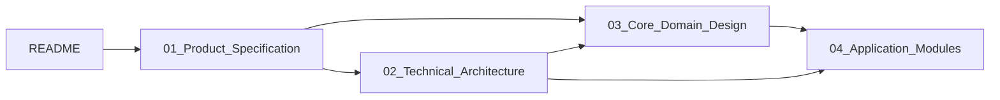
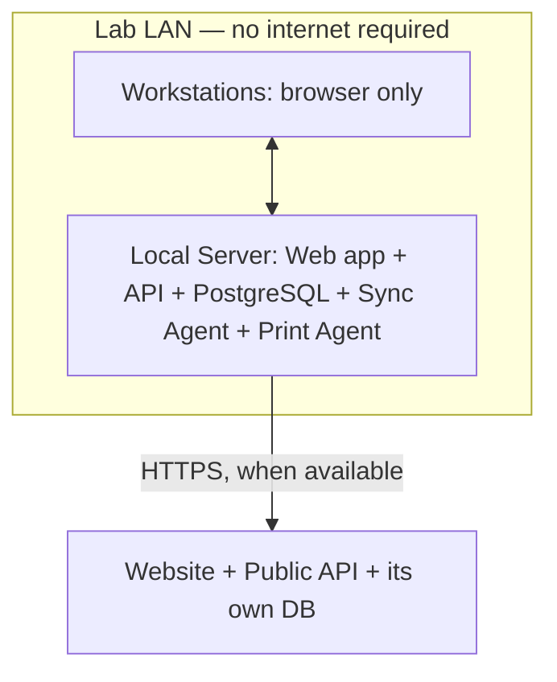

# Laboratory Management System — Architecture Handbook

**Status:** Design complete, pre-implementation. This is the authoritative documentation set for the project — supersedes the earlier per-topic file set.

## Project Overview

A Laboratory Management System (LMS) and public website, replacing a client's current H2 Cloud software. The client's core complaint with H2 Cloud — it requires internet to function — is the reason this entire project exists, so **offline-first** is the property everything else is designed around, not a feature bullet point.

The client's deployment is single-lab, self-hosted, one-time-purchase, no cloud dependency. The same codebase is architected to become the vendor's own multi-tenant SaaS product for future clients, without a rewrite — this dual purpose shapes several decisions throughout (see `03_Core_Domain_Design.md § Future SaaS Evolution` in `01_Product_Specification.md`).

## Project Goals

1. Eliminate all internet dependency for daily lab operations.
2. Give the client full ownership and control of their data.
3. Match the UX benefits of cloud LMS software (dashboards, SMS, online lookup) without the cloud dependency.
4. Build a technical foundation the vendor can extend into a SaaS product without re-architecting.

## Product Philosophy (summary)

Full text in `01_Product_Specification.md`. In short: local-first, one codebase serving multiple deployment modes, every integration replaceable and optional, business logic in the backend only, audit everything, no vendor lock-in, data belongs to the customer, offline is the default and online is an enhancement, future SaaS needs configuration rather than rewrites.

## Reading Order

1. **`01_Product_Specification.md`** — start here. What we're building and why, for anyone (technical or not).
2. **`02_Technical_Architecture.md`** — how the system is deployed, secured, and kept running offline/synced.
3. **`03_Core_Domain_Design.md`** — the business logic bible: domain model, glossary, events, state machines, workflows, pricing. Read before writing any backend code.
4. **`04_Application_Modules.md`** — the user-facing surface: screens, roles, portals, module-by-module behavior.
5. **`05_Analytics_Architecture.md`** — admin analytics dashboard design (planning only, not yet implemented).
6. **`06_Dependencies_and_Tooling.md`** — full inventory of every third-party package and DB tool actually used in the repo, why each was chosen, and what each means for building a packaged/distributable bundle. Read before packaging a release.
7. **`07_Website_Separation_and_Offline_Online_Hybrid.md`** — plan for pulling `apps/website` out of the local dev/deployment path once the core software is built and tested, and the scope for how the offline lab and the online website connect without breaking the offline-first guarantee. Read before hosting the website for real.
8. **`08_Windows_Packaging_and_Installer_Roadmap.md`** — roadmap for a two-installer Windows deployment (`LMS-Server-Setup.exe` + `LMS-Workstation-Setup.exe`) reflecting the server/LAN-workstation architecture, ending in one desktop icon per PC and no terminals. Read before packaging a client-facing release.

## Document Dependency Map



`03_Core_Domain_Design` is the dependency root for implementation — both the technical architecture and the application modules build on the domain model and rules defined there.

## Folder Structure

```
Research/
├── README.md
├── 01_Product_Specification.md
├── 02_Technical_Architecture.md
├── 03_Core_Domain_Design.md
├── 04_Application_Modules.md
├── 05_Analytics_Architecture.md
├── 06_Dependencies_and_Tooling.md
├── 07_Website_Separation_and_Offline_Online_Hybrid.md
└── 08_Windows_Packaging_and_Installer_Roadmap.md
```

## High-Level Architecture



Full detail in `02_Technical_Architecture.md`.

## Where Every Topic Lives

| Topic | Document |
|---|---|
| Business requirements, scope, roadmap, philosophy | `01_Product_Specification.md` |
| Server/DB architecture, offline & sync, security, SMS/printing infra, deployment, DR, risks | `02_Technical_Architecture.md` |
| Domain model, glossary, bounded contexts, domain events, state machines, workflows, pricing, DB schema | `03_Core_Domain_Design.md` |
| UI/UX principles, screens, portals, role-specific views | `04_Application_Modules.md` |
| Admin analytics dashboard design | `05_Analytics_Architecture.md` |
| Every third-party dependency and DB tool used, why it was chosen, packaging/native-binary considerations | `06_Dependencies_and_Tooling.md` |
| Separating the public website into its own hosting/DB, and the offline-first/online-hybrid sync scope | `07_Website_Separation_and_Offline_Online_Hybrid.md` |
| Two-installer Windows deployment (server + workstation), firewall/backup/health-check requirements | `08_Windows_Packaging_and_Installer_Roadmap.md` |

## Decisions Log

The 17 open items originally listed here have all been answered and are now folded into the relevant documents rather than tracked separately. Quick-reference summary (full detail in the linked section):

| # | Decision | Where |
|---|---|---|
| 1 | Full RBAC role list designed; only Admin/Reception/Sample Collector/Lab Tech enabled for this client | `02_Technical_Architecture.md § Authorization Matrix`, `04_Application_Modules.md § Admin Portal` |
| 2 | Cash, Bank Transfer, EasyPaisa, JazzCash supported; card disabled but interface-ready | `02_Technical_Architecture.md § Integration Strategy`, `03_Core_Domain_Design.md § Database Design` |
| 3 | H2 Cloud migration: unknown until client confirms; one-time import tool supported (CSV/Excel/SQL/API) | `01_Product_Specification.md § Non-Goals` |
| 4 | Website matches client branding; internal software neutral/modern; English-only v1, localization-ready | `04_Application_Modules.md § UI/UX Principles` |
| 5 | Home collection built (vendor add, not originally requested); radius/fee/max-bookings/scheduling all configurable | `03_Core_Domain_Design.md § Configuration vs. Hardcoded`, `§ Business Workflows` |
| 6 | No upfront payment on online booking — reserves a slot only; payment at reception/home collection | `03_Core_Domain_Design.md § Business Workflows: Core Patient Journey` |
| 7 | Refund: full if not performed, none if performed, package refunds partial per pricing engine; results never deleted | `03_Core_Domain_Design.md § Business Workflows: Exception Flows` |
| 8 | Corporate result-sharing (billing-only vs. full reports) configurable per company contract | `03_Core_Domain_Design.md § Business Workflows: Corporate Accounts` |
| 9 | Package repricing on test removal: configurable pricing-engine rule, defaults to recalculation | `03_Core_Domain_Design.md § Pricing Engine` |
| 10 | Doctor-pays-for-patient not required v1; architecture supports doctor credit accounts, dynamic commission (%/fixed) | `03_Core_Domain_Design.md § Business Workflows: Doctor Referrals` |
| 11 | Amendments notify patient, referring doctor, audit log, and website | `03_Core_Domain_Design.md § State Machines: Result/Report` |
| 12 | Partial report release configurable per lab policy, defaults to waiting for complete | `03_Core_Domain_Design.md § State Machines: Report` |
| 13 | Server purchased by client; mini-PC, 16GB RAM, 500GB SSD, UPS; vendor installs | `02_Technical_Architecture.md § Deployment Model` |
| 14 | Assume shared (non-isolated) LAN; implement internal HTTPS at minimum | `02_Technical_Architecture.md § Security` |
| 15 | Client owns backups; software automates; vendor trains; maintenance can include verification | `02_Technical_Architecture.md § Security`, `§ Deployment Strategy` |
| 16 | No existing SMS provider; interface-based, bake-off among eOcean/Jazz Business/Zong Business at deployment | `02_Technical_Architecture.md § SMS Architecture` |
| 17 | Client owns data/deployment/perpetual license; vendor retains source/IP and reuse rights — must be explicit contract clause | `01_Product_Specification.md § Business Context` |

No unresolved decisions remain at this stage.

## Future Roadmap Summary

Nine-phase evolution from single lab to full SaaS platform — full detail in `01_Product_Specification.md § Product Roadmap`: **Single Lab → Multi-Branch → Central Dashboard → Hosted SaaS → Marketplace → AI Features → Analyzer Integrations → Doctor Portal → Patient Mobile App.**
