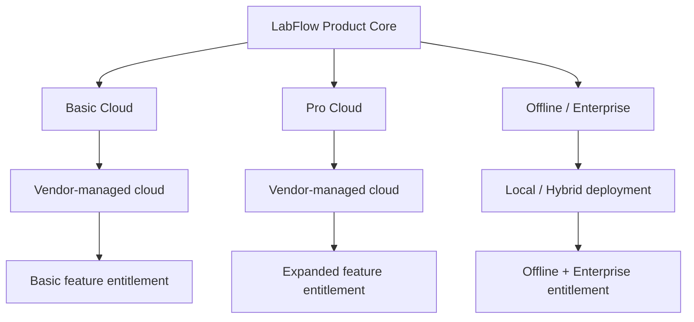
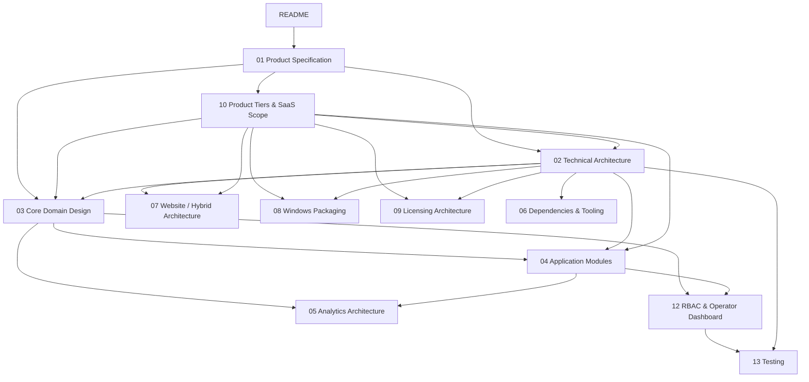
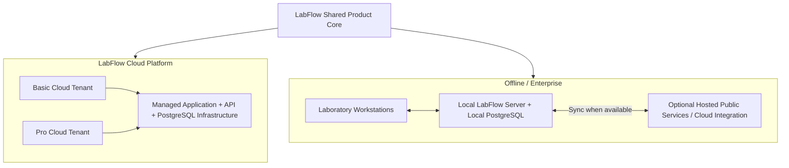

# Laboratory Management System — Architecture Handbook

**Product:** LabFlow

**Status:** Active product development and documentation modernization. This is the authoritative documentation set for the LabFlow product platform.

**Implemented separation (2026-10-01):** this repository contains local LabFlow software only. The public website is independent in `zaighaumrana/labwebsitedemo` and must never directly access the local API, PostgreSQL, laboratory LAN, filesystem, or locally stored reports. Doc 07 records this boundary and the future online service/bridge architecture; stabilization of the local application is the current priority.

> **Documentation precedence:** `01_Product_Specification.md` defines the current LabFlow product direction. Documents `02_Technical_Architecture.md`, `03_Core_Domain_Design.md`, and `04_Application_Modules.md` have now been modernized to follow the same product precedent. Remaining downstream documents are being reviewed individually. Where an older, not-yet-modernized document conflicts with Docs 01–04, the modernized documents take precedence.

## Project Overview

**LabFlow** is a laboratory management platform designed for diagnostic laboratories ranging from small independent labs to larger multi-branch organizations.

The product originally grew from a practical requirement for laboratory software that could continue operating without internet connectivity. That original offline-first implementation provided the foundation for the current system, but it no longer defines the boundaries of the product.

LabFlow is now being developed as a reusable commercial platform with **three product tiers**:

1. **Basic Cloud**
2. **Pro Cloud**
3. **Offline / Enterprise**

All three tiers belong to the same LabFlow product family and are intended to share the same core domain model, business rules, APIs, application architecture, and reusable modules wherever practical.

The major differences between tiers are:

* deployment model;
* infrastructure ownership;
* product entitlements;
* operational capabilities;
* service level;
* offline requirements;
* enterprise deployment requirements.

The goal is **one LabFlow product core, not three separate applications**.

Cloud tiers are vendor-managed SaaS deployments.

Offline / Enterprise is the locally deployed or hybrid edition for laboratories requiring local infrastructure ownership, offline operation, stronger deployment control, or enterprise capabilities.

The existing codebase already contains a substantial shared laboratory-management core and is progressively being productized around this three-tier model.

## Project Goals

1. Build one reusable LabFlow product platform serving Basic Cloud, Pro Cloud, and Offline / Enterprise.

2. Avoid customer-specific code forks by solving differences through configuration, product entitlements, branding, integrations, and reusable modules.

3. Provide a complete laboratory operating workflow covering patients, billing, samples, results, reports, staff permissions, analytics, notifications, and business administration.

4. Maintain strict tenant isolation for SaaS deployments.

5. Treat branches as first-class product/domain concepts rather than later customizations.

6. Allow Offline / Enterprise laboratories to perform core daily operations without internet connectivity.

7. Allow Basic Cloud and Pro Cloud customers to use LabFlow without operating local server infrastructure.

8. Keep product entitlement separate from employee RBAC:

   * subscription/tier determines what the laboratory owns;
   * permissions determine what an individual employee may use.

9. Give laboratories ownership and portability of their operational data.

10. Build infrastructure that can evolve across cloud, local, and hybrid deployments without re-architecting the core product.

## Product Philosophy (summary)

Full text is in `01_Product_Specification.md`.

In short:

* one product, multiple tiers;
* shared core, no permanent customer forks;
* tenant isolation is foundational;
* branches are first-class domain concepts;
* offline capability belongs primarily to Offline / Enterprise rather than defining the entire product;
* product entitlements and employee permissions are separate concerns;
* business logic belongs in the backend;
* clinically and financially significant changes must be auditable;
* external integrations should be replaceable where practical;
* integrations must not unnecessarily control core laboratory availability;
* customer data belongs to the customer;
* configuration should be preferred over customization;
* product tiers are entitlement boundaries, not codebase boundaries;
* architecture must evolve without breaking existing deployments;
* documentation must distinguish between implemented, partial/scaffolded, designed/planned, deferred, and superseded functionality.

## Product Model



The tiers must remain configurations of the same LabFlow product wherever deployment-specific infrastructure does not require different behavior.

Detailed tier strategy is defined in `10_Product_Tiers_and_SaaS_Scope.md`.

## Documentation Modernization Status

The documentation set originated while LabFlow was still centered around a smaller single-laboratory implementation.

The product has since expanded substantially.

The documentation is therefore being reviewed **one document at a time** against:

* the current codebase;
* the current three-tier product model;
* actual implemented functionality;
* partially implemented/scaffolded functionality;
* accepted but not-yet-implemented platform architecture;
* superseded historical assumptions.

### Current authority status

| Document                                                | Current status                                                                                      |
| ------------------------------------------------------- | --------------------------------------------------------------------------------------------------- |
| `01_Product_Specification.md`                           | **Updated — current product source of truth**                                                       |
| `02_Technical_Architecture.md`                          | **Updated — current shared technical/deployment architecture**                                      |
| `03_Core_Domain_Design.md`                              | **Updated — current shared domain/business-rule authority with implementation-status distinctions** |
| `04_Application_Modules.md`                             | **Updated — current product-module and user-surface definition**                                    |
| `05_Analytics_Architecture.md`                          | Significantly outdated — analytics has since been substantially implemented                         |
| `06_Dependencies_and_Tooling.md`                        | Generally useful — dependency/version refresh pending                                               |
| `07_Website_Separation_and_Offline_Online_Hybrid.md`    | Accepted and implemented repository separation; online service and sync/bridge remain future work    |
| `08_Windows_Packaging_and_Installer_Roadmap.md`         | Current planning document for Offline / Enterprise packaging                                        |
| `09_LabFlow_Licensing_and_Subscription_Architecture.md` | Current design document for Offline / Enterprise licensing                                          |
| `10_Product_Tiers_and_SaaS_Scope.md`                    | **Current strategic product-tier document**                                                         |
| `12_RBAC_and_Operator_Dashboard.md`                     | Recent implementation document; mostly current                                                      |
| `13_Testing.md`                                         | Recent implementation document; mostly current                                                      |

Docs 01–04 now share the same SaaS/product precedent.

Remaining older documents should be modernized without reintroducing assumptions from the original single-laboratory implementation.

## Reading Order

1. **`01_Product_Specification.md`** — start here. Defines what LabFlow is now: the shared product platform, three-tier commercial model, product principles, current capability boundaries, platform requirements, and roadmap.

2. **`10_Product_Tiers_and_SaaS_Scope.md`** — read early when making product or commercial decisions. Defines Basic Cloud, Pro Cloud, and Offline / Enterprise and explains why deployment/infrastructure and entitlement boundaries matter more than maintaining separate feature codebases.

3. **`02_Technical_Architecture.md`** — defines the shared technical architecture, current implementation, SaaS deployment model, Offline / Enterprise topology, security, synchronization direction, integrations, background services, feature entitlements, backups, and disaster recovery.

4. **`03_Core_Domain_Design.md`** — the business/domain authority: domain model, glossary, events, state machines, workflows, pricing, packages, corporate concepts, laboratory invariants, tenant rules, and implementation-state distinctions. Read before changing backend business behavior.

5. **`04_Application_Modules.md`** — defines the user-facing product surface: internal modules, staff workflows, Admin and Operator experiences, public portal, reporting, SaaS administration direction, branch management, Corporate modules, and entitlement-aware application behavior.

6. **`05_Analytics_Architecture.md`** — analytics architecture. Originally written as planning-only, but substantial analytics functionality has since been implemented and this document is pending an implementation-state rewrite.

7. **`06_Dependencies_and_Tooling.md`** — inventory of third-party packages and database/tooling dependencies, why they were chosen, and packaging/native-binary implications. Read before packaging or changing core infrastructure dependencies.

8. **`07_Website_Separation_and_Offline_Online_Hybrid.md`** — architecture for separating the public website from local Offline / Enterprise deployments and synchronizing selected online functionality without making local operations internet-dependent.

9. **`08_Windows_Packaging_and_Installer_Roadmap.md`** — roadmap for productizing Offline / Enterprise into Windows server/workstation installers and removing development-tool requirements from customer deployments.

10. **`09_LabFlow_Licensing_and_Subscription_Architecture.md`** — design architecture for Offline / Enterprise recurring licensing: activation, validation, offline grace behavior, and tamper resistance. Cloud subscription entitlement is a related but separate SaaS concern.

11. **`12_RBAC_and_Operator_Dashboard.md`** — centralized role/permission authorization architecture and the current ADMIN/LAB_OPERATOR implementation. Read before adding routes, roles, permissions, or changing protected application functionality.

12. **`13_Testing.md`** — current automated test foundations, what is covered, what remains uncovered, and conventions for adding tests.

**Numbering note:** document `11` is not currently present in this repository. Existing references to it will be reviewed as the documentation set is modernized.

## Document Dependency Map



### Authority Chain

The modernized documentation now follows this hierarchy:

```text id="pt17ra"
01 Product Specification
        ↓
10 Product Tiers & SaaS Scope
        ↓
02 Technical Architecture
        ↓
03 Core Domain Design
        ↓
04 Application Modules
        ↓
Feature / Deployment / Implementation Documents
```

`01_Product_Specification.md` is the **product authority**.

`10_Product_Tiers_and_SaaS_Scope.md` defines commercial/deployment tier boundaries.

`02_Technical_Architecture.md` defines the shared technical architecture.

`03_Core_Domain_Design.md` defines shared business/domain behavior.

`04_Application_Modules.md` defines how those capabilities surface to users.

A downstream implementation document should not silently redefine these layers.

## Folder Structure

```text id="yws09z"
docs/
├── README.md
├── 01_Product_Specification.md
├── 02_Technical_Architecture.md
├── 03_Core_Domain_Design.md
├── 04_Application_Modules.md
├── 05_Analytics_Architecture.md
├── 06_Dependencies_and_Tooling.md
├── 07_Website_Separation_and_Offline_Online_Hybrid.md
├── 08_Windows_Packaging_and_Installer_Roadmap.md
├── 09_LabFlow_Licensing_and_Subscription_Architecture.md
├── 10_Product_Tiers_and_SaaS_Scope.md
├── 12_RBAC_and_Operator_Dashboard.md
└── 13_Testing.md
```

## High-Level Product Architecture



This is the **product-level target architecture**.

Current implementation includes a large portion of the shared core.

Not every infrastructure component shown above is complete.

Full technical status belongs in `02_Technical_Architecture.md`.

## Current Implemented Technical Core

The current codebase substantially implements:

* React/Vite staff application;
* NestJS API;
* PostgreSQL;
* Prisma;
* REST APIs;
* Socket.IO;
* session authentication;
* bcrypt password hashing;
* permission-based RBAC;
* ADMIN superuser model;
* LAB_OPERATOR operational permission bundle;
* tenant/branch schema foundations;
* patient management;
* test catalog and parameters;
* invoicing and payments;
* sample workflow;
* outsourcing;
* result entry;
* result finalization;
* result reopen/amendment foundations;
* reporting;
* Puppeteer PDF generation;
* invoice PDFs;
* report PDFs;
* doctor statement PDFs;
* print/reprint tracking;
* doctor/referral management;
* doctor share calculations;
* analytics subsystem;
* Operator Dashboard;
* Cash Shift;
* implemented separation of the independent public website;
* SMS gateway abstraction;
* SendPK implementation;
* Notification persistence.

This list describes substantial shared product capability, not the completion of every surrounding product workflow.

## Entitlement vs. RBAC

LabFlow requires two separate access-control layers.

```text id="am35g4"
Laboratory / Tenant
        │
        ▼
Subscription / License
        │
        ▼
Product Tier
        │
        ▼
Feature Entitlements
        │
        ▼
User Role
        │
        ▼
Permissions
```

### Product entitlement answers:

> Has this laboratory purchased or been assigned access to this product capability?

Examples:

* advanced analytics;
* multi-branch capability;
* corporate accounts;
* offline deployment;
* advanced business modules.

### RBAC answers:

> Is this particular employee allowed to perform this operation?

Examples:

* create patients;
* receive samples;
* enter results;
* finalize results;
* view financial analytics;
* manage settings.

A permission must not automatically imply that the tenant owns the feature, and a tenant entitlement must not automatically give every employee access to it.

The current code has a functioning permission-based RBAC foundation.

Full product-tier entitlement enforcement remains a platform requirement.

## Domain Foundation

The LabFlow domain is shared across tiers.

The central operational journey is:

```text id="8y4jci"
Tenant
  ↓
Branch
  ↓
Patient
  ↓
Booking / Visit
  ↓
Invoice
  ↓
Sample
  ↓
Test
  ↓
Result
  ↓
Report
```

Supporting concepts include:

* Payment;
* Package;
* Doctor;
* Doctor Share / Commission;
* Company;
* Notification;
* Audit;
* Sync Outbox.

Detailed state machines, invariants, workflows, pricing rules, and implementation status are defined in `03_Core_Domain_Design.md`.

## Application Modules

The current internal/public product surface includes or substantially includes:

* Patient Management;
* Reception / Visit workflow;
* Billing & Payments;
* Laboratory;
* Reporting;
* Catalog;
* Doctor Management;
* Admin Dashboard;
* Operator Dashboard;
* Analytics / Insights;
* Settings;
* Cash Shift;
* independent website repository separation (see Doc 07).

Partial or planned product surfaces include:

* Corporate Accounts;
* complete Home Collection;
* Notification administration;
* SMS configuration UI;
* branch management;
* tier/entitlement management;
* SaaS platform administration;
* synchronization administration;
* backup administration;
* full website CMS;
* barcode/device workflow.

Detailed module behavior is defined in `04_Application_Modules.md`.

## Product Capability Status Language

All documentation should use the following language so architecture and implementation are not confused:

| Marker                   | Meaning                                                                                                |
| ------------------------ | ------------------------------------------------------------------------------------------------------ |
| **Implemented**          | Working product functionality exists across the necessary layers                                       |
| **Partial / Scaffolded** | Some schema, backend, frontend, or architectural foundation exists, but the complete workflow does not |
| **Designed / Planned**   | Accepted product or architectural direction with no complete implementation yet                        |
| **Deferred**             | Intentionally outside the current development phase                                                    |
| **Superseded**           | Historical requirement or architecture replaced by the current product direction                       |

### Important interpretation rule

The presence of any of the following does **not**, by itself, mean a feature is implemented:

* Prisma model;
* enum;
* field;
* migration;
* configuration value;
* interface;
* TODO;
* unused frontend route;
* placeholder UI.

Examples:

* `Company` does not mean Corporate Billing is complete.
* `SyncOutbox` does not mean synchronization is operational.
* `FeatureFlag` does not mean product entitlement enforcement exists.
* Role enum values do not mean all roles are active.
* refund states do not mean refund workflows exist.

## Where Every Topic Lives

| Topic                                                                                                    | Document                                                |
| -------------------------------------------------------------------------------------------------------- | ------------------------------------------------------- |
| LabFlow product definition, product principles, current scope, platform requirements, roadmap            | `01_Product_Specification.md`                           |
| Basic Cloud / Pro Cloud / Offline Enterprise product-tier strategy                                       | `10_Product_Tiers_and_SaaS_Scope.md`                    |
| Server/database architecture, deployment, security, integrations, synchronization architecture, DR       | `02_Technical_Architecture.md`                          |
| Domain model, glossary, state machines, business workflows, pricing, packages, corporate concepts        | `03_Core_Domain_Design.md`                              |
| UI/UX principles, application modules, screens, public portal, role-specific views, SaaS admin direction | `04_Application_Modules.md`                             |
| Analytics architecture and implemented analytical capabilities                                           | `05_Analytics_Architecture.md`                          |
| Third-party dependencies, tooling, package/native-binary considerations                                  | `06_Dependencies_and_Tooling.md`                        |
| Public website separation and Offline / Enterprise online-hybrid synchronization                         | `07_Website_Separation_and_Offline_Online_Hybrid.md`    |
| Offline / Enterprise Windows deployment, server/workstation installers, health/backup requirements       | `08_Windows_Packaging_and_Installer_Roadmap.md`         |
| Offline / Enterprise recurring license architecture                                                      | `09_LabFlow_Licensing_and_Subscription_Architecture.md` |
| Permission-based authorization and current ADMIN/LAB_OPERATOR implementation                             | `12_RBAC_and_Operator_Dashboard.md`                     |
| Automated testing foundations, current coverage, and testing conventions                                 | `13_Testing.md`                                         |

## Decisions Log

The original Decisions Log was created while LabFlow was centered around the first small-laboratory implementation.

Those decisions remain useful historical context, but the following product-wide decisions now govern LabFlow.

| #  | Current Product Decision                                                                                                                             | Status / Where                                                                            |
| -- | ---------------------------------------------------------------------------------------------------------------------------------------------------- | ----------------------------------------------------------------------------------------- |
| 1  | LabFlow is one commercial product platform with **Basic Cloud, Pro Cloud, and Offline / Enterprise** tiers                                           | `01_Product_Specification.md`, `10_Product_Tiers_and_SaaS_Scope.md`                       |
| 2  | Tier differences should primarily be handled through deployment architecture, configuration, and product entitlements rather than separate codebases | `01_Product_Specification.md`, `10_Product_Tiers_and_SaaS_Scope.md`                       |
| 3  | SaaS tenants require strict tenant isolation                                                                                                         | `01_Product_Specification.md`, `02_Technical_Architecture.md`, `03_Core_Domain_Design.md` |
| 4  | Branches remain first-class domain concepts across the product                                                                                       | Docs 01–04                                                                                |
| 5  | Offline operation is mandatory for **Offline / Enterprise**, not a requirement defining every LabFlow tier                                           | Docs 01, 02, 07, 10                                                                       |
| 6  | Core clinical and financial business rules belong in the shared backend/domain layer                                                                 | Docs 01–03                                                                                |
| 7  | Product entitlement and employee RBAC are separate authorization concerns                                                                            | Docs 01, 02, 04, 10, 12                                                                   |
| 8  | Current implemented RBAC bundles are **ADMIN** and **LAB_OPERATOR**; additional roles remain expandable through permission bundles                   | Docs 02, 04, 12                                                                           |
| 9  | Customer requirements should be solved through reusable configuration/features rather than permanent forks                                           | Doc 01                                                                                    |
| 10 | Customer laboratory data belongs to the customer and must remain portable/recoverable                                                                | Docs 01–03                                                                                |
| 11 | Clinically and financially significant corrections must preserve history and attribution                                                             | Docs 01–03                                                                                |
| 12 | Result entry and result release/finalization are separate operations                                                                                 | Docs 01, 03, 04                                                                           |
| 13 | Released result amendments preserve previous result versions rather than silently overwriting them                                                   | Doc 03                                                                                    |
| 14 | Cloud tiers use vendor-managed SaaS infrastructure; Offline / Enterprise uses local/hybrid deployment architecture                                   | Docs 01, 02, 10                                                                           |
| 15 | Offline / Enterprise is intended to receive production Windows packaging and local deployment tooling                                                | Docs 02, 08                                                                               |
| 16 | Offline / Enterprise licensing is a recurring commercial entitlement with its own technical licensing architecture                                   | Docs 01, 02, 09                                                                           |
| 17 | Public online services must not make Offline / Enterprise core laboratory operations internet-dependent                                              | Docs 01, 02, 07                                                                           |
| 18 | External integrations should use replaceable service boundaries where practical; **SendPK is the currently implemented SMS provider**                | Docs 01, 02                                                                               |
| 19 | Package catalog/billing support does not count as complete until constituent Tests participate correctly in lab/report workflows                     | Docs 01, 03, 04                                                                           |
| 20 | Corporate Accounts belong to the product domain but are currently partial/scaffolded                                                                 | Docs 01, 03, 04                                                                           |
| 21 | SaaS Platform Administration and Tenant Administration are separate security/operational concerns                                                    | Doc 04                                                                                    |
| 22 | Documentation must explicitly distinguish implemented, partial/scaffolded, planned, deferred, and superseded behavior                                | Docs 01–04, this README                                                                   |

Older implementation-specific decisions remain in downstream documents and will be reconciled as each document is modernized.

## Current Product Core

The current codebase already contains substantial working foundations including:

* patient management;
* test catalog;
* parameters/reference ranges;
* package catalog foundations;
* invoicing and payments;
* manual discounts;
* laboratory sample workflows;
* outsourcing;
* manual result entry;
* abnormal/critical result evaluation;
* explicit result finalization;
* amendments/reopening foundations;
* PDF reporting;
* invoice printing;
* doctor statements;
* print/reprint tracking;
* doctor/referral management;
* doctor commission/share calculation;
* Admin analytics;
* Operator Dashboard;
* financial analytics;
* operational analytics;
* test analytics;
* doctor analytics;
* outsourcing analytics;
* business insights;
* cash-shift reconciliation;
* permission-based RBAC;
* tenant/branch-aware schema foundations;
* implemented separation of the independent public website;
* SMS gateway abstraction;
* SendPK integration;
* Notification persistence.

This does **not** mean every workflow represented in the schema is complete.

## Major Platform Work Still Ahead

Major product/platform work includes:

* SaaS tenant provisioning;
* subscription management;
* product-tier entitlement enforcement;
* full role expansion;
* complete package-to-test processing;
* Corporate Accounts and billing;
* complete Home Collection;
* application-wide audit logging;
* notification retry/background workers;
* complete refund/void flows;
* complete doctor payout accounting;
* barcode/label/scanner workflows;
* public CMS/website administration;
* hosted online service and sync/bridge integration for Offline / Enterprise;
* local/cloud synchronization;
* Windows production packaging;
* automated backup and restore;
* Offline / Enterprise licensing implementation;
* cloud operational control plane;
* branch-management product surface;
* SaaS platform administration;
* production observability and deployment automation;
* public-report security hardening;
* clinical/result-integrity hardening;
* automated test expansion.

These are product roadmap items, not evidence that the current product should be reduced back to its original MVP scope.

## Documentation Work Remaining

The next documentation priorities are:

1. **`05_Analytics_Architecture.md`**
   Rewrite from "planning only" into an implemented analytics architecture with clearly marked remaining future work.

2. **`06_Dependencies_and_Tooling.md`**
   Refresh versions, dependency counts, testing dependencies, and current shared-package usage.

3. **`07_Website_Separation_and_Offline_Online_Hybrid.md`**
   Preserve the implemented repository separation and keep future online service/bridge work clearly distinguished from current local functionality.

4. **`08_Windows_Packaging_and_Installer_Roadmap.md`**
   Align deployment assumptions with the current Offline / Enterprise architecture.

5. **`09_LabFlow_Licensing_and_Subscription_Architecture.md`**
   Align licensing language with the current SaaS/tier model while preserving its design-only status.

6. **`10_Product_Tiers_and_SaaS_Scope.md`**
   Review against the now-modernized Docs 01–04 and refine exact entitlement strategy where needed.

7. **`12_RBAC_and_Operator_Dashboard.md`**
   Update the obsolete "no automated tests" statement and clarify active versus reserved roles.

8. **`13_Testing.md`**
   Refresh current controller/test references and remove or resolve broken Doc 11 references.

## Future Roadmap Summary

The roadmap is the evolution of **one shared LabFlow product platform**:

**Core Product Hardening → Entitlements & RBAC Expansion → SaaS Control Plane → Basic & Pro Cloud → Offline / Enterprise Productization → Hybrid Sync & Multi-Branch → Advanced Business Modules → Integrations & Portals → Ecosystem, AI & Mobile**

Full detail is in `01_Product_Specification.md § Product Roadmap`.

The roadmap must not be interpreted as:

> build one laboratory system first, then someday turn it into SaaS.

LabFlow is **the product now**.

The remaining work is the continued productization and hardening of its cloud, enterprise, entitlement, deployment, integration, clinical, financial, and advanced-business capabilities.
